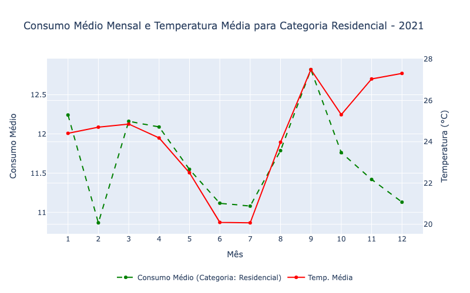
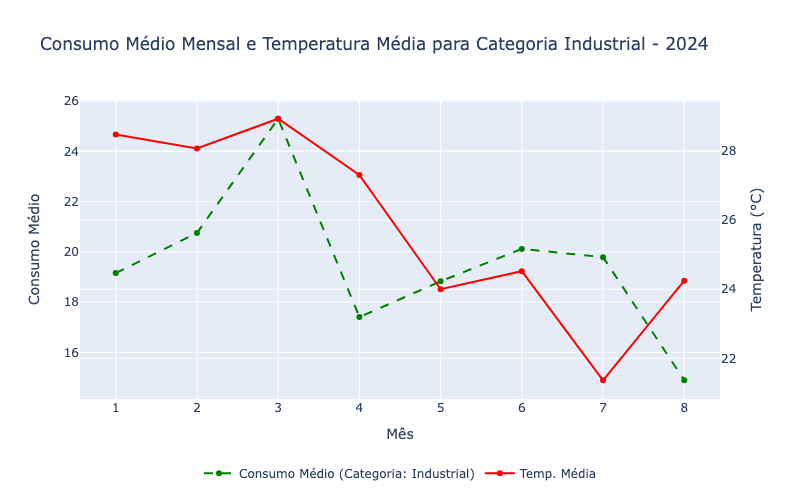

## Sumário

[1. Introdução](#c1)

[2. Consumo 2019](#c2)

[3. Consumo 2020](#c3)

[4. Consumo 2021](#c4)

[5. Consumo 2022](#c5)

[6. Consumo 2023](#c6)

[7. Consumo 2024](#c7)

[8. Correlação de Pearson](#c8)

[9. Análise de Padrões Suspeitos](#c9)

[10. Correlação de Pearson](#c10)

<br>

# <a name="c1"></a>1. Introdução

&emsp;&emsp; Este documento apresenta um notebook desenvolvido para analisar os dados sobre o Consumo de Água (2019 -> 2024), com o objetivo de extrair insights relevantes a partir de um conjunto de informações fornecidas. Esse notebook está organizado da seguinte forma:

## Estrutura do Projeto
### 1.1 Instalação de Bibliotecas
As seguintes bibliotecas foram utilizadas:

- `numpy` e `pandas`: Manipulação de dados.
- `matplotlib`, `seaborn`, `plotly`: Visualizações gráficas.
- `scipy.stats`: Para cálculos estatísticos, como correlação de Pearson.
- `meteostat`: Coleta de dados meteorológicos.

Para garantir que todos dados externos estejam instalados, o seguinte comando foi executado no Google Colab:
```
!pip install meteostat
```


&emsp;&emsp; Todas as estruturações do colab utilizam a biblioteca ``` meteostat ``` para extrair as médias de temperaturas em todos os meses de cada ano. 

```
location = Point(-20.4435, -54.6478)

start = datetime(2019, 1, 1) # 
end = datetime(2019, 12, 31)

data = Daily(location, start, end)
data = data.fetch()

df_monthly_weather = data.resample('M').mean()
```

&emsp;&emsp; Para realizar as próximas análises foi feito um _merge_ com o dataset de consumo para que esse dados sejam visualizados em um gráfico posteriormente.

```
df['REFERENCIA'] = pd.to_datetime(df['REFERENCIA'])

df['MES'] = df['REFERENCIA'].dt.month

df_weather['MES'] = df_weather.index.month

consumo_medio = df.groupby('MES')['CONS_MEDIDO'].mean().reset_index()

df_combined = pd.merge(consumo_medio, df_weather, on='MES')
```
### 1.2 Coleta e Preparação dos Dados
Os dados de consumo de água foram coletados de diferentes anos (2019-2024) e organizados por categorias de consumidores e tipos de ligação. A coleta de dados climáticos foi realizada usando a API meteostat para recuperar a temperatura média mensal das cidades analisadas.

### 1.3 Análise Ano a Ano e Resultados de Correlação
A correlação de Pearson é uma medida estatística que expressa a força da relação linear entre duas variáveis. O coeficiente de correlação de Pearson varia entre -1 e +1:

<b> +1</b>: Indica uma correlação linear positiva perfeita. Isso significa que, à medida que uma variável aumenta, a outra também aumenta proporcionalmente.<br>
<b>0</b>: Indica que não há nenhuma correlação linear entre as variáveis.<br>
<b>-1</b>: Indica uma correlação linear negativa perfeita. Isso significa que, à medida que uma variável aumenta, a outra diminui proporcionalmente.<br>

#### Tabela Explicativa da Correlação de Pearson

| Coeficiente de Correlação (r) | Relação entre Variáveis                        |
|-------------------------------|------------------------------------------------|
| **+1**                         | Correlação positiva perfeita (aumentam juntas) |
| **Entre +0.5 e +0.9**          | Correlação positiva forte                      |
| **Entre +0.1 e +0.5**          | Correlação positiva moderada                   |
| **0**                          | Sem correlação linear                          |
| **Entre -0.1 e -0.5**          | Correlação negativa moderada                   |
| **Entre -0.5 e -0.9**          | Correlação negativa forte                      |
| **-1**                         | Correlação negativa perfeita (uma aumenta e outra diminui) |

Neste projeto, a correlação de Pearson foi escolhida porque estamos interessados em quantificar a relação linear entre a temperatura média e o consumo de água em várias categorias de consumo (Residencial, Comercial, Industrial, Pública). O objetivo é identificar se um aumento ou diminuição na temperatura está associado a um aumento ou diminuição no consumo de água em cada categoria.<br>

A correlação de Pearson é uma ferramenta eficaz para esta análise porque permite medir a força da relação entre essas variáveis quantitativas e auxilia na detecção de padrões consistentes ao longo dos anos analisados.
Ao aplicar a correlação de Pearson, os valores obtidos para cada categoria indicam o seguinte:
- Valores próximos a +1 indicam que, conforme a temperatura aumenta, o consumo de água também tende a aumentar.
- Valores próximos a 0 indicam que não há uma relação clara entre temperatura e consumo de água.
- Valores negativos indicam que, conforme a temperatura aumenta, o consumo de água tende a diminuir.


# <a name="c2"></a>2. Consumo 2019

&emsp;&emsp; O primeiro dataset analisado é o do ano de 2019, chamado de "Consumo 2019". Este conjunto obtem um total de 4.210.820 registros, representando informações detalhadas sobre o consumo de água ao longo do ano de 2019. Dentro deste volume de dados, foram identificadas 355.823 matrículas únicas, ou seja, estabelecimentos distintos que são abastecidos. Ao longo do ano, o volume total de água consumido por esses estabelecimentos atingiu a marca de 52.656.791 metros cúbicos.

&emsp;&emsp; O primeiro gráfico apresenta a relação entre o consumo médio de água e a temperatura média ao longo dos meses de 2019. Observa-se que o consumo médio de água, representado pela linha verde pontilhada, tende a diminuir nos primeiros meses do ano, estabilizando-se a partir de junho, com uma leve elevação em agosto e setembro. A temperatura média, representada pela linha vermelha contínua, começa elevada em janeiro, cai até julho e volta a subir até dezembro. 


Figura 1: Gráfico Consumo Médio Mensal e Temperatura Média 2019  <br>
Fonte: Elaboração própria <br><br>

&emsp;&emsp; O segundo gráfico apresentado ilustra a relação entre o consumo médio mensal de água para a categoria pública e a temperatura média ao longo dos meses de 2019. A linha verde pontilhada representa o consumo médio de água nessa categoria, enquanto a linha vermelha contínua indica a temperatura média mensal.


Figura 2: Gráfico Consumo Médio Mensal e Temperatura Média 2019 - Categoria Pública  <br>
Fonte: Elaboração própria <br><br>

&emsp;&emsp; Ao observar o comportamento do consumo médio de água, percebe-se uma tendência de leve diminuição nos primeiros meses do ano, com um consumo que flutua entre 200 e 210 m³, seguido por um aumento significativo em junho e agosto, onde o consumo atinge picos, especialmente em agosto. Após esse ponto, o consumo volta a cair drasticamente em setembro, voltando a se estabilizar nos meses seguintes. Uma hipótese criada é que no mês de Julho, por ter atingido uma temperatura baixa, os hospitais públicos podem ter recebido um volume maior de pessoas, fazendo com o que utilizem mais água. 

&emsp;&emsp; O terceiro gráfico demonstra a relação entre o consumo médio mensal de água para a categoria comercial e a temperatura média ao longo dos meses de 2019. As linhas continuam com os mesmos significados.


Figura 3: Gráfico Consumo Médio Mensal e Temperatura Média 2019 - Categoria Comercial  <br>
Fonte: Elaboração própria <br><br>

&emsp;&emsp; Observando o consumo médio de água ao longo do ano, percebe-se que ele se mantém relativamente estável, com uma leve queda entre janeiro e fevereiro, seguido por uma estabilidade nos meses seguintes, variando entre 12 e 14 m³. Essa estabilidade no consumo, independentemente das variações na temperatura, sugere que a demanda de água no setor comercial pode ser menos sensível a flutuações sazonais, possivelmente devido à constância nas operações comerciais ao longo do ano. 

&emsp;&emsp; O quarto gráfico apresentado mostra a relação entre o consumo médio mensal de água na categoria residencial e a temperatura média ao longo dos meses de 2019. As linhas continuam com os mesmos significados.


Figura 4: Gráfico Consumo Médio Mensal e Temperatura Média 2019 - Categoria Residencial  <br>
Fonte: Elaboração própria <br><br>

&emsp;&emsp; No que diz respeito ao consumo de água na categoria residencial, observa-se uma leve queda nos primeiros meses do ano, estabilizando-se em torno de 11 m³ entre março e julho. A partir de julho, há um aumento constante no consumo, atingindo o pico em setembro e outubro, antes de cair novamente em novembro e dezembro. Esse comportamento sugere que o consumo residencial é influenciado por variações sazonais, possivelmente devido ao aumento da temperatura, que normalmente impulsiona o uso de água para atividades como irrigação de jardins, uso de piscinas, entre outros. Além disso, é interessante observar que mesmo nos meses de férias (Janeiro, Julho e Dezembro) o consumo varia um pouco. 

&emsp;&emsp; O gráfico apresentado mostra a relação entre o consumo médio mensal de água na categoria industrial e a temperatura média ao longo dos meses de 2019. As linhas continuam com os mesmos significados.


Figura 5: Gráfico Consumo Médio Mensal e Temperatura Média 2019 - Categoria Industrial  <br>
Fonte: Elaboração própria <br><br>

#### Análise da Correlação
<b>Ano de 2019</b>
- Categoria Analisada: Residencial, Comercial, Industrial e Pública.
- <i>Correlação de Pearson:</i>
  - Residencial: 0.73
  - Comercial: 0.52
  - Industrial: -0.07
  - Pública: -0.39
> Insights:
A categoria residencial mostra uma correlação forte e positiva com a temperatura, sugerindo que o consumo de água é altamente dependente do clima mais quente.<br>
A comercial tem uma correlação moderada, indicando algum impacto da temperatura no consumo.<br>
Já a categoria industrial apresenta uma correlação negativa fraca, sugerindo que outros fatores influenciam mais o consumo nesse setor.<br>
A pública apresenta uma correlação negativa mais forte, o que pode refletir uma possível inversão no padrão de consumo em resposta a mudanças climáticas ou fatores sazonais.<br>


&emsp;&emsp; O consumo médio de água na categoria industrial apresenta uma variabilidade significativa ao longo do ano, com picos e quedas acentuadas em diferentes momentos. Essa variação contrasta com a relativa estabilidade observada em outras categorias, como residencial e comercial. Os picos de consumo de água industrial em janeiro, maio e agosto sugerem uma demanda elevada durante esses períodos. Isso pode ser explicado por fatores sazonais, como aumento da produção em determinados setores industriais para atender à demanda de mercado específica, como agricultura, construção ou manufatura, que pode aumentar em resposta a contratos ou ciclos de produção. 

&emsp;&emsp; O gráfico abaixo compara o consumo médio mensal de água entre as categorias Pública, Comercial, Residencial e Industrial ao longo de 2019. Observa-se que a categoria Pública possui o maior consumo, variando entre 200 m³ e 250 m³, com picos em agosto. Em contraste, as categorias Comercial e Residencial têm os menores consumos, mantendo-se estáveis entre 10 e 15 m³ ao longo do ano. A categoria Industrial apresenta um consumo ligeiramente superior ao Comercial e Residencial, com variações entre 10 e 50 m³, indicando maior flutuação na demanda. No geral, o consumo na categoria Pública é significativamente maior do que nas outras categorias.


Figura 6: Gráfico Consumo Médio Mensal por Categoria 2019 <br>
Fonte: Elaboração própria <br><br>

&emsp;&emsp; O gráfico abaixo destaca a diferença significativa entre o consumo baseado em medição real (hidrometrado) e o consumo fixo, refletindo a importância do monitoramento adequado para uma gestão eficiente dos recursos hídricos.


Figura 7: Gráfico Consumo Médio Mensal por Tipo de Ligação 2019  <br>
Fonte: Elaboração própria <br><br>

&emsp;&emsp; O gráfico abaixo mostra o consumo médio mensal por subcategoria ao longo de 2019, destacando uma grande disparidade entre as subcategorias. A linha que representa o consumo médio mais elevado pertence à subcategoria “RES. INDUBRASIL”, que faz parte da categoria residencial. Observa-se que o consumo médio nessa subcategoria é significativamente maior do que em todas as outras subcategorias, levantando um questionamento sobre o motivo dessa diferença tão acentuada.


Figura 8: Gráfico Consumo Médio Mensal por Subcategoria 2019  <br>
Fonte: Elaboração própria <br><br>

Ao excluir a subcategoria **RES. INDUBRASIL** da análise, é possível observar com mais clareza os padrões de consumo das demais subcategorias ao longo dos meses de 2019.


Figura 9: Gráfico Consumo Médio Mensal por Subcategoria - 2019 (subcategoria RES. INDUBRASIL excluída)
Fonte: Elaboração própria <br><br>

> Insights:
Pública: A subcategoria Pública apresenta o consumo mais alto entre as categorias analisadas, com uma média constante em torno de 200 a 250 m³ por mês. Há uma leve oscilação durante os meses de junho a agosto, mas o padrão geral é estável.
Residencial: O consumo Residencial se manteve em torno de 30 a 50 m³ por mês. O padrão observado mostra uma leve variação ao longo do ano, mas o consumo é significativamente mais baixo do que o da subcategoria pública.
Comercial e Social: Ambas as subcategorias Comercial e Social apresentam consumos similares ao longo dos meses, com valores médios bastante próximos e estáveis entre 10 e 40 m³ por mês. A diferença entre essas duas subcategorias é mínima, sugerindo que o comportamento de consumo é semelhante para essas atividades durante o ano de 2019.
Industrial: A subcategoria Industrial tem o menor consumo médio registrado, com pouca variação ao longo dos meses. Seu consumo se manteve abaixo de 10 m³ por mês, destacando-se como a subcategoria com menor sensibilidade à sazonalidade.


# <a name="c3"></a>3. Consumo 2020

&emsp;&emsp; O próximo dataset analisado é o do ano de 2020, chamado de "Consumo 2020". Este conjunto obtem um total de 4.297.810 registros, uma diferença de mais de 80 mil registros quando comparado com 2019. Dentro deste volume de dados, foram identificadas 361.683 matrículas únicas, ou seja, estabelecimentos distintos que são abastecidos, que também podemos observar uma diferença de 2019 (355.823). Ao longo do ano, o volume total de água consumido por esses estabelecimentos atingiu a marca de 54.127.085 metros cúbicos.

&emsp;&emsp; Em 2020, o gráfico de consumo médio mensal de água comparado com a temperatura média reflete o impacto significativo da pandemia de COVID-19, especialmente em relação ao ano de 2019. O consumo médio de água em 2020 apresenta variações mais acentuadas ao longo do ano, com quedas e subidas pronunciadas em diferentes meses. Durante os meses de maio e junho, houve um declínio significativo no consumo, seguido de um aumento constante até dezembro. Esse comportamento pode ser atribuído às mudanças nos padrões de uso da água devido ao isolamento social e ao fechamento temporário de estabelecimentos comerciais e industriais, que reduziram o consumo em alguns períodos.


Figura 10: Gráfico Consumo Médio Mensal e Temperatura Média 2020  <br>

Fonte: Elaboração própria <br><br>

&emsp;&emsp; Em 2020, o consumo médio mensal de água na categoria pública apresenta variações significativas ao longo do ano, refletindo os impactos da pandemia de COVID-19. Nos primeiros meses, o consumo se mantém relativamente estável, mas a partir de março há uma queda acentuada que atinge seu ponto mais baixo em maio, antes de começar a se recuperar gradualmente nos meses seguintes. Esse padrão é visivelmente diferente do observado em 2019, onde o consumo foi mais consistente ao longo do ano.


Figura 11: Gráfico Consumo Médio Mensal e Temperatura Média 2020 - Pública <br>

Fonte: Elaboração própria <br><br>

&emsp;&emsp; A queda abrupta no consumo em maio pode ser diretamente atribuída às medidas de restrição implementadas para conter a pandemia, como o fechamento de escolas, repartições públicas e outros serviços que normalmente consomem grandes volumes de água. Com menos pessoas frequentando esses locais, a demanda por água diminuiu drasticamente.

&emsp;&emsp; O gráfico de consumo médio mensal de água para a categoria comercial em 2020 também revela o impacto da pandemia de COVID-19 nesse setor. Nos primeiros meses do ano, o consumo se mantém relativamente estável, mas a partir de março, há uma queda acentuada que atinge o ponto mais baixo em maio. Esse comportamento reflete o impacto das restrições impostas para conter a pandemia, incluindo o fechamento de lojas, escritórios e outros estabelecimentos comerciais, resultando em uma menor demanda por água. O curioso é o aumento no mês de Maio, o que não ocorreu na categoria Pública.


Figura 12: Gráfico Consumo Médio Mensal e Temperatura Média 2020 - Comercial <br>

Fonte: Elaboração própria <br><br>

&emsp;&emsp; Comparando com o ano de 2019, o consumo comercial em 2020 foi mais volátil, com uma recuperação mais lenta e uma tendência de aumento apenas no segundo semestre, conforme as restrições foram sendo relaxadas e os estabelecimentos comerciais gradualmente reabertos. Essa recuperação, embora positiva, não foi suficiente para retornar aos níveis de consumo observados antes da pandemia, indicando que muitos estabelecimentos podem ter permanecido fechados ou operando em capacidade reduzida durante grande parte do ano.

&emsp;&emsp; Diferentemente de outras categorias, o consumo residencial apresenta uma variação menos dramática, mas ainda notável, com um padrão que reflete as mudanças nos hábitos das pessoas durante o período de isolamento social. Nos primeiros meses de 2020, o consumo residencial começa relativamente estável, com uma leve queda em março e abril, possivelmente coincidindo com o início das restrições mais severas e o ajuste inicial das famílias às novas rotinas de trabalho e estudo em casa. A partir de maio, há uma recuperação no consumo, que se intensifica até setembro, seguindo uma tendência de aumento que pode estar associada ao maior tempo passado em casa, o que naturalmente eleva o uso de água para atividades domésticas.


Figura 13: Gráfico Consumo Médio Mensal e Temperatura Média 2020 - Residencial <br>

Fonte: Elaboração própria <br><br>

&emsp;&emsp; Comparando com 2019, onde o consumo residencial foi mais linear, 2020 mostra uma maior sensibilidade às mudanças no comportamento das famílias, com um aumento no consumo durante o verão, mesmo com a temperatura permanecendo dentro dos padrões normais.

&emsp;&emsp; O gráfico de consumo médio mensal de água para a categoria industrial em 2020 mostra um comportamento atípico e notável, especialmente considerando o contexto da pandemia de COVID-19. Nos primeiros meses do ano, o consumo se mantém relativamente baixo e estável, refletindo a possível redução das atividades industriais devido às restrições impostas.


Figura 14: Gráfico Consumo Médio Mensal e Temperatura Média 2020 - Industrial <br>
Fonte: Elaboração própria <br><br>

#### Análise da Correlação
<b>Ano de 2020</b>
- Categoria Analisada: Residencial, Comercial, Industrial e Pública.
- <i>Correlação de Pearson:</i>
  - Residencial: 0.49
  - Comercial: 0.22
  - Industrial: -0.35
  - Pública: 0.61

> Insights:
O consumo residencial ainda é moderadamente correlacionado com a temperatura, mas o impacto é menor do que em 2019, talvez devido a mudanças no comportamento durante a pandemia.<br>
A comercial e a industrial apresentam correlações fracas, com a última mantendo uma correlação negativa significativa, o que sugere que fatores não relacionados à temperatura influenciam essas categorias.<br>
A categoria pública se destaca com uma forte correlação positiva, sugerindo uma resposta direta à elevação das temperaturas.<br>

&emsp;&emsp; No entanto, há um aumento drástico e suspeito no consumo de água em agosto, que não parece estar alinhado com o padrão observado nos meses anteriores nem com as condições climáticas representadas pela temperatura média. Este aumento abrupto em Julho levanta questionamentos sobre possíveis causas não convencionais, como um erro de medição, uma mudança temporária na operação de alguma instalação industrial específica, ou até mesmo uma falha na coleta de dados.

&emsp;&emsp; O gráfico revela a predominância do consumo na categoria Pública, a estabilidade nas categorias Comercial e Residencial, e um pico atípico na categoria Industrial que merece atenção especial. Esses padrões refletem as influências das medidas pandêmicas sobre o uso da água e destacam a importância de um monitoramento contínuo e rigoroso para identificar e investigar desvios incomuns nos dados de consumo.


Figura 15: Gráfico Consumo Médio Mensal por Categoria 2020 <br>

Fonte: Elaboração própria <br><br>

&emsp;&emsp; O gráfico de consumo médio mensal por tipo de ligação em 2020 mostra uma clara distinção entre os consumos das ligações hidrometradas e as de consumo fixo. O consumo hidrometrado, representado pela linha azul, mantém-se estável ao longo do ano, com pequenas variações entre 12 e 14 m³, indicando um uso regular e medido de água. Esse padrão sugere que, mesmo durante a pandemia, o consumo nas ligações hidrometradas permaneceu relativamente consistente.


Figura 16: Gráfico Consumo Médio Mensal por Tipo de Ligação 2020 <br>

Fonte: Elaboração própria <br><br>

&emsp;&emsp; O gráfico de consumo médio mensal por subcategoria em 2020 apresenta algumas diferenças notáveis em relação ao ano de 2019. A subcategoria “RES. INDUBRASIL” continua a mostrar um consumo significativamente maior em comparação com as outras subcategorias, mas o padrão de crescimento ao longo do ano é mais acentuado em 2020.


Figura 17: Gráfico Consumo Médio Mensal por Subcategoria 2020 <br>
Fonte: Elaboração própria <br><br>

Ao excluir a subcategoria **RES. INDUBRASIL**, podemos observar com mais clareza os padrões de consumo das demais subcategorias ao longo de 2020.


Fonte: Elaboração própria <br><br>

> **Insights**:
&emsp;&emsp; **Pública**: A subcategoria **Pública** novamente liderou o consumo, com uma média constante em torno de 200 a 300 m³ por mês. Houve uma leve diminuição no consumo nos meses de junho a agosto, provavelmente devido à diminuição das atividades públicas durante o período de inverno.<br>
**Residencial**: O consumo **Residencial** se manteve estável, com uma média de 20 a 40 m³ por mês, sem grandes variações sazonais.<br>
**Comercial e Social**: As subcategorias **Comercial** e **Social** tiveram comportamentos de consumo semelhantes, com médias baixas de aproximadamente 10 a 30 m³ por mês. Essas subcategorias apresentaram um consumo bastante estável ao longo do ano, sem grandes oscilações.<br>
**Industrial**: O consumo **Industrial** teve uma leve variação no meio do ano, com um pico registrado em julho. No entanto, o consumo permaneceu abaixo de 50 m³ por mês na maior parte do ano, sendo a categoria menos sensível às mudanças sazonais.<br>

# <a name="c4"></a>4. Consumo 2021

&emsp;&emsp; O próximo dataset analisado é o do ano de 2021, chamado de "Consumo 2021". Este conjunto obtem um total de 4.393.626 registros, uma diferença de quase 100 mil registros quando comparado com 2020. Dentro deste volume de dados, foram identificadas 370.881 matrículas únicas, ou seja, estabelecimentos distintos que são abastecidos, que também podemos observar uma pequena diferença de 2020. Ao longo do ano, o volume total de água consumido por esses estabelecimentos atingiu a marca de 53.932.473 metros cúbicos, diminuindo o consumo de 2020.

&emsp;&emsp; O gráfico de consumo médio mensal de água e temperatura média em 2021 reflete um ano ainda impactado pelo isolamento social nos primeiros meses, seguido por uma gradual normalização das atividades ao longo do ano. Comparando com 2020, observa-se que, enquanto em 2020 o consumo de água teve uma queda acentuada nos meses de maio e junho, em 2021 o consumo médio se manteve relativamente estável, com uma leve queda em março e abril, mas não tão pronunciada quanto no ano anterior. Ao comparar com 2019, um ano não afetado pela pandemia, nota-se que o consumo em 2021 mostra variações sazonais típicas, mas com menos estabilidade. Em 2019, o consumo foi mais linear e menos influenciado por fatores externos, enquanto em 2021, especialmente no início do ano, as incertezas e variações causadas pelo contexto pandêmico ainda são evidentes.


Figura 18: Gráfico Consumo Médio Mensal e Temperatura Média 2021 <br>

Fonte: Elaboração própria <br><br>

&emsp;&emsp; O gráfico de 2021 para a categoria pública mostra uma recuperação gradual do consumo de água, com uma queda significativa nos primeiros meses devido ao isolamento social, semelhante a 2020, mas menos acentuada. No segundo semestre, o consumo se recupera mais fortemente do que em 2020, alinhado ao aumento das temperaturas e à retomada das atividades presenciais. Em comparação com 2019, o consumo de 2021 é mais volátil, refletindo o impacto contínuo da pandemia e as adaptações nas operações públicas. O pico de consumo em julho de 2021, seguido por uma queda, destaca ajustes pontuais nas atividades públicas, contrastando com o padrão mais linear de 2019.


Figura 19: Gráfico Consumo Médio Mensal e Temperatura Média 2021 - Pública <br>

Fonte: Elaboração própria <br><br>

&emsp;&emsp; O gráfico de 2021 para a categoria comercial mostra um consumo de água relativamente estável nos primeiros meses, com uma queda acentuada em abirl, possivelmente refletindo o impacto prolongado do isolamento social. No entanto, a partir de agosto, o consumo aumenta significativamente, acompanhando a retomada das atividades comerciais e o aumento das temperaturas. Comparado a 2020, o padrão de 2021 é mais estável, mas ainda apresenta volatilidade em relação a 2019, quando o consumo foi mais linear. Isso indica que, apesar de alguma recuperação, as operações comerciais em 2021 ainda foram afetadas pelas condições da pandemia.


Figura 20: Gráfico Consumo Médio Mensal e Temperatura Média 2021 - Comercial <br>

Fonte: Elaboração própria <br><br>

&emsp;&emsp; O gráfico de 2021 para a categoria residencial mostra uma leve queda no consumo de água nos primeiros meses, seguida por um aumento constante a partir de julho, alinhado ao aumento das temperaturas e à retomada das atividades. Comparado a 2020, o padrão de 2021 é mais estável, mas ainda apresenta variações que refletem o impacto residual da pandemia. Em relação a 2019, o consumo em 2021 foi menos linear, com uma maior sensibilidade às mudanças sazonais e às condições externas, indicando que o comportamento das famílias continuou a ser influenciado pelas circunstâncias excepcionais daquele ano.


Figura 21: Gráfico Consumo Médio Mensal e Temperatura Média 2021 - Residencial <br>

Fonte: Elaboração própria <br><br>

&emsp;&emsp; O gráfico de 2021 para a categoria industrial destaca um aumento acentuado no consumo de água em maio, seguido por uma queda significativa nos meses subsequentes. Esse aumento pode estar relacionado a um pico temporário na atividade industrial, talvez devido a uma recuperação econômica ou a demandas sazonais específicas. Em janeiro de 2021, o consumo começou em um nível baixo, o que pode indicar uma retomada lenta após o período de isolamento social, refletindo uma operação industrial reduzida no início do ano.


Figura 22: Gráfico Consumo Médio Mensal e Temperatura Média 2021 - Industrial <br>
Fonte: Elaboração própria <br><br>

#### Análise da Correlação
<b>Ano de 2021</b>
- Categoria Analisada: Residencial, Comercial, Industrial e Pública.
- <i>Correlação de Pearson:</i>
  - Residencial: 0.40
  - Comercial: 0.48
  - Industrial: 0.02
  - Pública: -0.40

> Insights:
O residencial mostra uma queda na correlação em comparação com anos anteriores, talvez refletindo uma normalização pós-pandemia.<br>
A comercial retorna a uma correlação positiva moderada, sugerindo que a economia pode estar se recuperando e respondendo à temperatura.<br>
A industrial permanece sem uma relação clara com a temperatura.<br>
A categoria pública continua a exibir uma correlação negativa, o que pode indicar políticas públicas ou mudanças no padrão de uso.<br>

&emsp;&emsp; Comparando com 2020, o pico de consumo em julho de 2020 foi ainda mais pronunciado e isolado, sugerindo uma anomalia específica naquele ano, possivelmente ligada a um evento ou necessidade excepcional. Em contraste, o aumento em maio de 2021 parece ser parte de um padrão mais consistente ao longo do ano, indicando uma recuperação mais gradual e controlada das operações industriais em comparação ao pico abrupto observado no ano anterior.

&emsp;&emsp; O gráfico de 2021 mostra o consumo médio mensal de água por categoria. Este sugere que, em 2021, a categoria pública teve uma operação mais irregular, possivelmente devido a ajustes na reabertura e ao manejo dos serviços durante a fase de transição da pandemia.


Figura 23: Gráfico Consumo Médio Mensal por Categoria 2021 <br>

Fonte: Elaboração própria <br><br>

&emsp;&emsp; O gráfico de consumo médio mensal por tipo de ligação em 2021 mostra uma diferença clara entre as ligações hidrometradas e as de consumo fixo. O consumo hidrometrado manteve-se relativamente estável ao longo do ano, com pequenas variações entre 12 e 14 m³, o que indica um uso consistente e monitorado de água. Já o consumo fixo permaneceu próximo de zero durante todo o ano, refletindo a natureza fixa e inalterada dessas ligações, que não variam com o uso real de água.


Figura 24: Gráfico Consumo Médio Mensal por Tipo de Ligação 2021 <br>

Fonte: Elaboração própria <br><br>

&emsp;&emsp; O gráfico de consumo médio mensal por subcategoria em 2021 destaca um aumento significativo no consumo da subcategoria “RES. INDUBRASIL”, especialmente a partir de maio. Comparado aos anos anteriores, esse comportamento é notável, pois em 2019 e 2020, embora o consumo dessa subcategoria fosse elevado, não apresentava um crescimento tão acentuado ao longo do ano.


Figura 25: Gráfico Consumo Médio Mensal por Subcategoria 2021 <br>
Fonte: Elaboração própria <br><br>

Ao excluir a subcategoria **RES. INDUBRASIL**, podemos observar com mais clareza os padrões de consumo das demais subcategorias ao longo de 2021.


> **Insights**:
**Pública**: A subcategoria **Pública** novamente dominou o consumo, com uma média em torno de 200 a 300 m³ por mês. O padrão foi bastante estável ao longo do ano, com pequenas oscilações.<br>
**Residencial**: O consumo **Residencial** manteve-se entre 20 e 50 m³ por mês, sem grandes flutuações sazonais.<br>
**Comercial e Social**: As subcategorias **Comercial** e **Social** mantiveram um consumo estável ao longo do ano, com médias mensais de 10 a 30 m³.<br>
**Industrial**: O consumo **Industrial** permaneceu baixo, com uma pequena variação em julho, mas, em geral, não apresentou grandes oscilações sazonais, com um consumo médio abaixo de 10 m³ por mês.<br>

# <a name="c5"></a>5. Consumo 2022

&emsp;&emsp; O próximo dataset analisado é o do ano de 2022, chamado de "Consumo 2022". Este conjunto obtem um total de 4.492.148 registros, uma diferença de quase 100 mil registros quando comparado com 2021. Dentro deste volume de dados, foram identificadas 377.724 matrículas únicas, ou seja, estabelecimentos distintos que são abastecidos, que também podemos observar uma pequena diferença de 2021. Ao longo do ano, o volume total de água consumido por esses estabelecimentos atingiu a marca de 53.169.734 metros cúbicos, diminuindo novamente o consumo de 2021.

&emsp;&emsp; O gráfico de consumo médio mensal de água em 2022 reflete o primeiro ano de retorno completo à normalidade após a pandemia, mostrando uma recuperação e estabilização no consumo. Comparado a 2019, observa-se uma maior variabilidade ao longo dos meses em 2022, com quedas acentuadas em maio e junho, seguidas de um aumento significativo no segundo semestre, enquanto 2019 apresentou um consumo mais estável. Em relação a 2020, que teve grandes flutuações devido às restrições pandêmicas, 2022 também teve uma queda semelhante nos meses de maio e junho, mas com uma recuperação mais rápida e forte no segundo semestre, alinhada à retomada das atividades. Comparado a 2021, onde o consumo ainda sofria o impacto das restrições e apresentava variações significativas, 2022 mostra uma tendência de retorno a padrões mais típicos, com o consumo se ajustando às temperaturas e retomando um comportamento mais regular, mas ainda refletindo adaptações pós-pandemia.


Figura 26: Gráfico Consumo Médio Mensal e Temperatura Média 2022 <br>

Fonte: Elaboração própria <br><br>

&emsp;&emsp; O gráfico de 2022 para a categoria pública mostra um padrão de consumo que, embora apresente variações, indica uma recuperação em direção à normalidade. Comparando com 2019, o consumo em 2022 é mais volátil, com picos e quedas mais pronunciados, enquanto 2019 manteve um padrão mais estável ao longo do ano. Comparado a 2021, onde o consumo foi mais errático devido à transição do período pandêmico, 2022 ainda apresenta flutuações, mas com uma tendência de estabilização maior, especialmente no segundo semestre, indicando um retorno gradual aos padrões de uso pré-pandêmicos.


Figura 27: Gráfico Consumo Médio Mensal e Temperatura Média 2022 - Pública <br>

Fonte: Elaboração própria <br><br>

&emsp;&emsp; O gráfico de 2022 para a categoria comercial mostra um padrão de consumo que, embora flutuante, reflete uma tendência de recuperação ao longo do ano. Comparando com 2019, o consumo em 2022 é mais variável, com quedas acentuadas no meio do ano, particularmente em maio e junho, seguidas por uma recuperação significativa no segundo semestre. Em relação a 2020, ano em que o consumo foi fortemente impactado pelas restrições pandêmicas, o gráfico de 2022 apresenta um padrão mais previsível e controlado, embora ainda com quedas e aumentos notáveis. Comparado a 2021, onde o consumo foi marcado por uma volatilidade devido à transição de um período de restrições para a normalidade, 2022 mostra uma estabilização maior, especialmente no segundo semestre.


Figura 28: Gráfico Consumo Médio Mensal e Temperatura Média 2022 - Comercial <br>

Fonte: Elaboração própria <br><br>

&emsp;&emsp; O gráfico de 2022 para a categoria residencial mostra um consumo que começa estável, cai acentuadamente até junho, e depois se recupera no segundo semestre. Comparado a 2019, o consumo em 2022 é mais volátil, com quedas e subidas mais pronunciadas. Em 2020, o consumo foi drasticamente afetado pelas restrições, enquanto em 2022, apesar de uma queda similar, houve uma recuperação mais rápida. Em relação a 2021, que foi marcado por instabilidade devido à transição pós-pandemia, 2022 apresenta uma maior estabilização, especialmente no final do ano, refletindo o retorno às condições normais.


Figura 29: Gráfico Consumo Médio Mensal e Temperatura Média 2022 - Residencial <br>

Fonte: Elaboração própria <br><br>

&emsp;&emsp; O gráfico de 2022 para a categoria industrial mostra um início de ano com consumo estável, seguido por uma queda acentuada em maio e uma recuperação gradual ao longo do segundo semestre. Comparado a 2019, o consumo em 2022 é mais volátil, com quedas e picos mais pronunciados. Em 2020, houve um pico isolado em julho, muito diferente do comportamento mais consistente de 2022, que reflete a normalização das atividades industriais pós-pandemia. Em 2021, o consumo foi marcado por flutuações devido à transição das restrições, enquanto 2022 apresenta uma recuperação mais estável e alinhada ao aumento das temperaturas, indicando um retorno mais próximo ao padrão de consumo pré-pandêmico.


Figura 30: Gráfico Consumo Médio Mensal e Temperatura Média 2022 - Industrial <br>
Fonte: Elaboração própria <br><br>

#### Análise da Correlação
<b>Ano de 2022</b>
- Categoria Analisada: Residencial, Comercial, Industrial e Pública.
- <i>Correlação de Pearson:</i>
  - Residencial: 0.64
  - Comercial: 0.44
  - Industrial: 0.07
  - Pública: -0.53

>Insights:
O residencial recupera uma forte correlação positiva com a temperatura, refletindo uma sensibilidade renovada à temperatura.<br>
As categorias comercial e industrial permanecem com correlações moderadas a fracas, com o consumo industrial quase independente da temperatura.<br>
A categoria pública mostra uma correlação negativa ainda mais forte, o que pode indicar intervenções sazonais ou mudanças no comportamento de consumo.<br>

&emsp;&emsp; O gráfico de 2022 mostra o consumo médio mensal por categoria, destacando a categoria pública com um consumo consistentemente elevado em relação às demais. Em comparação com os anos anteriores, 2022 reflete um retorno à estabilidade, com a categoria pública mantendo um padrão mais linear, enquanto as categorias comercial, residencial e industrial apresentam pequenas variações ao longo do ano.


Figura 31: Gráfico Consumo Médio Mensal por Categoria 2022 <br>

Fonte: Elaboração própria <br><br>

&emsp;&emsp; O gráfico de 2022 mostra o consumo médio mensal por tipo de ligação, evidenciando a constância no consumo hidrometrado ao longo do ano, com pequenas variações entre 12 e 14 m³, o que reflete um uso regular e monitorado de água. O consumo fixo, como esperado, permanece próximo de zero durante todo o ano, mantendo a estabilidade característica desse tipo de ligação.


Figura 32: Gráfico Consumo Médio Mensal por Tipo de Ligação 2022 <br>

Fonte: Elaboração própria <br><br>

&emsp;&emsp; O gráfico de 2022 para o consumo médio mensal por subcategoria destaca a subcategoria “RES. INDUBRASIL” como a de maior consumo, com uma tendência de crescimento ao longo do ano, até uma queda abrupta em dezembro. Comparado aos anos anteriores, 2022 mostra um comportamento mais consistente em “RES. INDUBRASIL”, com um consumo elevado e relativamente estável até o final do ano, quando ocorre a queda. Essa queda abrupta em dezembro para “RES. INDUBRASIL” pode indicar uma anomalia ou um evento específico que interrompeu o consumo, diferindo dos padrões estáveis que dominaram a maior parte do ano.


Figura 33: Gráfico Consumo Médio Mensal por Tipo de Ligação 2022 <br>
Fonte: Elaboração própria <br><br>

Ao excluir a subcategoria **RES. INDUBRASIL**, podemos observar com mais clareza os padrões de consumo das demais subcategorias ao longo de 2022.


> **Insights**:
**Pública**: A subcategoria **Pública** continua a liderar o consumo, com uma média constante em torno de 250 a 350 m³ por mês. O padrão foi estável ao longo do ano, sem grandes variações sazonais.<br>
**Residencial**: O consumo **Residencial** permaneceu estável entre 20 e 50 m³ por mês. Essa subcategoria apresentou pouca variação ao longo do ano, refletindo um consumo regular e previsível.<br>
**Comercial e Social**: As subcategorias **Comercial** e **Social** mantiveram um consumo baixo e estável, com médias mensais em torno de 10 a 30 m³, sem grandes oscilações.<br>
**Industrial**: O consumo **Industrial** manteve-se baixo ao longo do ano, com uma leve oscilação nos meses intermediários, mas em geral sem grandes variações, com uma média abaixo de 10 m³ por mês.<br>

# <a name="c6"></a>6. Consumo 2023

&emsp;&emsp; O próximo dataset analisado é o do ano de 2023, chamado de "Consumo 2023". Este conjunto obtem um total de 4.574.507 registros, uma diferença um pouco menos que 100 mil registros quando comparado com 2022. Dentro deste volume de dados, foram identificadas 384.553 matrículas únicas, ou seja, estabelecimentos distintos que são abastecidos, que também podemos observar uma pequena diferença de 2022. Ao longo do ano, o volume total de água consumido por esses estabelecimentos atingiu a marca de 55.921.055 metros cúbicos, aumentando drasticamente o consumo de 2022.

&emsp;&emsp; O gráfico de 2023 mostra um consumo médio mensal de água que começa estável, com uma leve queda até junho, seguida por uma recuperação acentuada no segundo semestre. Esse padrão de recuperação no segundo semestre é consistente com os anos anteriores, especialmente com 2022, quando houve um aumento semelhante após um período de queda. Em comparação com 2021, o consumo em 2023 apresenta menos volatilidade, sugerindo um retorno a um padrão mais estável e previsível, ainda que com variações sazonais normais. Comparado a 2019, o consumo em 2023 é mais variável, com flutuações mais pronunciadas, o que pode indicar ajustes e adaptações contínuas nos padrões de uso de água após o impacto da pandemia.


Figura 34: Gráfico Consumo Médio Mensal e Temperatura Média 2023 <br>

Fonte: Elaboração própria <br><br>

&emsp;&emsp; O gráfico de 2023 para a categoria pública revela um padrão de consumo que se mantém estável nos primeiros meses, com um aumento significativo em setembro, coincidindo com um dos pico da temperatura média. Comparado aos anos anteriores, 2023 mostra um aumento mais acentuado no consumo durante os meses de pico de temperatura, o que pode indicar uma maior demanda por água em instituições públicas durante esse período. Em relação a 2022, onde o consumo foi mais constante ao longo do ano, 2023 apresenta flutuações mais pronunciadas, refletindo possíveis variações nas operações públicas ou na demanda de serviços. A comparação com 2019 e 2020 mostra que, enquanto 2020 teve quedas mais drásticas devido à pandemia, 2023 reflete um retorno ao uso mais típico, mas com picos mais intensos nos meses de alta temperatura.


Figura 35: Gráfico Consumo Médio Mensal e Temperatura Média 2023 - Pública <br>

Fonte: Elaboração própria <br><br>

&emsp;&emsp; O gráfico de 2023 para a categoria comercial mostra um padrão de consumo que começa em alta, com uma queda acentuada até junho, seguida por uma recuperação no segundo semestre, acompanhando o aumento das temperaturas. Comparado aos anos anteriores, 2023 apresenta uma maior variação no consumo ao longo do ano. Em 2022, o consumo foi mais estável, mas ainda com picos e quedas, enquanto 2023 mostra flutuações mais pronunciadas, refletindo possíveis ajustes nas operações comerciais. Em relação a 2021, onde o consumo foi mais instável devido à transição pós-pandemia, 2023 exibe um comportamento mais típico, mas com oscilações sazonais mais marcantes, especialmente nos meses de maior calor, que coincidem com o aumento do consumo.


Figura 36: Gráfico Consumo Médio Mensal e Temperatura Média 2023 - Comercial <br>

Fonte: Elaboração própria <br><br>

&emsp;&emsp; O gráfico de 2023 para a categoria residencial mostra um consumo que começa estável, cai acentuadamente entre março e maio, e depois se recupera no segundo semestre, com picos nos meses mais quentes. Essa recuperação é consistente com o aumento das temperaturas, que eleva a demanda por água nas residências. Comparado a 2022, o consumo em 2023 é mais volátil, com oscilações mais pronunciadas. Em relação a 2021, que foi mais errático devido à transição pós-pandemia, 2023 reflete um retorno a padrões mais típicos, embora ainda fortemente influenciado pelas variações climáticas. O comportamento indica um alinhamento do consumo com as condições sazonais, destacando a importância das temperaturas no uso de água residencial.


Figura 37: Gráfico Consumo Médio Mensal e Temperatura Média 2023 - Residencial <br>

Fonte: Elaboração própria <br><br>

&emsp;&emsp; O gráfico de 2023 para a categoria industrial mostra um início de ano com consumo relativamente estável, seguido por uma queda acentuada até junho. A partir de julho, o consumo se recupera significativamente, atingindo um pico em agosto, que coincide com as temperaturas mais altas. Essa recuperação sugere que as operações industriais aumentaram durante os meses de verão, provavelmente devido à maior demanda ou ao funcionamento pleno das instalações. Comparado aos anos anteriores, 2023 apresenta um padrão de maior volatilidade, com flutuações mais acentuadas do que em 2022 e 2021. Isso pode refletir ajustes nas operações industriais ou respostas a variações de demanda ao longo do ano, indicando que a indústria ainda está se adaptando a novas condições econômicas ou climáticas.


Figura 38: Gráfico Consumo Médio Mensal e Temperatura Média 2023 - Industrial <br>
Fonte: Elaboração própria <br><br>

#### Análise da Correlação
<b>Ano de 2023</b>
- Categoria Analisada: RResidencial, Comercial, Industrial e Pública.
- <i>Correlação de Pearson:</i>
  - Residencial: 0.60
  - Comercial: 0.52
  - Industrial: 0.59
  - Pública: 0.28

> Insights:
O residencial e comercial mostram fortes correlações positivas com a temperatura, sugerindo uma recuperação econômica e aumento de atividades durante períodos mais quentes.<br>
O industrial exibe, pela primeira vez no período analisado, uma correlação positiva significativa, sugerindo um alinhamento mais forte entre a produção e as condições climáticas.<br>
A categoria pública apresenta uma correlação positiva fraca, sugerindo um padrão menos claro em relação à temperatura.<br>

&emsp;&emsp; O gráfico de 2023 para o consumo médio mensal por categoria destaca um pico marcante na categoria pública em setembro, que se destaca em relação aos outros meses e categorias. Esse aumento abrupto sugere um evento ou necessidade específica que impulsionou o consumo de água em instituições públicas nesse mês. Esse comportamento contrasta com os anos anteriores, onde o consumo na categoria pública foi mais linear e sem picos tão pronunciados. A presença desse pico isolado em 2023 pode indicar uma demanda excepcional por água em setembro, possivelmente devido a uma operação específica ou evento extraordinário nas instituições públicas.


Figura 39: Gráfico Consumo Médio Mensal por Categoria 2023 <br>

Fonte: Elaboração própria <br><br>

&emsp;&emsp; O gráfico de 2023 para o consumo médio mensal por tipo de ligação mostra um padrão estável no consumo hidrometrado, com pequenas variações ao longo do ano, mantendo-se entre 12 e 14 m³. O consumo fixo permanece inalterado e próximo de zero, como esperado. Em comparação com os anos anteriores, 2023 segue a tendência de estabilidade no consumo hidrometrado, refletindo um uso constante e monitorado de água.


Figura 40: Gráfico Consumo Médio Mensal por Tipo de Ligação 2023 <br>

Fonte: Elaboração própria <br><br>

&emsp;&emsp; O gráfico de 2023 destaca um comportamento anômalo na subcategoria “RES. INDUBRASIL”, com quedas acentuadas nos meses de fevereiro e junho. Essa queda abrupta, especialmente no mês de junho, levanta suspeitas de possíveis fraudes ou erros na medição do consumo de água. Considerando que essa subcategoria normalmente apresenta um consumo significativamente mais alto do que as outras, a queda pode indicar manipulação dos dados ou uma falha no sistema de medição. O padrão incomum e isolado em “RES. INDUBRASIL” contrasta com a estabilidade observada nas outras subcategorias, sugerindo que uma investigação mais aprofundada pode ser necessária para entender a origem dessas variações atípicas.


Figura 41: Gráfico Consumo Médio Mensal por Subcategoria 2023 <br>
Fonte: Elaboração própria <br><br>

Ao excluir a subcategoria **RES. INDUBRASIL**, podemos observar com mais clareza os padrões de consumo das demais subcategorias ao longo de 2023.


> **Insights**:
**Pública**: A subcategoria **Pública** continua a liderar o consumo, com uma média constante em torno de 200 a 300 m³ por mês. O padrão foi estável ao longo do ano, com poucas variações.<br>
**Residencial**: O consumo **Residencial** permaneceu estável, entre 20 e 50 m³ por mês, sem grandes oscilações sazonais.<br>
**Comercial e Social**: As subcategorias **Comercial** e **Social** mantiveram um consumo estável ao longo do ano, com médias mensais de 10 a 30 m³. Essas subcategorias mostraram um padrão constante de consumo sem grandes variações.<br>
**Industrial**: O consumo **Industrial** permaneceu estável, com médias abaixo de 10 m³ por mês, e sem grandes flutuações ao longo do ano.<br>

# <a name="c7"></a>7. Consumo 2024

&emsp;&emsp; O próximo dataset analisado é o do ano de 2024, chamado de "Consumo 2024". Este conjunto obtem um total de 2.805.908 registros, um número baixo quando comparado com os outros anos, mas como esse projeto está sendo feito em Agosto de 2024, temos somente 6 meses de dados. Dentro deste volume de dados, foram identificadas 389.577 matrículas únicas, ou seja, estabelecimentos distintos que são abastecidos, que também podemos observar uma pequena diferença de 2023. Ao longo do ano, o volume total de água consumido por esses estabelecimentos atingiu a marca de 34.136.808 metros cúbicos, valor abaixo já que temos metade dos meses de dados.

&emsp;&emsp; O gráfico de 2024, que apresenta dados até o mês de julho, mostra um início de ano relativamente estável em termos de consumo, com uma leve tendência de alta até março. A partir de abril, observa-se uma queda tanto no consumo médio quanto na temperatura média, que se acentua até junho. Em julho, o consumo se estabiliza, mas ainda em níveis mais baixos em relação ao início do ano. Comparando com anos anteriores, o comportamento em 2024 até julho é semelhante em termos de variabilidade sazonal, mas com uma queda mais acentuada durante os meses de outono e inverno. A estabilização do consumo em julho, mesmo com a temperatura ainda baixa, pode sugerir que o consumo está mais relacionado a outros fatores além da temperatura, como mudanças no comportamento de uso da água ou possíveis intervenções na gestão do consumo.


Figura 42: Gráfico Consumo Médio Mensal e Temperatura Média 2024 <br>

Fonte: Elaboração própria <br><br>

&emsp;&emsp; O gráfico de 2024 para a categoria pública, com dados até julho, mostra um início de consumo estável, seguido por uma queda gradual a partir de abril, alinhada com a diminuição das temperaturas. Essa queda mais acentuada nos meses de outono sugere possíveis medidas de economia de água ou ajustes operacionais nas instituições públicas. A estabilização do consumo em julho, mesmo com temperaturas mais baixas, indica um ajuste nas operações para manter o consumo constante, refletindo um padrão sazonal típico, mas com uma redução mais marcada no outono em comparação aos anos anteriores.


Figura 43: Gráfico Consumo Médio Mensal e Temperatura Média 2024 - Pública <br>

Fonte: Elaboração própria <br><br>

&emsp;&emsp; O gráfico de 2024 para a categoria comercial, com dados até julho, mostra um início de consumo estável, seguido por um pico em março, antes de cair consistentemente até junho. Esse aumento em março pode estar relacionado a uma necessidade temporária ou a um aumento nas atividades comerciais, enquanto a queda subsequente acompanha a diminuição das temperaturas.


Figura 44: Gráfico Consumo Médio Mensal e Temperatura Média 2024 - Pública <br>

Fonte: Elaboração própria <br><br>

&emsp;&emsp; O gráfico de 2024 para a categoria residencial, com dados até julho, mostra um consumo relativamente estável nos primeiros meses, seguido por uma queda gradual a partir de abril, coincidindo com a diminuição das temperaturas. Essa queda é típica do padrão sazonal observado em anos anteriores, onde o consumo de água residencial tende a diminuir durante os meses mais frios.


Figura 45: Gráfico Consumo Médio Mensal e Temperatura Média 2024 - Residencial <br>

Fonte: Elaboração própria <br><br>

&emsp;&emsp; O gráfico de 2024 para a categoria industrial, com dados até julho, revela um início de ano com um aumento gradual no consumo até março, seguido por uma queda acentuada até junho. Essa queda coincide com a diminuição das temperaturas, o que pode indicar uma redução na atividade industrial durante os meses mais frios.


Figura 46: Gráfico Consumo Médio Mensal e Temperatura Média 2024 - Industrial <br>
Fonte: Elaboração própria <br><br>

#### Análise da Correlação
<b>Ano de 2024</b>
- Categoria Analisada: Residencial, Comercial, Industrial e Pública.
- <i>Correlação de Pearson:</i>
  - Residencial: 0.47
  - Comercial: 0.42
  - Industrial: 0.42
  - Pública: 0.34

> Insights:
Todas as categorias mantêm correlações positivas, com a residencial ainda respondendo moderadamente às mudanças de temperatura.<br>
Comercial e industrial mostram correlações quase idênticas, podendo estar sugerindo que os setores estão sincronizados em termos de resposta às variações de temperatura.<br>
A pública apresenta uma correlação positiva fraca, indicando que fatores além da temperatura podem estar guiando o consumo.<br>

&emsp;&emsp; O gráfico de 2024 para o consumo médio por categoria, com dados até julho, destaca um consumo mais elevado na categoria pública, que atinge seu pico em abril e depois apresenta uma queda acentuada até julho. Essa redução pode estar relacionada a ajustes operacionais ou sazonalidade nas atividades públicas. As outras categorias, como comercial, residencial e industrial, mostram um padrão de consumo mais estável e baixo ao longo do ano, com pequenas variações. A categoria industrial mantém um consumo um pouco mais elevado em comparação às demais, mas ainda assim estável.


Figura 47: Gráfico Consumo Médio Mensal por Categoria 2024 <br>

Fonte: Elaboração própria <br><br>

&emsp;&emsp; O gráfico de 2024 para o consumo médio mensal por tipo de ligação, até julho, mostra uma leve variação no consumo hidrometrado, que começa em um patamar estável e sofre uma pequena queda a partir de abril, com uma nova diminuição em julho. O consumo fixo, como esperado, permanece constante e próximo de zero ao longo do período.


Figura 48: Gráfico Consumo Médio Mensal por Tipo de Ligação 2024 <br>

Fonte: Elaboração própria <br><br>

&emsp;&emsp; O gráfico de 2024 para o consumo médio mensal por subcategoria, até julho, destaca a subcategoria “RES. INDUBRASIL” com um consumo consistentemente elevado, embora apresente uma leve queda em julho. Essa subcategoria continua a dominar em termos de volume de consumo em comparação às outras, que mantêm padrões estáveis e baixos ao longo do período. 


Figura 49: Gráfico Consumo Médio Mensal por Subcategoria 2024 <br>
Fonte: Elaboração própria <br><br>

Ao excluir a subcategoria **RES. INDUBRASIL**, podemos observar com mais clareza os padrões de consumo das demais subcategorias ao longo de 2024.


> **Insights**:
**Pública**: A subcategoria **Pública** continuou a liderar o consumo, com uma média de 200 a 300 m³ por mês. No entanto, houve uma queda significativa no consumo a partir de julho.<br>
**Residencial**: O consumo **Residencial** manteve-se estável entre 20 e 50 m³ por mês ao longo do ano, com pouca variação sazonal.<br>
**Comercial e Social**: As subcategorias **Comercial** e **Social** mantiveram um consumo estável, variando entre 10 e 30 m³ por mês, sem grandes oscilações.<br>
**Industrial**: O consumo **Industrial** também manteve-se estável, com variações mínimas ao longo dos primeiros meses de 2024.<br>

# <a name="c8"></a>8. Correlação de Pearson

#### Tabela Comparativa de Correlações por Ano e Categoria

| Ano  | Residencial | Comercial | Industrial | Pública |
|------|-------------|-----------|------------|---------|
| 2019 | 0.73        | 0.52      | -0.07      | -0.39   |
| 2020 | 0.49        | 0.22      | -0.35      | 0.61    |
| 2021 | 0.40        | 0.48      | 0.02       | -0.40   |
| 2022 | 0.64        | 0.44      | 0.07       | -0.53   |
| 2023 | 0.60        | 0.52      | 0.59       | 0.28    |
| 2024 | 0.47        | 0.42      | 0.42       | 0.34    |

#### Insights Comparativos
   
&emsp;&emsp; **Correlação Residencial Consistente**: A categoria residencial se destaca como consistentemente a mais sensível às mudanças de temperatura, embora o nível de correlação varie ano a ano, possivelmente devido a fatores econômicos e sociais.<br><br>
&emsp;&emsp; **Flutuação na Categoria Comercial**: A categoria comercial apresenta flutuações na correlação ao longo dos anos, com um pico em 2019 e estabilidade entre 2022 e 2023, refletindo uma retomada econômica após a pandemia.<br><br>
&emsp;&emsp; **Categoria Industrial em Evolução**: A correlação na categoria industrial foi fraca ou negativa em anos anteriores, mas em 2023 ela finalmente apresentou uma correlação positiva significativa, indicando um aumento de atividades industriais sensíveis ao clima.<br><br>
&emsp;&emsp; **Categoria Pública com Padrões Não Lineares**: A categoria **pública** é a mais inconsistente, exibindo correlações negativas e positivas que variam de ano para ano. Isso sugere que fatores como políticas públicas, sazonalidade e o tipo de instituição impactam mais o consumo do que o clima por si só. Por exemplo, em períodos de verão, seria esperado um aumento no consumo de água, mas em órgãos públicos, como escolas públicas no Brasil, o consumo tende a cair devido às férias escolares que ocorrem em janeiro e fevereiro. Essa sazonalidade específica neutraliza parte do impacto das temperaturas mais altas, resultando em uma correlação negativa em alguns anos.<br><br>

## Comparação de Consumo Médio por Subcategoria entre os Anos

| Ano  | Pública (m³/mês) | Comercial (m³/mês) | Residencial (m³/mês) | Social (m³/mês) | Industrial (m³/mês) | RES. INDUBRASIL (m³/mês) |
|------|------------------|--------------------|----------------------|-----------------|---------------------|--------------------------|
| 2019 | 200 - 250        | 10 - 30            | 30 - 50              | 10 - 30         | <10                 | 5000 - 8000               |
| 2020 | 200 - 300        | 10 - 30            | 20 - 40              | 10 - 30         | <10                 | 5000 - 7000               |
| 2021 | 200 - 300        | 10 - 30            | 20 - 50              | 10 - 30         | <10                 | 7000 - 8000               |
| 2022 | 250 - 350        | 10 - 30            | 20 - 50              | 10 - 30         | <10                 | 6000 - 8000               |
| 2023 | 200 - 300        | 10 - 30            | 20 - 50              | 10 - 30         | <10                 | 7000 - 18000              |
| 2024 | 200 - 300        | 10 - 30            | 20 - 50              | 10 - 30         | <10                 | 8000 - 8500               |

&emsp;&emsp; Para complementar o documento já existente, podemos adicionar um novo tópico focado na análise detalhada de padrões de consumo suspeitos e suas possíveis implicações para a detecção de fraudes. O novo tópico será intitulado “9. Análise de Padrões Suspeitos e Implicações para Detecção de Fraudes”.

# <a name="c9"></a>9. Análise de Padrões Suspeitos

&emsp;&emsp; Esta seção apresenta uma análise detalhada dos padrões de consumo que podem indicar possíveis fraudes, explorando características como variações atípicas, picos de consumo, sazonalidade inconsistente e outros comportamentos suspeitos. O objetivo é identificar características que possam diferenciar um consumidor fraudador de um não fraudador, proporcionando insights que guiem futuras investigações.

## 9.1 Variações Atípicas no Consumo

&emsp;&emsp; Analisando a variação de consumo ao longo dos anos, identificamos subcategorias e períodos com flutuações anômalas. A subcategoria RES. INDUBRASIL, por exemplo, frequentemente apresenta variações bruscas, sugerindo possíveis fraudes ou problemas na medição.

## 9.2 Sazonalidade e Alinhamento com a Temperatura

&emsp;&emsp; Em subcategorias onde a correlação entre o consumo de água e a temperatura é historicamente forte, desvios desse padrão podem ser sinais de fraude. Por exemplo, se o consumo em categorias como Residencial ou Pública não acompanha a tendência de aumento nas temperaturas durante o verão, isso pode ser uma indicação de consumo irregular.

## 9.3 Consistência Anormal no Consumo Mensal

&emsp;&emsp; Um comportamento suspeito pode ser identificado quando o consumo permanece idêntico ou quase igual por vários meses consecutivos, principalmente em unidades onde normalmente se espera alguma variação. Esse tipo de padrão pode ser um sinal de manipulação de medição para evitar cobranças mais altas.


# <a name="c10"></a>10. Conclusão

&emsp;&emsp;Ao longo dos anos analisados, observamos variações significativas no consumo de água em algumas subcategorias, enquanto outras mantiveram padrões mais estáveis. Esta análise de consumo é uma peça fundamental para futuras investigações sobre possíveis fraudes no uso de água. 

### Principais Destaques

- **Pública**: A subcategoria **Pública** manteve um padrão relativamente estável de consumo ao longo dos anos. Isso pode ser um indicativo de que qualquer variação brusca no consumo nesta subcategoria poderia sinalizar uma atividade atípica ou possivelmente fraudulenta, uma vez que o comportamento histórico é bem previsível.
- **Residencial e Comercial**: Ambas as subcategorias apresentaram padrões estáveis de consumo ao longo dos anos, tornando mais fácil a identificação de anomalias. O consumo consistentemente baixo e previsível dessas categorias pode ser usado como linha de base para identificar aumentos ou quedas anômalas, que podem ser indicativos de fraudes.
- **Industrial**: A subcategoria **Industrial** mostrou o menor consumo médio, mas com um comportamento estável. Fraudes nessa categoria poderiam ser detectadas observando aumentos repentinos ou variações incomuns, que se desviem do padrão historicamente estável.
- **RES. INDUBRASIL**: Esta subcategoria apresentou grandes variações de consumo, com picos e quedas significativas ao longo dos anos. Isso a torna uma subcategoria de alto risco para fraudes, dado que as mudanças bruscas podem ser justificadas por variações operacionais, mas também podem ocultar comportamentos fraudulentos. Uma investigação mais profunda nesta subcategoria é necessária para determinar se esses picos são devidos a atividades legítimas ou se podem ser atribuídos a fraudes.

### Considerações Finais
&emsp;&emsp; Embora esta análise de consumo de água não tenha incluído dados diretos sobre fraudes, o entendimento dos padrões de consumo ao longo dos anos é uma etapa essencial para a identificação de comportamentos fraudulentos. Anomalias e desvios dos padrões estabelecidos nas subcategorias **Pública**, **Comercial**, **Residencial**, **Industrial** e **RES. INDUBRASIL** podem ajudar a focar os esforços de investigação em potenciais casos de fraude.<br>
O próximo passo será combinar essa análise de consumo com os dados de fraudes registrados, para identificar padrões comuns que possam estar ocultos dentro dessas variações. Identificar essas anomalias permitirá o desenvolvimento de sistemas de alerta para prevenir e combater fraudes no consumo de água.
