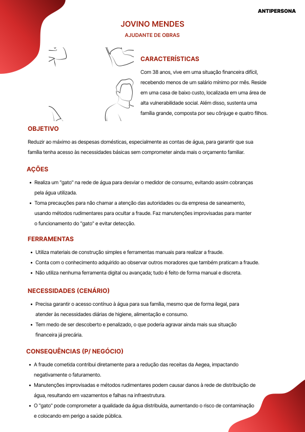

# Antipersona

## Sumário

[1. Antipersona](#c1)

[1.1. Contexto com o projeto](#c1.1)

[2. Antipersona - Má usabilidade do sistema](#c2)

[3. Antipersona - Fraudador](#c3)

# 1. Antipersona

&emsp;&emsp; Uma antipersona é uma representação fictícia de um perfil de usuário que exemplifica pessoas que não utilizam o produto da forma correta. Diferente da persona, que descreve o usuário-alvo ideal, a antipersona ajuda a identificar e entender os perfis que podem levar a interações problemáticas ou a falhas na adoção do produto. 

## 1.1 Contexto com o projeto

&emsp;&emsp; No contexto do projeto de detecção de fraudes no consumo de água, a criação de uma antipersona é importante para antecipar os desafios que podem surgir ao usar o sistema de Machine Learning. Neste caso, construiu-se dois usuários que podem impactar o projeto, sendo eles: 

1. Diretor da Aegea que, apesar de ter uma posição de alta responsabilidade, possui pouca familiaridade com ferramentas analíticas e de Machine Learning. O que pode resultar em uso inadequado do sistema, interpretação errônea dos dados e decisões enviesadas.
2. Da mesma forma, um usuário com dificuldades financeiras, que realiza fraudes para reduzir o custo da conta de água, pode levar a maiores dificuldades na identificação de fraudes.

# 2. Antipersona - Má usabilidade do sistema

&emsp;&emsp; Zyron Callas é o diretor de atendimento da Aegea, com 50 anos e uma longa trajetória no setor de saneamento. Embora esteja habituado a lidar com ferramentas digitais simples, como e-mails e apresentações, Zyron tem pouca experiência com softwares analíticos mais complexos. Seu principal objetivo é detectar fraudes no sistema de forma eficiente, garantindo que o processo de detecção seja eficaz e que as decisões tomadas tenham um impacto positivo tanto na redução das perdas financeiras quanto no aumento da eficiência operacional da Aegea.

Figura 1: AntiPersona Zyron Callas  
Fonte: Elaboração própria -- <a href="https://www.figma.com/proto/fPAIEC2dzyURX2BiaMcpel/Persona-e-AntiPersona?node-id=39-115&t=wkIc2Ua3Xhr72U7q-1&scaling=min-zoom&content-scaling=fixed&page-id=0%3A1 ">Link do figma</a>

# 3. Antipersona - Fraudador

&emsp;&emsp; Jovino Mendes, de 38 anos, vive em uma situação financeira difícil, recebendo menos de um salário mínimo por mês. Ele reside em uma casa de baixo custo, localizada em uma área de alta vulnerabilidade social, e sustenta uma família grande, composta por sua esposa e quatro filhos. Seu objetivo principal é reduzir ao máximo as despesas domésticas, especialmente as contas de água, para garantir que sua família tenha acesso às necessidades básicas sem comprometer ainda mais o orçamento familiar já apertado.

Figura 2: AntiPersona Jovino Mendes  
Fonte: Elaboração própria -- <a href="https://www.figma.com/proto/fPAIEC2dzyURX2BiaMcpel/Persona-e-AntiPersona?node-id=39-171&t=jzupuDFESgpM9gDx-1&scaling=min-zoom&content-scaling=fixed&page-id=0%3A1">Link do figma</a>