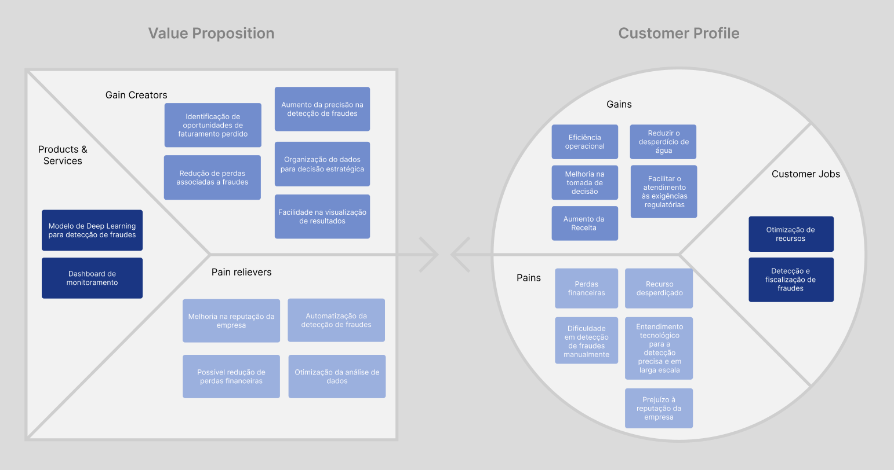
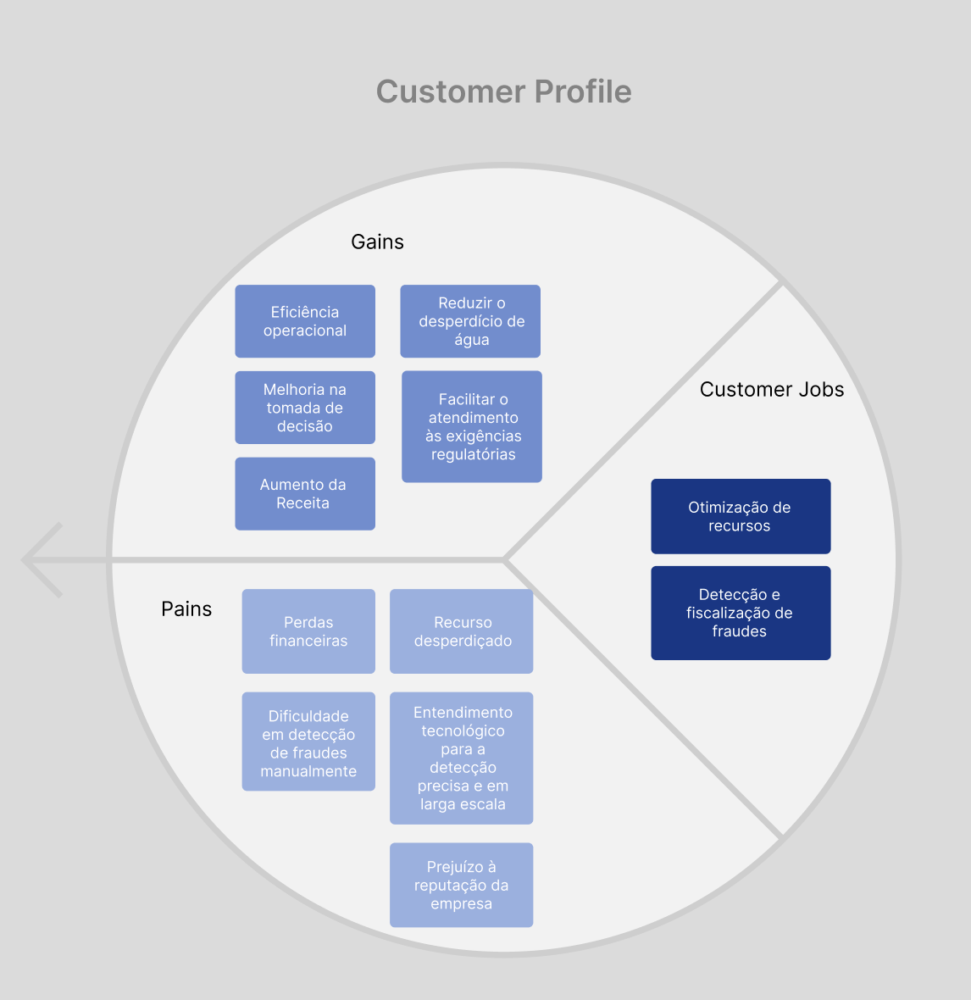
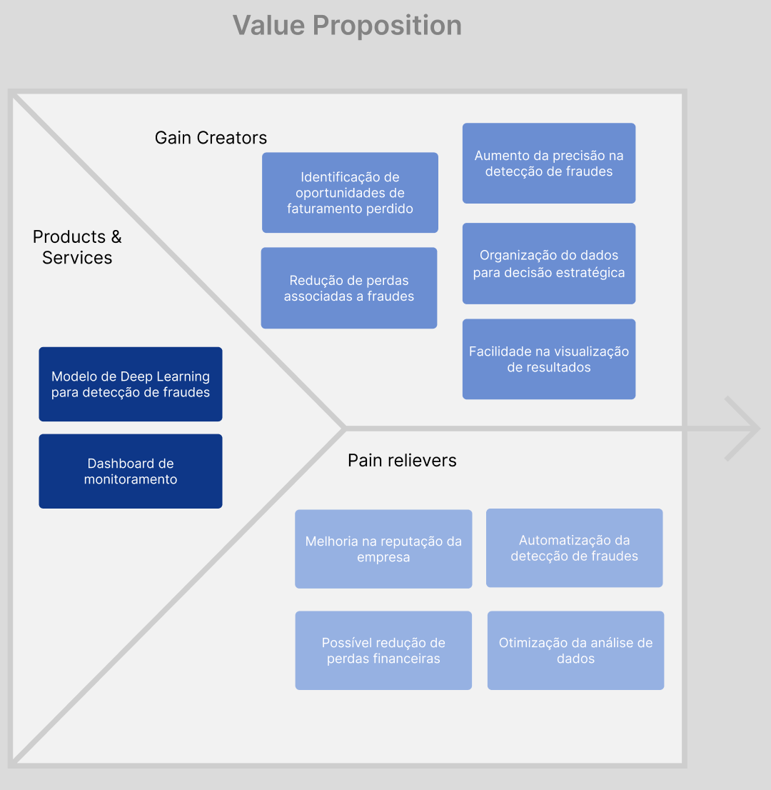

## Sumário

[1. Value Proposition Canvas](#c1)

[1.1 Customer Profile](#c2)

[1.2 Value Proposition](#c3)

 

# 1. Value Proposition Canvas

&emsp;&emsp; Este documento descreve o Value Proposition Canvas desenvolvido para o projeto de detecção de fraudes no consumo de água pela Aegea Saneamento e Participações S.A. O objetivo do projeto é melhorar a capacidade de identificação de fraudes e otimizar as operações da empresa.

Figura 1: Proposta de Valor   
Fonte: Elaboração própria

## 1.1 Customer Profile

### Customer Jobs
- **Otimização de recursos:** Garantir o uso eficiente de recursos humanos e tecnológicos.
- **Detecção e fiscalização de fraudes:** Identificar e mitigar fraudes no consumo de água.

### Pains
- **Perdas financeiras:** Fraudes no consumo de água que afetam diretamente a receita da empresa.
- **Recurso desperdiçado:** Alocação ineficiente de recursos em processos de detecção de fraudes.
- **Dificuldade em detecção de fraudes manualmente:** Falta de precisão e agilidade na identificação de fraudes de forma manual.
- **Entendimento tecnológico para a detecção precisa e em larga escala :** A empresa não tem uma equipe com o conhecimento para realizar modelos que detectam em larga escala essas fraudes.
- **Prejuízo à reputação da empresa:** Falhas na detecção de fraudes podem impactar negativamente a imagem da Aegea.

### Gains
- **Eficiência operacional:** Melhorar a eficiência dos processos de detecção de fraudes.
- **Melhoria na tomada de decisão:** Prover dados e insights precisos para decisões estratégicas.
- **Aumento da Receita:** Reduzir perdas financeiras através da detecção eficaz de fraudes.
- **Reduzir o desperdício de água:** Identificar e corrigir fraudes, diminuindo o desperdício.
- **Facilitar o atendimento às exigências regulatórias:** Assegurar conformidade com normas e regulamentações.

Figura 2: Customer Profile   
Fonte: Elaboração própria

## 1.2 Value Proposition

### Products & Services
- **Modelo de Deep Learning para detecção de fraudes:** Um modelo de Deep Learning que prevê comportamentos fraudulentos no consumo de água.
- **Dashboard de monitoramento:** Interface visual para análise e monitoramento dos resultados do modelo de detecção de fraudes.

### Pain Relievers
- **Automatização da detecção de fraudes:** Reduz a necessidade de intervenção manual, aumentando a precisão e a eficiência.
- **Possível redução de perdas financeiras:** Detecção mais precisa que minimiza o impacto financeiro de fraudes.
- **Otimização da análise de dados:** Garantir que os recursos sejam alocados de maneira eficiente.
- **Melhoria da reputação da empresa:** Um sistema eficaz de detecção de fraudes pode melhorar a imagem da Aegea.

### Gain Creators
- **Aumento da precisão na detecção de fraudes:** Alinha-se com a eficiência operacional, melhorando a eficácia e reduzindo a necessidade de recursos adicionais.
- **Organização do dados para decisão estratégica:** Apoia a melhoria na tomada de decisão, oferecendo dados claros e precisos para decisões estratégicas.
- **Identificação de oportunidades de faturamento perdido:** Relaciona-se com o aumento da receita, recuperando valores não faturados anteriormente.
- **Redução de perdas associadas a fraudes:** Contribui para a redução do desperdício de água, identificando rapidamente fraudes que causam essas perdas.

Figura 3: Value Proposition   
Fonte: Elaboração própria

## Conclusão

&emsp;&emsp; O Value Proposition Canvas desenvolvido fornece um alinhamento claro entre as necessidades dos clientes da Aegea e as soluções oferecidas pelo projeto de detecção de fraudes. Cada elemento foi considerado para garantir que a proposta de valor atenda aos principais desafios e oportunidades identificados.
