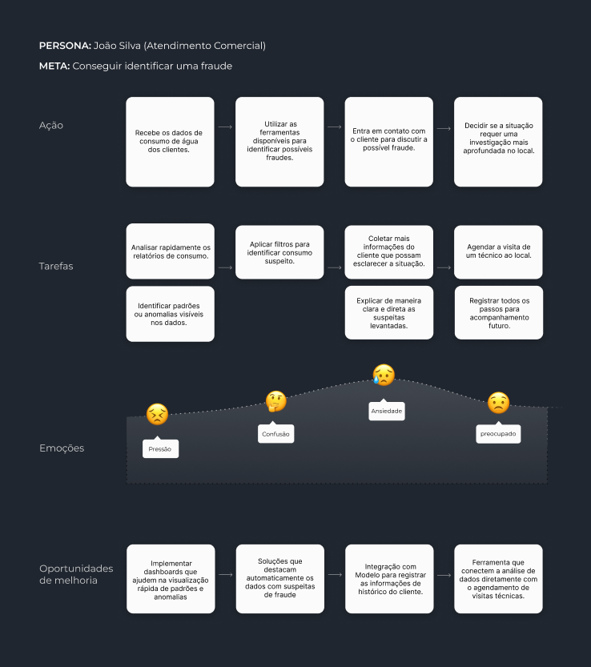

# Jornada do Usuário

No contexto do projeto de aplicação de Machine Learning para a detecção de fraudes no consumo de água, a **jornada do usuário** permite que a solução desenvolvida atenda às necessidades reais dos usuários. Mapeando as etapas que os usuários percorrem ao interagir com a nova aplicação, entendendo melhor o contexto de uso, identificar possíveis dificuldades e orientar o design para proporcionar uma experiência fluida e intuitiva. A abordagem permite que o modelo seja implementado para que os usuários, possam utilizar a aplicação de maneira eficiente, maximizando a precisão na identificação de fraudes e contribuindo para a melhoria do serviço de abastecimento de água.

> <a href="https://www.figma.com/design/dkzzrejRjeXxdKHLGHbwOk/Jornada-do-Usu%C3%A1rio?node-id=1-140&t=qh05GEQZYjPDiWrn-4">Link do Figma</a>