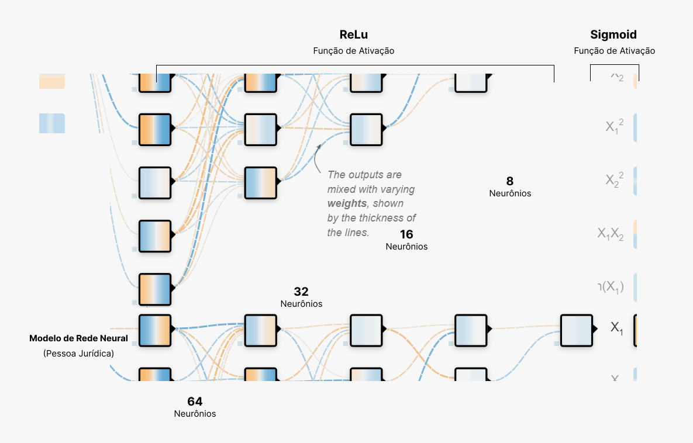

# Arquitetura

## Sumário

[1. Arquitetura do Sistema](#c1)

[2. Arquitetura do Modelo](#c2)


# <a name="c1"></a>1. Arquitetura do Sistema

## 1.1 Arquitetura macro


Fonte: Autores

### 1.1.1 Visão geral

A arquitetura apresentada no diagrama segue um fluxo de trabalho típico em projetos de machine learning, estruturada em várias etapas para processar dados e gerar insights acionáveis. 

### 1.2.1 Fluxo de trabalho

- **FONTE DE DADOS** : Corresponde à origem dos dados utilizados no processo. As fontes podem variar desde bancos de dados internos, APIs e arquivos CSV. A qualidade e relevância dos dados obtidos aqui são fundamentais para o sucesso de todo o pipeline.
  
- **INGESTÃO E PRÉ-PROCESSAMENTO DE DADOS** : Esta etapa combina a ingestão de dados com o pré-processamento. Durante a ingestão, os dados são extraídos do local de armazenamento e submetidos a uma análise inicial. Em seguida, os dados passam pelo pré-processamento, que envolve a limpeza (remoção de valores nulos, tratamento de outliers), transformação (normalização, padronização), e codificação de variáveis categóricas. Além disso, há a seleção e criação de features relevantes para o modelo.
A ingestão garante a transferência íntegra dos dados para análise, enquanto o pré-processamento os prepara para um modelo de machine learning mais robusto e preciso.

- **ARMANZENAMENTO DE DADOS**: Por necessidade do time, após as transformações dos dados, eles são armazenados como em apenas 1 dataset, a fim de facilitar na entrada do modelo.
  
- **MODELO DEEP LEARNING**: Nesta etapa, os dados pré-processados são usados para treinar um modelo de deep learning. Este modelo será utilizado para predizer ações de possíveis fraudes ou não (1/0). Modelos de deep learning, como redes neurais profundas, são capazes de detectar padrões não lineares e altamente complexos nos dados. Por isso, tal escolha foi realizada, com base na complexidade dos dados, não contento informações diretamente ou inversamente proporcinais, fator que dificulda a observação de padrões.

- **DASHBOARD**: Após o modelo ser treinado e aplicado, os resultados são visualizados e apresentados em dashboards interativos. Essas ferramentas são essenciais para a tomada de decisão, visto que, o usuário poderá visulizar as possíveis fraudes de consumo de água, garantindo assim maior assertividade nas visitas técnicas ou corte de água.
A visualização clara e precisa dos resultados facilita a compreensão dos dados e a implementação de ações estratégicas baseadas nos insights obtidos.


## 1.2 Arquitetura


Fonte: Autores

<br>


Fonte: Autores

<br>

### 1.2.1 Visão Geral

As arquiteturas apresentadas foram desenvolvidas para abordar de maneira eficiente e escalável a análise de dados complexos provenientes de diversas fontes. O principal objetivo ao utilizar essa arquitetura é criar um sistema robusto que possa lidar com grandes volumes de dados de diferentes naturezas, realizar o pré-processamento necessário e aplicar modelos de deep learning para extrair insights valiosos, como a detecção de fraudes e predição de consumo. Por tanto, estruturamos a arquitetura que demonstra o fluxo de cada informação pertencente ao projeto em primórdio, e logo em seguida, realizamos a distribuição de cada etapa até a visualização.

### 1.2.2 Justificativas

A arquitetura foi projetada para integrar dados de diferentes origens, como fraudes, consumo e clima. Essa integração permite uma análise mais rica e contextualizada, essencial para a precisão dos modelos de deep learning.

Ao estruturar o pipeline de ingestão e preparação de dados, garantimos que as informações sejam processadas de forma eficiente. O uso de scripts dedicados para ingestão e pré-processamento assegura que os dados estejam limpos, normalizados e prontos para serem utilizados nos modelos.

A arquitetura suporta o escalonamento horizontal e vertical, permitindo que o sistema cresça conforme a demanda. Isso é crucial em cenários onde o volume de dados pode aumentar significativamente ao longo do tempo, visto que, trata-se de dados de consumos arrecadados mensalmente sobre cada usuário do serviço.

A escolha por modelos de deep learning é justificada pela capacidade desses algoritmos de identificar padrões complexos e não-lineares nos dados, resultando em previsões mais precisas e na detecção de anomalias como fraudes.

A inclusão de um dashboard e ferramentas de monitoramento permite que os resultados dos modelos sejam facilmente interpretados e acompanhados em tempo real. Isso facilita a tomada de decisões baseada em dados e garante que possíveis problemas sejam detectados e corrigidos rapidamente.


## 1.3 Arquitetura com tecnologias


Fonte: Autores

### 1.3.1 Visão Geral

Este documento técnico descreve a arquitetura de ferramentas apresentada, justificando a escolha de cada uma, que engloba a ingestão, preparação, armazenamento e visualização de dados para modelos de aprendizado profundo. A arquitetura foi projetada para integrar diferentes fontes de dados, além de permitir a criação e monitoramento de modelos preditivos, utilizando uma combinação de scripts em Python, APIs e frameworks de aprendizado de máquina.

### 1.3.2. Componentes da Arquitetura

A arquitetura é dividida em quatro seções principais: **Fonte de Dados**, **Ingestão de Dados**, **Preparação e Armazenamento de Dados** e **Visualização**.

**Fonte de Dados**

- **Dados Fraude (CSV):** Conjunto de dados que contêm informações históricas e/ou transacionais relacionadas a fraudes detectadas pela AEGEA.
- **Dados Consumo (CSV):** Contém registros sobre o consumo de água na região analisada , a fim de  auxiliar na detecção de anomalias ou padrões de consumo. Tal base também foi indicada pela AEGEA.
- **Dados Climáticos (API):** Dados obtidos de uma API climática (```!pip install meteostat```), que fornece informações sobre condições meteorológicas, que podem ser relevantes para entender variações no consumo.

**Ingestão de Dados**

- **Script Fraude:** Script Python responsável por processar e preparar os dados de fraude para análise. Isso pode incluir etapas como limpeza de dados, transformação e carregamento.
- **Script Consumo:** Script Python que trata os dados de consumo, realizando operações similares às descritas para o script de fraude, adequando os dados para serem utilizados em análises subsequentes.
- **API Climática:** Uma interface programática que coleta dados meteorológicos e os integra no fluxo de trabalho para complementar as análises baseadas nos dados de consumo.

**Preparação e Armazenamento de Dados**

- **Script AEGEA:** Um script central que combina e prepara os dados de fraude e consumo, possivelmente utilizando informações climáticas, para formar um dataset unificado, denominado "Dados AEGEA".
- **Dados AEGEA (CSV):** Este é o dataset final, que contém todas as informações necessárias para o treinamento de modelos de aprendizado profundo.
- **Modelos de Deep Learning (Keras):**
    - **Modelo Deep Learning (PJ):** Modelo de aprendizado profundo treinado para prever comportamentos ou detectar fraudes em contextos corporativos (Pessoa Jurídica).
    - **Modelo Deep Learning (PF):** Modelo similar ao PJ, mas focado em prever comportamentos ou detectar fraudes em contextos individuais (Pessoa Física).
- **API Modelo (Flask):**
    - **API Modelo - PJ:** API desenvolvida com Flask que expõe o modelo de deep learning para Pessoa Jurídica.
    - **API Modelo - PF:** API que serve o modelo de deep learning para Pessoa Física.

**Visualização**

- **Dashboard:** Interface gráfica onde os resultados dos modelos são apresentados, permitindo uma análise visual e interativa dos dados preditivos.
- **Monitoramento (TensorFlow):** Módulo para monitoramento contínuo dos modelos de deep learning, verificando a performance e o comportamento em tempo real.
- **REST API:** Serve como ponte entre as APIs dos modelos (PJ e PF) e o Dashboard, facilitando a integração e comunicação entre diferentes partes da arquitetura.

### 1.3.3. Fluxo de Dados

1. Os dados de fraude, consumo e climáticos são ingeridos através de scripts e APIs dedicadas.
2. Esses dados são então processados e integrados pelo Script AEGEA para formar um dataset unificado.
3. O dataset AEGEA é usado para treinar modelos de deep learning, que são expostos via APIs Flask.
4. As APIs Flask alimentam um Dashboard através de uma REST API, onde os resultados podem ser visualizados e monitorados em tempo real.

### 1.3.4. Tecnologias Utilizadas

- **Python:** Linguagem principal para scripts de processamento de dados.
- **Keras:** Biblioteca de deep learning usada para criar e treinar os modelos.
- **Flask:** Framework para construir APIs em Python.
- **REST API:** Para integração e comunicação entre diferentes componentes do sistema.
- **TensorFlow:** Utilizado para o monitoramento dos modelos de deep learning.
- **Dashboard:** Ferramenta para visualização e análise dos resultados.

## 1.4 Considerações Finais

Essa arquitetura foi desenhada para ser modular e escalável, permitindo a inclusão de novos dados, modelos e ferramentas de monitoramento de forma flexível. A separação clara entre ingestão, processamento e visualização garante que cada etapa possa ser otimizada individualmente, resultando em um sistema robusto e eficiente.


# <a name="c2"></a>2. Arquitetura do Modelo

Uma arquitetura de rede neural é a estrutura que define como os dados fluem e são processados dentro do modelo, envolvendo a organização das camadas e a forma como elas se conectam. Sua adequação é importante para determinar como o modelo aprenderá a partir dos dados, impactando diretamente a precisão e a eficiência das previsões. Uma boa arquitetura pode melhorar o desempenho do modelo, tornando-o mais preciso em resolver o problema. Além disso, com um bom planejamento ajuda a evitar problemas como overfitting e underfitting, garantindo que o modelo generalize bem para novos dados.

Para o projeto atual de detecção de fraudes no consumo de água para a Aegea, foram criados dois modelos: um específico para a análise de pessoas físicas (PF) e outro para a análise de pessoas jurídicas (PJ). Isso foi necessário porque, ao analisar os dados, ficou evidente que os padrões de consumo diferem entre PF e PJ. Um único modelo poderia introduzir vieses ao não considerar essas diferenças.

Nas camadas ocultas de ambos os modelos, foi utilizada a função de ativação **ReLU** (Rectified Linear Unit). A ReLU é usada em redes neurais por ser eficiente e simples, ativando neurônios apenas quando o valor de entrada é positivo, o que ajuda a evitar problemas e a acelerar o treinamento do modelo. Na camada de saída dos dois modelos, aplicou-se a função de ativação **sigmoide**. Ela transforma os valores de saída em uma escala de 0 a 1, tornando-a ideal para tarefas de classificação binária, como a detecção de fraudes. Ela permite que o modelo atribua uma probabilidade à classe positiva, facilitando a interpretação dos resultados.

## 2.1 Modelo Pessoa Jurídica (PJ)

A imagem abaixo apresenta uma representação gráfica da arquitetura criada para o modelo PJ. Os neurônios exibidos representam uma parte da estrutura completa, que conta com 4 camadas ocultas (além da entrada e saída de dados), contendo, respectivamente, 64, 32, 16 e 8 neurônios.

Essa configuração segue uma **arquitetura em pirâmide** ou **arquitetura em funil**, onde o número de neurônios diminui progressivamente em cada camada. Essa abordagem é utilizada para capturar características mais complexas nas camadas iniciais e, em seguida, refinar essas características à medida que o modelo avança para camadas mais profundas.



Fonte: Autores

## 2.2 Modelo Pessoa Física (PF)

A imagem abaixo apresenta uma visualização da arquitetura criada para o modelo PF. Os neurônios exibidos representam uma parte da estrutura completa, que conta com 5 camadas ocultas (além da entrada e saída de dados), cada uma contendo 64 neurônios.

Diferente do modelo PJ, onde foi aplicada uma arquitetura em pirâmide, no modelo PF optou-se por manter a quantidade de 64 neurônios em todas as camadas ocultas. Essa configuração visa proporcionar uma maior capacidade de captura e processamento de padrões complexos, preservando o mesmo nível de detalhe ao longo de todas as camadas. 


Fonte: Autores

## 2.3 Comparação dos modelos

A tabela abaixo destaca as principais diferenças entre as arquiteturas dos modelos PF e PJ, mostrando como cada um foi adaptado para capturar os padrões específicos de consumo de água de seus datasets.

| **Característica**              | **Modelo PF**                                                                                                 | **Modelo PJ**                                                                                                 |
|---------------------------------|----------------------------------------------------------------------------------------------------------------|----------------------------------------------------------------------------------------------------------------|
| **Número de Camadas Ocultas**   | 5                                                                                                              | 4                                                                                                              |
| **Neurônios por Camada**        | 64, 64, 64, 64, 64                                                                                             | 64, 32, 16, 8                                                                                                  |
| **Função de Ativação Oculta**   | ReLU                                                                                                            | ReLU                                                                                                            |
| **Função de Ativação na Saída** | Sigmoide                                                                                                        | Sigmoide                                                                                                        |
| **Dropout**                     | Não aplicado                                                                                                    | Aplicado após cada camada oculta para evitar overfitting                                                        |
| **Forma de Arquitetura**        | Estrutura fixa com o mesmo número de neurônios em todas as camadas ocultas                                      | Arquitetura em pirâmide/funil, com número de neurônios decrescente em cada camada oculta                        |
| **Tamanho da Camada de Entrada**| 75 neurônios                          | 94 neurônios         |
| **Objetivo**                    | Mais camadas ocultas com o mesmo número de neurônios para capturar padrões complexos em dados de Pessoa Física   | Arquitetura mais simplificada e compacta, projetada para diferenciar padrões em dados de Pessoa Jurídica        |

<br>

## 2.4 Conclusão

A arquitetura atual dos modelos está adaptada às diferenças entre pessoas físicas e jurídicas. No entanto, há espaço para aprimoramento. Na Sprint 3, serão aplicados ajustes nos hiperparâmetros para aprimorar a performance dos modelos. Essas modificações podem levar a alterações na arquitetura existente, com o objetivo de melhorar ainda mais a precisão e a eficiência das previsões.