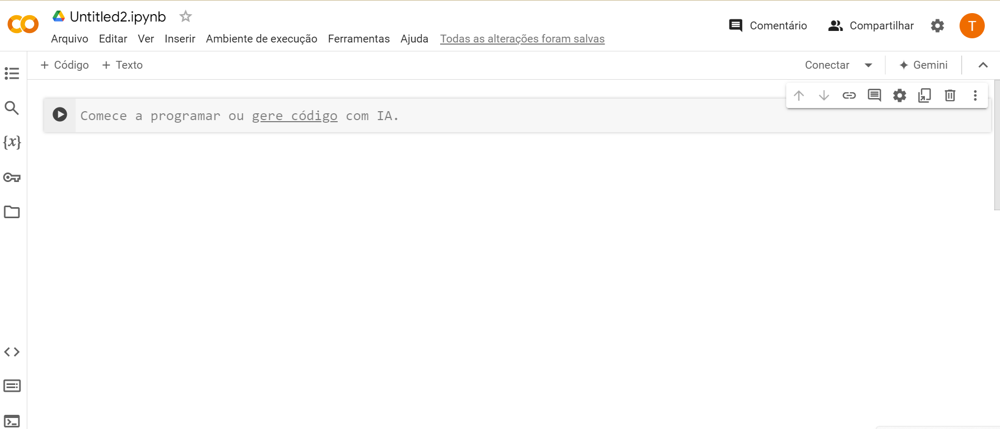
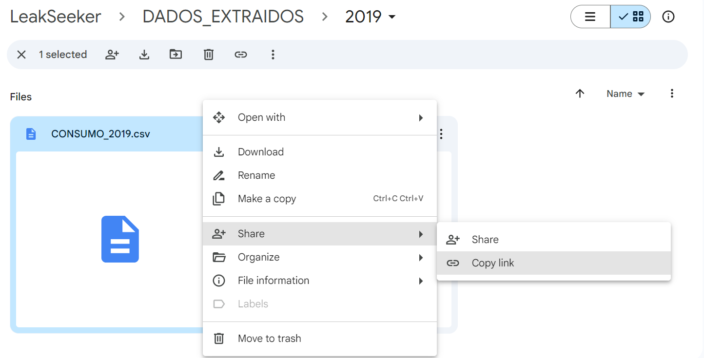
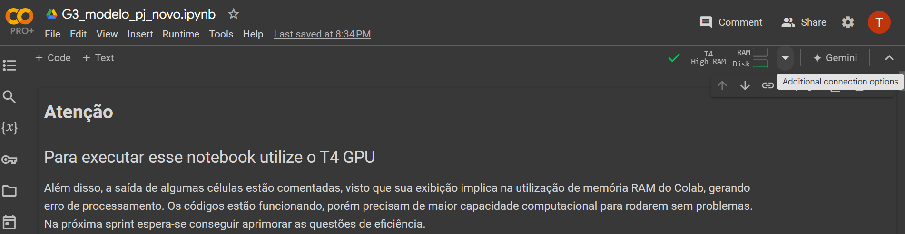
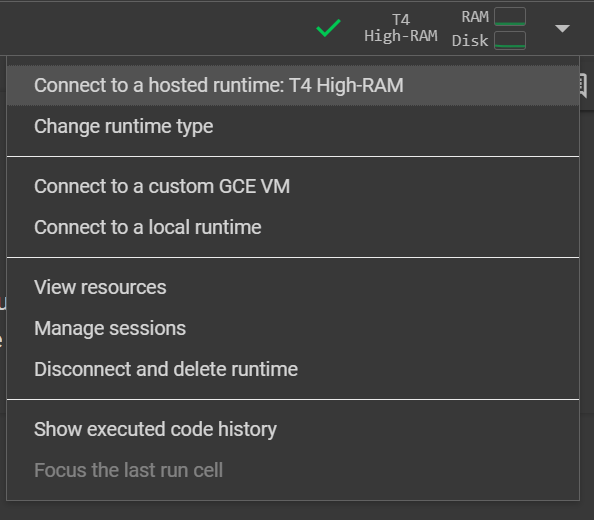
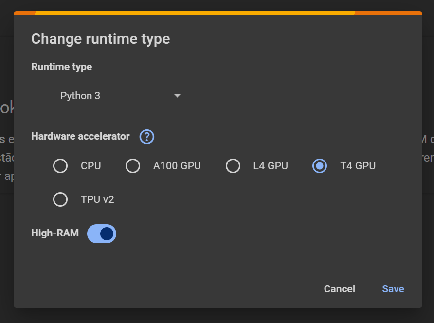
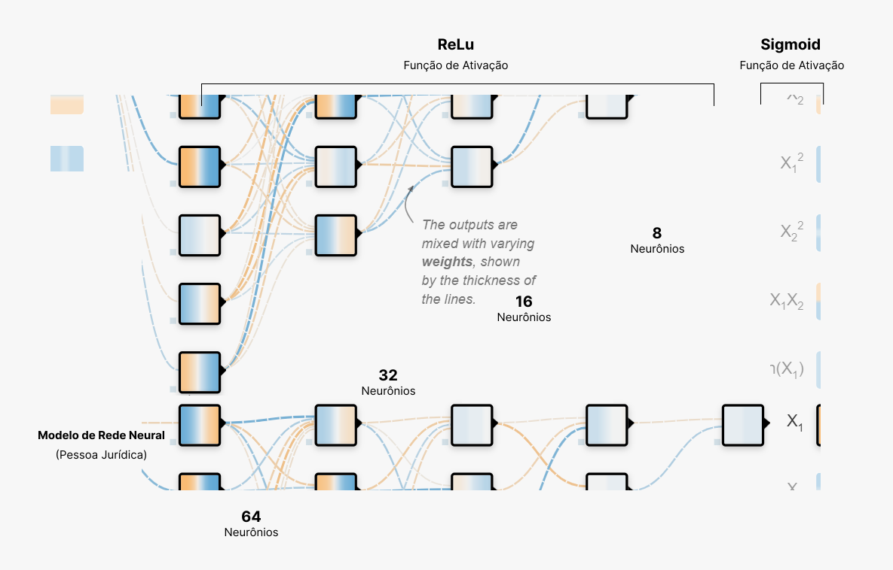
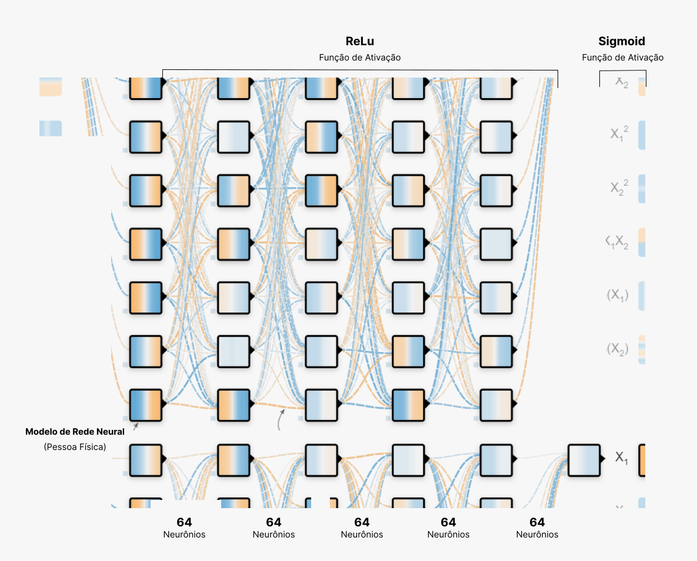
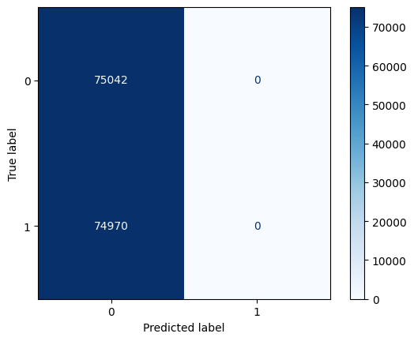
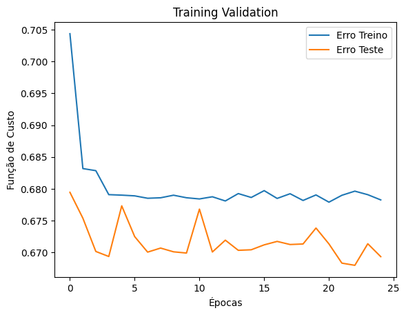

## Sumário

[1. Introdução](#c1)

[2. Objetivos](#c2)

[3. Pré-requisitos](#c3)

[4. Modelo PJ](#c4)

[5. Modelo PF](#c5)

[6. Interpretação de saídas](#c6)

[7. Conclusão](#c7)

[8. Referências](#c8)

<br>

# <a name="c1"></a>1. Introdução

&emsp;&emsp; Este guia orienta o uso do modelo de detecção de fraudes de água, projetado para identificar irregularidades no consumo dos clientes. O modelo, baseado em técnicas de deep learning, foi treinado com dados históricos de fraude e consumo para garantir predições precisas.

O documento fornece instruções detalhadas para configurar e integrar o modelo em ambientes operacionais, abordando desde o carregamento e processamento dos dados até a interpretação das saídas. Com exemplos práticos e orientações claras, este guia capacita o usuário a utilizar o modelo de forma a maximizar a eficiência na detecção das fraudes.

# <a name="c2"></a>2. Objetivos

- Objetivo geral

&emsp;&emsp; Fornecer um guia detalhado para a utilização do modelo de detecção de fraudes de água, assegurando que o parceiro possa integrar o modelo de forma eficaz em seus ambientes operacionais e utilizar suas funcionalidades para identificar e mitigar fraudes no consumo de água.

- Objetivos específicos

     - Explicar como carregar e configurar o modelo de detecção de fraudes de água.
     - Demonstrar como preparar os dados de entrada para o modelo.
     - Orientar sobre como realizar chamadas ao modelo para predições de fraude.
     - Instruir sobre a interpretação das saídas geradas pelo modelo.
     - Oferecer exemplos práticos de uso do modelo em cenários reais.
     - Sugerir práticas para otimizar a performance do modelo e a integração com os sistemas existentes.
     - Fornecer diretrizes para a manutenção e atualização contínua do modelo conforme novas necessidades surgem.

# <a name="c3"></a>3. Pré-requisitos


- Ambiente de desenvolvimento 

&emsp;&emsp; Para a utilização do modelo, deve-se ter o python configurado na versão 3.7 ou superior. 
&emsp;&emsp; Existem plataformas que suportam desenvolvimento como:

               - Google Colaboratory: Ideal configurações rápidas e acesso a GPUs para acelerar o treinamento e inferência do modelo. Além disso, permite fácil colaboração e compartilhamento de notebooks.

               - Jupyter Notebook: Excelente para desenvolvimento interativo e visualização imediata dos resultados. Recomendado para exploração de dados e ajustes finos no modelo.

               - Visual Studio Code (VS Code): Perfeito para quem deseja uma integração robusta com controle de versão (Git) e uma interface mais completa para desenvolvimento de código, permitindo também depuração avançada.

&emsp;&emsp; Em suma, no projeto foi utilizado o *Google Colaboratory*, a fim de todo o grupo obtivesse visualização rápidas sobre cada passo até a construção do modelo. Por tanto, visto a estruturação já feita, indica-se a utilização da mesma ferramenta. 
Entretanto, caso o uso de outras seja o ideal conforme o time que usará, recomenda-se a leitura do tópico sobre a preparação de ambiente.

- Preparação de ambiente

&emsp;&emsp; Google Colab é uma plataforma baseada na nuvem que permite executar código Python em notebooks. Você não precisa configurar nada localmente, pois o ambiente vem pré-configurado com a maioria dos pacotes necessários.
          - Passos a passo:
               1. Acesso à Google Colaboratory:

              Acesse ao Google drive. Clique em Novo -> Mais -> Google Colaboratory (Figura 1)


Figura 1: Caminho para acesso ao Google Colab  <br>
Fonte: Elaboração própria <br><br>

               2. Criação de um novo notebook:

               Ao clicar no nome da ferramenta, um novo notebook será aberto automaticamente. 


Figura 2: Novo notebook <br>
Fonte: Elaboração própria <br><br>

               3. Instalação de Pacotes:

               Muitos pacotes já estão pré-instalados. No entanto, você pode instalar qualquer pacote adicional utilizando o comando '!pip install'. 

               ```
               pip install pandas numpy scikit-learn keras tensorflow flask requests gdown

               ```

               4. Upload de arquivos 
              Nesse momento, pensando na utilização do Google Colab por qualquer pessoa que precise carregar as informações sem acessos específicos, utilizamos a biblioteca   ``` gdown ``` para converter automaticamente o link de compartilhamento em download.

               ```
               arquivo_destino_base = "dataset_{}.csv"

               id = {
                    'fraude_histo': '1Yils9N2z5V_8SJLrmxtiIbauWFJ3WmWm' 
                    # ID presente no final do link de compartilhamento do Google Drive
               }

               dataframes = {}

               for key, file_id in id.items():
               url = f"https://drive.google.com/uc?id={file_id}"
               arquivo_destino = arquivo_destino_base.format(key)

               gdown.download(url, arquivo_destino, quiet=False)
               df = pd.read_csv(arquivo_destino, sep=",")
               dataframes[key] = df
               ```

Figura 3: Link de compartilhamento do Google Drive <br>
Fonte: Elaboração própria <br><br>

- Fontes de dados

&emsp;&emsp; A fim de que o modelo desenvolvido faça previsões assertivas sobre o consumo fraudulento de água, é necessário obter bases de dados com os requisitos adequados. Ressalta-se como requisitos elementares, um volume significativo de dados, serialidade temporal, exemplos de targets (fraudes) já identificadas manualmente e informações externas complementares.

**Dados Fraude (CSV):** Conjunto de dados que contêm informações históricas e/ou transacionais relacionadas a fraudes detectadas pela AEGEA. Esse conjunto é formado por 1 arquivo de 19.014KB.

**Dados Consumo (CSV):** Contém registros sobre o consumo de água na região analisada, a fim de  auxiliar na detecção de anomalias ou padrões de consumo. Tal base também foi indicada pela AEGEA. Nessa composição, temos 6 bases diferentes, referentes aos anos de 2019, 2020, 2021, 2022, 2023 e 2024. Respectivamente, cada um dos arquivos possuem 195.213KB, 206.254KB, 206.911KB, 205.426KB , 210.8MB e 124.9 MB

**Dados Climáticos (API):** Dados obtidos de uma API climática (```!pip install meteostat```), que fornece informações sobre condições meteorológicas, que podem ser relevantes para entender variações no consumo. 

- Scripts necessários

&emsp;&emsp; No desenvolvimento de um modelo de detecção de fraudes, a preparação e o processamento dos dados são etapas cruciais que influenciam diretamente a eficácia e a precisão do modelo final. Para garantir que os dados sejam manipulados de forma consistente e eficiente, a utilização de scripts específicos é essencial. 

**Script Fraude:** Este script é responsável por extrair, limpar e formatar os dados fraudulentos. Como os dados de fraude geralmente são sensíveis e apresentam complexidade devido a vários cenários de fraude, é necessário garantir que todos os dados sejam padronizados e livres de inconsistências antes de serem utilizados pelo modelo. 

**Script Consumo:** Script Python que trata os dados de consumo, realizando operações similares às descritas para o script de fraude. Este script garante que os dados de consumo estejam prontos para serem correlacionados com os dados de fraude, permitindo que o modelo de detecção funcione de maneira eficiente

**API Climática:** Uma interface programática que coleta dados meteorológicos e os integra no fluxo de trabalho para complementar as análises baseadas nos dados de consumo.

# <a name="c4"></a>4. Modelo PJ
&emsp;&emsp; Os modelos desenvolvidos utilizam as bibliotecas TensorFlow e Keras. TensorFlow é uma biblioteca de código aberto desenvolvida pelo Google, projetada para tarefas de machine learning e deep learning. Ela é extremamente poderosa e flexível, permitindo que os desenvolvedores criem, treinem e implantem modelos complexos de aprendizado de máquina em diferentes plataformas, incluindo CPUs, GPUs e TPUs. Já o Keras é uma API de alto nível que roda em cima de TensorFlow, tornando o desenvolvimento de modelos de deep learning mais acessível e intuitivo. Foi projetada para ser fácil de usar, permitindo que desenvolvedores e pesquisadores criem e experimentem rapidamente com diferentes arquiteturas de redes neurais.

&emsp;&emsp; A solução descrita nessa seção considera as particularidades do consumo por Pessoa Jurídica (PJ), onde certos comportamentos, como o alto consumo de água ou o não pagamento de faturas, podem ser comuns e não necessariamente indicam fraude. Isso foi destacado pelo cliente, que indicou que alguns clientes PJ possuem práticas de pagamento diferenciadas, o que deve ser considerado para evitar enviesar o modelo. Portanto, foi desenvolvido dois modelos diferentes, respectivos às particularidades de consumo de cada grupo, PF E PJ.

&emsp;&emsp; Além do mais, este notebook foi projetado para ser executado na GPU T4, devido à complexidade e ao volume de dados. Executá-lo em máquinas com menor capacidade pode resultar em erros ou em desempenho insuficiente.
Caso precise modificar, dentro do Google Colaboratory, a capacidade de processamento:


Figura 4: Passo 1 para acessar a capacidade de processamento GPU T4 <br>
Fonte: Elaboração própria <br><br>


Figura 5: Passo 2 para acessar a capacidade de processamento GPU T4 <br>
Fonte: Elaboração própria <br><br>


Figura 6: Passo 3 para acessar a capacidade de processamento GPU T4 <br>
Fonte: Elaboração própria <br><br>


- Preparação 

&emsp;&emsp; Esta seção aborda a preparação dos dados para garantir que estejam prontos para o treinamento do modelo. 

&emsp;&emsp; É importante dividir os dados em conjuntos de treinamento e validação, garantindo que o modelo possa ser avaliado de forma justa.

&emsp;&emsp; O modelo é composto por várias camadas densas (Dense layers) que utilizam a função de ativação ReLU (Rectified Linear Unit). A camada final utiliza a ativação sigmoide (sigmoid) para transformar as saídas em uma probabilidade binária, indicando a presença ou ausência de fraude.

- Camadas

Primeira Camada: Recebe a entrada com 75 características e aplica a função ReLU para capturar relações não lineares nos dados.

Camadas Intermediárias: As camadas subsequentes continuam a refinar a representação dos dados através de múltiplas transformações, mantendo a mesma função de ativação ReLU.

Camada de Saída: Reduz a dimensionalidade para uma única unidade, onde a função sigmoide converte a saída em uma probabilidade entre 0 e 1.


Figura 7: Modelo de rede neural para PJ <br>
Fonte: Elaboração própria <br><br>

- Compilação e Treinamento

O modelo é compilado utilizando o otimizador adam e a função de perda binary_crossentropy, apropriada para problemas de classificação binária. Além disso, é treinado por 13 épocas, com um tamanho de lote de 300 amostras. Durante o treinamento, o modelo ajusta seus pesos para minimizar a perda e melhorar a capacidade de prever fraudes com base nos dados de treinamento.

# <a name="c5"></a>5. Modelo PF

- Preparação 

&emsp;&emsp; Antes de treinar o modelo, os dados precisaram ser processados e preparados. Técnicas de normalização, como MinMaxScaler e RobustScaler, são aplicadas para escalar os dados, garantindo que todas as variáveis estejam na mesma faixa de valores.

&emsp;&emsp; Além disso, como a detecção de fraudes é um problema de classificação desbalanceado, onde a quantidade de casos de fraude é muito menor do que os casos legítimos, a técnica SMOTE (Synthetic Minority Over-sampling Technique) é utilizada para aumentar o número de exemplos da classe minoritária.

&emsp;&emsp; Por fim, o dataset é dividido em conjuntos de treino e validação utilizando a função train_test_split da biblioteca sklearn.

- Camadas

O modelo de rede neural é construído utilizando a API sequencial do Keras. Ele inclui várias camadas densas (Dense layers) e camadas de dropout para evitar overfitting. As camadas incluem:

Camadas de Entrada e Ocultas: Com função de ativação relu, essas camadas processam os dados de entrada e aprendem as representações internas.

Camada de Dropout: Aplicada para prevenir o overfitting, forçando o modelo a não depender demais de nenhum neurônio específico.

Camada de Saída: Usa a função de ativação sigmoid para produzir uma probabilidade binária indicando a presença ou ausência de fraude.

Compilação do Modelo: O modelo é compilado usando a função de perda binary_crossentropy e a métrica de accuracy para avaliação.

- Treinamento

O modelo é treinado utilizando os dados de treino por 25 épocas, com uma estratégia de early stopping para interromper o treinamento se a validação não melhorar após 5 épocas.


Figura 8: Modelo de rede neural para PF <br>
Fonte: Elaboração própria <br><br>

# <a name="c6"></a>6. Interpretação de saídas

- Modelo PF

&emsp;&emsp; Ao avaliar o desempenho de um modelo de deep learning, é fundamental entender como as diferentes saídas nos fornecem insights sobre a qualidade do modelo e sua capacidade de generalização. As formas de analisar saídas escolhidas pelo time desenvolvedor, a fim de fornecer boas análises, incluem a Matriz de Confusão e os Gráficos de Validação, cada uma fornecendo informações específicas sobre o comportamento do modelo em relação aos dados de treino e teste.

&emsp;&emsp; A Matriz de Confusão é uma ferramenta essencial para a análise de modelos de classificação. Ela nos permite visualizar o desempenho do modelo ao exibir as contagens de predições corretas e incorretas, categorizadas por cada classe do problema.


Figura 2: Matriz de Confusão PF <br>
Fonte: Elaboração própria <br><br>

&emsp;&emsp; A matriz de confusão apresentada revela que o modelo falhou em classificar corretamente qualquer instância da classe de fraude. Os resultados indicam que o modelo previu todas as instâncias como pertencentes à classe negativa (não fraude), ignorando completamente a classe positiva (fraude). 

&emsp;&emsp; Já o Gráfico de Validação corresponde à exibição da função de custo ao longo das épocas para os conjuntos de treinamento e teste. 


Figura 3: Validação de Treino Modelo PF<br>
Fonte: Elaboração própria <br><br>

&emsp;&emsp; O erro de treinamento (linha azul) diminui rapidamente nas primeiras épocas e se estabiliza em torno de 0.68, o que sugere que o modelo está aprendendo a partir dos dados de treino. A linha que representa o erro de teste (linha laranja) também mostra um comportamento semelhante ao erro de treinamento, com uma leve oscilação entre épocas. A proximidade das curvas de erro de treino e teste indica que o modelo não está sofrendo de overfitting significativo. Entretanto, a falta de uma diminuição do erro de teste sugere que o modelo pode não estar capturando corretamente as relações presentes nos dados.

&emsp;&emsp; Os resultados apresentados sugerem que o modelo pensado em dados de Pessoa Física (PF), na forma atual, não está apto para ser utilizado em produção. Será necessário revisitar a etapa de pré-processamento, possivelmente aplicando técnicas como balanceamento de classes ou aumento de dados para a classe minoritária, e explorar diferentes arquiteturas de rede neural para melhorar o desempenho.


# <a name="c7"></a>7. Conclusão

&emsp;&emsp; Este guia buscou fornecer um entendimento abrangente sobre o processo de implementação e utilização do modelo de detecção de fraudes de água, desde a configuração do ambiente até a aplicação prática em diferentes cenários de consumo. O uso de técnicas avançadas de deep learning, como redes neurais, aliado à preparação adequada dos dados e à escolha cuidadosa das ferramentas e bibliotecas, garante que o modelo possa oferecer previsões precisas e relevantes para a identificação de fraudes.

&emsp;&emsp; Ao seguir as diretrizes e exemplos apresentados, os usuários são capacitados a integrar o modelo em seus ambientes operacionais, a realizar ajustes conforme necessário e a interpretar as saídas de maneira que facilite a tomada de decisões informadas. A segmentação entre clientes Pessoa Jurídica (PJ) e Pessoa Física (PF) permite uma abordagem mais direcionada e eficaz, respeitando as particularidades de cada grupo.


# <a name="c8"></a>8. Referências
