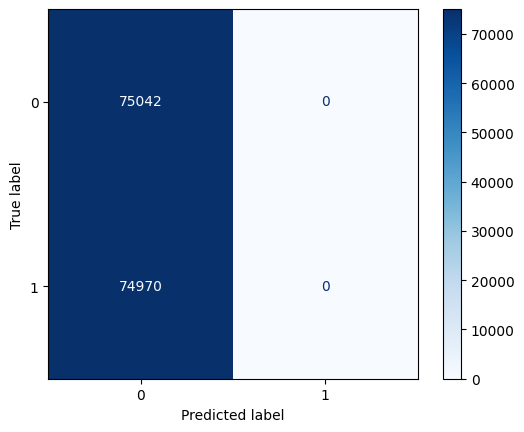
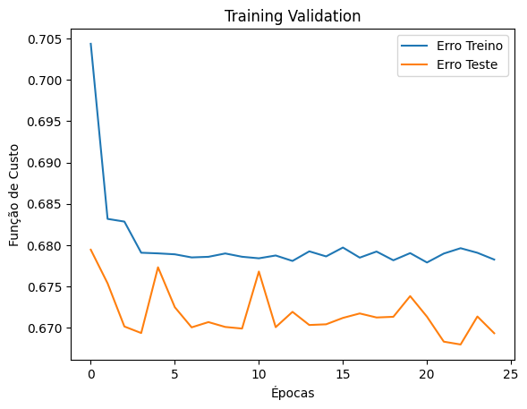

## Sumário

[1. Introdução](#c1)

[2. Modelo PJ](#c2)

[3. Modelo PF](#c3)

[4. Conclusão](#c4)

 

# 1. Introdução

&emsp;&emsp; Os modelos a seguir foram desenvolvidos com o objetivo de detectar fraudes no consumo de água para a Aegea. Tais fraudes, como a manipulação de hidrômetros e ligações clandestinas, comprometem não apenas o faturamento e a qualidade do serviço, mas também podem causar danos à infraestrutura e representar riscos à saúde pública.

&emsp;&emsp; Decidimos criar dois modelos distintos após analisar os dados e identificar comportamentos de consumo diferentes entre pessoas físicas (PF) e pessoas jurídicas (PJ). Ao utilizar apenas um modelo, correríamos o risco de introduzir vieses, prejudicando a precisão e a eficácia na detecção das fraudes. A separação dos modelos permitiu uma análise mais direcionada, ajustando as técnicas utilizadas de acordo com as características específicas de cada público.

# 2. Modelo PJ

## 2. Preparação dos Dados

&emsp;&emsp; A preparação dos dados foi feita um pouco diferente no modelo para pessoas jurídicas, no qual separamos um código mais consolidado e encapsulado com funções de tratamento e preparação (neste caso adicionamos mais um arquivo na pasta modelo, para mostrar o processo de preparação no modelo PJ). Optamos por essa abordagem para garantir a modularidade do código e a facilidade de ajustes futuros.

### 2.1 Escolha de Features Relevantes

&emsp;&emsp; Durante a análise exploratória, identificamos que certas colunas, como `CONS_MEDIDO` e a sua distribuição histórica, apresentaram maior relevância para a detecção de fraudes em comparação com outras colunas, como as de volume. Essas colunas foram escolhidas com base na correlação observada com eventos de fraude, o que indicou uma maior capacidade de distinguir padrões anômalos.

### 2.2 Inferência da Coluna DESCRICAO_OCORRENCIA

&emsp;&emsp; Outro ponto muito relevante, que foi mapeado como um target para a coluna de pessoas físicas e foi utilizada como uma premissa de atuação para residencial também, foi a coluna `DESCRICAO_OCORRENCIA`, que documenta detalhes dos eventos relacionados ao processo de medição, ela foi identificada como um possível indicador de fraudes também para pessoas jurídicas (talvez aqui vale um olhar mais atento às possíveis descrições). Optamos por utilizar essa coluna, pois ela contém informações que podem refletir diretamente problemas relacionados a fraudes, como dificuldades no acesso ao medidor ou indícios de manipulação.

### 3. Separação do DataFrame

&emsp;&emsp; O DataFrame original foi filtrado para criar um novo conjunto de dados contendo apenas os registros de empresas classificadas como `PJ` (Pessoa Jurídica). Esse processo assegura que o modelo se concentre apenas nas linhas que correspondem às pessoas jurídicas. Essa abordagem visa evitar o viés que poderia ser introduzido se os dados de pessoas físicas e jurídicas fossem tratados em conjunto, dado que os padrões de consumo são significativamente diferentes. 

## 4. Normalização dos Dados

&emsp;&emsp; A normalização dos dados foi realizada utilizando o `RobustScaler`, que subtrai a mediana e divide pela amplitude interquartil (IQR). Este método foi escolhido por sua robustez contra outliers, comuns em dados financeiros e de consumo de empresas. Também realizamos a tentativa usando o MinMax Scaler que é uma técnica de normalização que transforma os dados para que estejam dentro de um intervalo específico, entre 0 e 1. Esse método é útil para ajustar os dados de diferentes escalas para que fiquem em um mesmo patamar, facilitando o treinamento de modelos de machine learning. Durante os testes, também experimentamos o uso do MinMaxScaler, que mostrou-se menos eficaz devido à sensibilidade a valores extremos presentes nos dados.

## 5. Balanceamento dos Dados

&emsp;&emsp; O balanceamento dos dados foi feito utilizando duas técnicas diferentes, o SMOTE de oversampling, e o RandomUnderSampler com undersampling. Essa combinação foi escolhida para assegurar que tanto a classe minoritária quanto a majoritária fossem tratadas adequadamente, melhorando a capacidade do modelo de identificar fraudes.

### 5.1 SMOTE (Synthetic Minority Over-sampling Technique)

&emsp;&emsp; Utilizamos o SMOTE para balancear o dataset, uma vez que havia um desbalanceamento significativo entre as classes (fraudes e não fraudes). O SMOTE aumenta a quantidade de amostras da classe minoritária gerando exemplos sintéticos, ajudando a melhorar a performance do modelo e garantindo que ele não favoreça excessivamente a classe majoritária. Essa técnica foi escolhida por ser uma abordagem comprovada em cenários onde a classe minoritária representa uma pequena fração dos dados.

### 5.2 RandomUnderSampler

&emsp;&emsp; O RandomUnderSampler foi utilizado para tratar desbalanceamento das classes na classificação, ele reduz o número de amostras da classe majoritária, escolhendo aleatoriamente amostras para remover, até que o número de amostras das duas classes seja aproximadamente o mesmo. Por exemplo, se houver 1000 amostras da classe "não fraude" e 100 da classe "fraude", o RandomUnderSampler pode reduzir as amostras da classe "não fraude" para 100. Optamos por essa abordagem para complementar o SMOTE, garantindo que o modelo não se tornasse enviesado para a classe majoritária.

## 6. Construção da Rede Neural

### 6.1 Estrutura do Modelo

&emsp;&emsp; A arquitetura da rede neural, para o modelo PJ, é composta por 6 camadas de 64 neurônios, organizadas de forma sequencial para o processo de identificação das fraudes. As primeiras 5 camadas, possuem a função de ativação Relu e a camada de saída possui uma função sigmoid. Segue abaixo uma demonstração da arquitetura do modelo:

&emsp;&emsp; Aqui escolhemos também manter as camadas sem qualquer utilização do dropout, por enquanto, por termos de teste. Isso porque foi definido por escolha, um olhar diferente na arquitetura do modelo PJ para um refinamento mais robusto para as próximas sprints. A decisão de usar 6 camadas e 64 neurônios foi baseada em experimentos com diferentes configurações. Camadas com menos neurônios mostraram menor desempenho, enquanto um número maior aumentava o tempo de treinamento sem ganhos significativos na precisão.

### 7. Análise de Treinamento e Teste

&emsp;&emsp; A partir da análise do gráfico acima, é possível inferir que o modelo está aprendendo com os dados de treinamento (diminuição do erro de treinamento), mas a diferença crescente entre o erro de treinamento e o erro de teste pode indicar overfitting, especialmente após a 10ª época. Implementar técnicas como Early Stopping ou Dropout pode ser considerado nas próximas sprints para mitigar esse problema.

&emsp;&emsp; Aqui também nos indica que o modelo está aprendendo e ajustando-se aos dados de treinamento, com a função de custo diminuindo ao longo das épocas. Esse comportamento reforça a necessidade de ajustes para melhorar a generalização.

#### 7.1 Análise Preliminar dos Resultados do Modelo

- **Accuracy (Acurácia):** 0.6654  
  Mede a proporção de previsões corretas em relação ao total de previsões. Indica o quão bem o modelo está acertando de forma geral.
   - **Validation Accuracy (Acurácia de Validação):** **0.6339**
     - Acurácia calculada nos dados de validação, que não foram usados para treinar o modelo. Serve para avaliar o quão bem o modelo está generalizando para novos dados.

- **Loss (Perda):** 0.6171  
  Representa a função de custo do modelo, que indica o quão ruim o modelo está em prever os dados de treinamento. O objetivo é minimizar essa perda durante o treinamento.
  - **Validation Loss (Perda de Validação):** **0.6741**  
     - Função de custo calculada nos dados de validação. Ajuda a identificar se o modelo está sofrendo de overfitting, ou seja, se está se ajustando muito bem aos dados de treinamento, mas não aos de validação.

- **Precision (Precisão):** 0.6973  
  Mede a proporção de previsões positivas corretas em relação a todas as previsões positivas feitas. Alta precisão significa que a maioria das previsões positivas do modelo estão corretas.
   - **Validation Precision (Precisão de Validação):** **0.6623**  
     - Mede a precisão das previsões positivas feitas pelo modelo nos dados de validação. Indica a capacidade do modelo de generalizar corretamente para novos dados.

# 3. Modelo PF

## 3.1 Preparação dos Dados

&emsp;&emsp; A preparação dos dados é um processo no desenvolvimento de modelos de machine learning e envolve uma série de etapas para transformar os dados brutos em um formato adequado para ser utilizado pela rede neural. Essas etapas foram adaptadas especificamente para capturar as nuances dos dados de consumo residencial.

### 3.1 Escolha de Features Relevantes

&emsp;&emsp; Durante a análise exploratória, feita na sprint 1, identificamos que a coluna **Consumo Medido** se mostrou mais consistente para validação do modelo em comparação à coluna de **Volume Estimado Acumulado** (e todas as colunas que se referem a volume). Isso sugere que **Consumo Medido** é uma feature mais robusta para a detecção de fraudes, apresentando resultados mais confiáveis. A escolha foi baseada na correlação com fraudes detectadas anteriormente, o que sugere uma relação direta entre essa variável e o comportamento anômalo.

### 3.2 Investigação da Coluna `DSC_OCORRENCIA`

&emsp;&emsp; A coluna `DSC_OCORRENCIA`, que descreve o processo de vistoria e coleta realizado em cada domicílio, foi identificada como um possível indicador de fraudes. A análise das ocorrências revelou que a maior parte dos problemas está relacionada a medidores de difícil acesso ou furtados, sugerindo manipulação ou fraude. A escolha foi baseada na correlação com fraudes detectadas anteriormente, o que sugere uma relação direta entre essa variável e o comportamento anômalo.

### 3.3 Separação do DataFrame

&emsp;&emsp; O DataFrame original foi filtrado para criar um novo conjunto de dados contendo apenas as matrículas classificadas como **Residencial**. Esse processo garantiu que o modelo em questão fosse somente de pessoas físicas. Essa decisão foi essencial para evitar que padrões comerciais ou industriais influenciassem negativamente o desempenho do modelo residencial.

### 3.4 One-Hot Encoding

&emsp;&emsp; Para preparar os dados, realizamos o One-Hot Encoding das colunas categóricas. Isso transformou variáveis categóricas em colunas binárias, permitindo que essas informações fossem usadas como features no modelo. Optamos pelo One-Hot Encoding para preservar a natureza não ordinal das variáveis categóricas e melhorar a precisão do modelo.

## 4. Normalização dos Dados

### 4.1. Normalização com Robust Scaler

&emsp;&emsp; A normalização dos dados foi realizada utilizando o **Robust Scaler**, que subtrai a mediana e divide pela amplitude interquartil (IQR). Esse método foi escolhido por sua robustez contra outliers, comuns em dados de consumo de água, como valores atípicos de consumo e volume. O uso do RobustScaler foi mais eficaz do que o MinMaxScaler nos testes realizados, mostrando maior capacidade de lidar com outliers sem comprometer o desempenho do modelo.

## 5. Balanceamento dos Dados

### 5.1. SMOTE (Synthetic Minority Over-sampling Technique)

&emsp;&emsp; Utilizamos o SMOTE para balancear o dataset, uma vez que havia um desbalanceamento significativo entre as classes (fraudes e não fraudes). O SMOTE aumenta a quantidade de amostras da classe minoritária gerando exemplos sintéticos, o que ajuda a melhorar a performance do modelo, garantindo que ele não favoreça excessivamente a classe majoritária.

## 6. Construção da Rede Neural

### 6.1. Estrutura do Modelo

&emsp;&emsp; A rede neural foi configurada com várias camadas densas intercaladas com camadas de Dropout para evitar overfitting. Cada camada densa utiliza a função de ativação **ReLU**, exceto a camada de saída, que usa a função **Sigmoid** para produzir uma probabilidade de fraude. A imagem abaixo mostra uma representação da arquitetura do modelo, feita na apresentação da Sprint 2.

Figura 1: Demonstração da Arquitetura da Rede Neural PF   
Fonte: Elaboração própria   

## 7. Treinamento do Modelo

### 7.1 Early Stopping

&emsp;&emsp; Implementamos o **Early Stopping** para monitorar a perda de validação e interromper o treinamento caso não houvesse melhora em 5 épocas consecutivas. Isso ajudou a prevenir overfitting, garantindo que o modelo não continuasse a treinar além do necessário.

### 7.2 Avaliação com Matriz de Confusão

&emsp;&emsp;  A matriz de confusão foi utilizada para avaliar o desempenho do modelo. Infelizmente, os resultados indicaram que o modelo falhou em classificar corretamente instâncias da classe de fraude, sugerindo que o modelo ainda precisa de ajustes.

Figura 2: Matriz de Confusão PF  
Fonte: Elaboração própria   

#### Problema Evidenciado

O modelo está prevendo todas as instâncias como a classe 0 (negativa) e nenhuma instância como a classe 1 (positiva). Isso significa que: O modelo tem uma taxa de falsos negativos muito alta (74970), ou seja, ele falhou em identificar corretamente qualquer instância da classe 1 (o que basicamente indica que ele tá "chutando" tudo o que é fraude ou não é e não identificando isso propriamente dito). A precisão do modelo para a classe positiva é zero, o que indica que o modelo não é capaz de distinguir entre as classes.

Neste caso, o ajuste dos termos de decisão, tomando como premissa que o modelo pode estar usando um limiar de decisão que favorece excessivamente a classe negativa, talvez devemos considerar o ajuste dos termos de decisão para um valor que equilibre melhor as previsões entre as duas classes. Outro ponto pode ser considerar e revisar o conjunto de features.

Mesmo assim, este problema já foi identificado, e sabendo disso iremos trabalhar para melhorar o modelo nas próximas sprints. Como foi discutido com os professores, o reconhecimento e identificação deste tipo de problema permeia o processo de ajuste nos modelos de rede neural. E nesta primeira versão do modelo este tipo de "erro" poderia acontecer visando o tempo de atribuição do conteúdo e das features selecionadas.

### 7.3 Análise dos Gráficos de Validação

&emsp;&emsp; O gráfico de validação mostrou que, embora o modelo tenha apresentado um erro de treino consistentemente menor que o erro de validação, a diferença entre os dois não foi muito grande, o que indica que pode haver potencial para melhorar a generalização do modelo.

Figura 3: Validação de Treino Modelo PF 
Fonte: Elaboração própria   

Figura 4: Precisão de Treinamento e Perda de Validação
Fonte: Elaboração própria   

&emsp;&emsp; O gráfico acima mostra as métricas de Precisão de Treinamento e Perda de Validação ao longo das épocas de treinamento. É possível visualizar que a Precisão de Treinamento parece aumentar rapidamente nas primeiras épocas e, em seguida, estabiliza-se em torno de 0.6, sugerindo que o modelo melhora inicialmente, mas depois atinge um platô de precisão. Do mesmo modo que a Perda de Validação não mostra uma tendência clara de diminuição ao longo das épocas. Isso pode indicar que o modelo não está generalizando bem para os dados de validação, o que pode ser sinal de subajuste, onde o modelo não está **complexo o suficiente** (ou talvez não esteja na melhor arquitetura final) para capturar os padrões dos dados, ou com a necessidade de mais ajustes nos hiperparâmetros.

&emsp;&emsp; Esse tipo de resultado nos dá um caminho para os próximos ajustes, como talvez teste de mais camadas, diferentes funções de ativação, maior entendimento do uso da regularização, ajuste de taxas de aprendizado, olhar para outras features ou até mesmo alteração no conjunto de dados de treinamento/validação (pensar em outros tipos de balanceamento, por exemplo).

### 7.4 Análise Preliminar dos Resultados

&emsp;&emsp; Como não é foco desta sprint, a análise será sucinta e passar nos pontos de melhoria só para maior entendimento do modelo.

### Cálculo das Médias dos Resultados (PF)

1. **Média da Acurácia (Accuracy):**
   - **Treinamento:** 59.31\%
   - **Validação:** 61.04\%

&emsp;&emsp; Mede a proporção de previsões corretas entre todas as previsões feitas; importante para avaliar o desempenho geral do modelo, especialmente quando as classes estão balanceadas.

2. **Média da Perda (Loss):**
   - **Treinamento:** 0.6811
   - **Validação:** 0.6719

&emsp;&emsp; A "Loss" representa a penalidade por erros nas previsões do modelo; é essencial para otimizar o modelo durante o treinamento, pois indica o quanto o modelo está se ajustando aos dados.

3. **Média da Precisão (Precision):**
   - **Treinamento:** 61.35\%
   - **Validação:** 62.96\%

&emsp;&emsp; A precisão é utilizada pra medoir proporção de verdadeiros positivos entre todas as previsões positivas; é usada em cenários onde o custo de falsos positivos é alto, como na detecção de fraudes.

4. **F1-Score:** 66% (_este rodamos várias vezes na mão e também junto ao modelo, no entanto a biblioteca que estavamos usando no código foi depreciada no tensor flow metrics_) 

&emsp;&emsp; O **F1-Score** é a nossa métrica target, ele combina a precisão (precision) e a revocação (recall) para fornecer uma única métrica que equilibra ambos. O resultado mencionado de cerca de **66%** indica um equilíbrio razoável entre a precisão e a capacidade de encontrar verdadeiros positivos, o que significa que o modelo consegue identificar corretamente uma parte razoável das instâncias positivas enquanto mantém uma quantidade aceitável de previsões corretas. No entanto, ainda há espaço para melhorias, especialmente para maximizar a detecção de uma classe particular (como fraudes).

&emsp;&emsp; O F1-Score é a nossa métrica target porque ele é muito relevante em cenários onde há um desbalanceamento de classes (por exemplo, fraudes representam uma pequena parte do total de casos) e onde tanto a precisão quanto a revocação são importantes. Uma pontuação de 66% é um ponto de partida razoável, mas indica que ainda há uma margem significativa para melhorar o desempenho do modelo.

# 4. Conclusão

&emsp;&emsp; Com base nos resultados obtidos pelos modelos desenvolvidos para a detecção de fraudes, percebemos que a abordagem de criar modelos distintos para pessoas físicas (PF) e pessoas jurídicas (PJ) se mostrou adequada, dado que ambos os modelos apresentaram comportamentos diferentes na identificação de padrões de fraude. No entanto, é evidente que ainda há espaço para melhorias em ambos os modelos, como indicam as métricas de desempenho e a análise dos gráficos de validação.

&emsp;&emsp; **Modelo PJ:** O modelo para pessoas jurídicas demonstrou uma capacidade razoável de aprendizado, mas sinais de overfitting após a 10ª época indicam que o modelo pode estar se ajustando excessivamente aos dados de treinamento, sem generalizar adequadamente para novos dados. **A implementação de técnicas como regularização, dropout, e ajuste dos hiperparâmetros pode ajudar a mitigar esse problema e melhorar a capacidade de generalização do modelo.** 

&emsp;&emsp; **Modelo PF:** O modelo para pessoas físicas apresentou um desempenho inicial positivo, mas os gráficos de validação sugerem um potencial problema de subajuste (underfitting). A precisão do modelo parece atingir um platô relativamente baixo, e a perda de validação não mostra uma tendência clara de diminuição, indicando que o modelo pode não estar capturando suficientemente bem os padrões nos dados. **Ajustes na arquitetura da rede, testes com novas funções de ativação e otimizações de hiperparâmetros serão necessários.**

&emsp;&emsp; Próximos passos identificados nessa sprint:
   - Seria interessante considerar técnicas como regularização, dropout ou early stopping para o modelo PJ
   -  Experimentar com arquiteturas mais complexas, incluindo mais camadas ou neurônios para o modelo PF
   -  Analisar novamente a relevância das features utilizadas, identificando possíveis melhorias ou novos atributos que possam agregar valor para ambos modelos
   -  Revisar o balanceamento dos dados de treinamento e validação para o modelo PF

&emsp;&emsp; À medida que avançamos nas próximas sprints, o foco será em aprimorar ambos os modelos para que possam identificar as fraudes de forma mais precisa e eficiente (sem cair na falácia do overfitting), garantindo uma solução robusta para a Aegea. As mudanças propostas serão implementadas após os testes e comprovação da sua utilidade, com análises contínuas dos resultados para assegurar a melhoria constante da performance de ambos os modelos.
