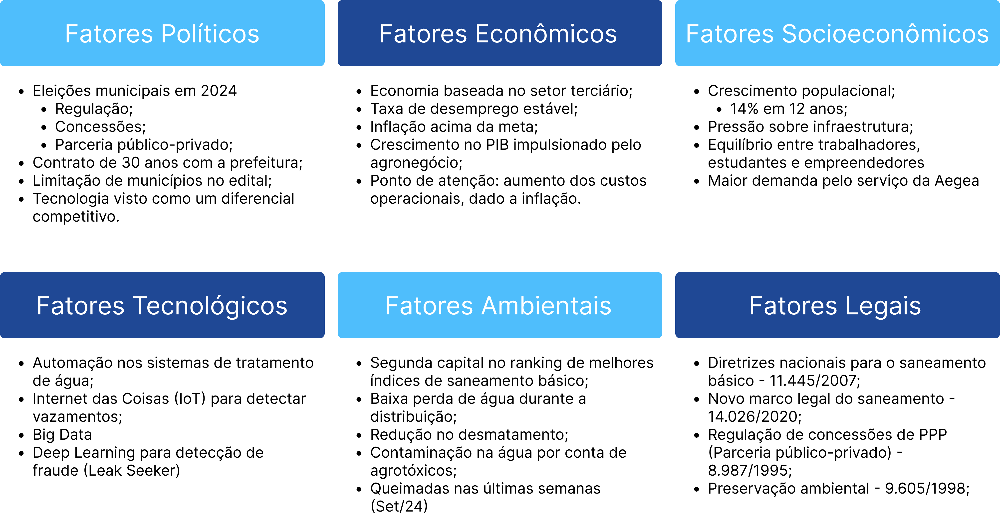

## Sumário

[1. Introdução](#c1)

[2. Fatores Políticos (P)](#c2)

[3. Fatores Econômicos (E)](#c3)

[4. Fatores Socioculturais (S)](#c4)

[5. Fatores Tecnológicos (T)](#c5)

[6. Fatores Ambientais (E)](#c6)

[7. Fatores Legais (L)](#c7)

[8. Conclusão](#c8)

[9. Referências](#c9)

 

# 1. Introdução

&emsp;&emsp; A análise PESTEL é uma ferramenta de gestão estratégica usada para identificar e avaliar os fatores externos que podem influenciar uma organização. O acrônimo "PESTEL" refere-se a Políticos, Econômicos, Socioculturais, Tecnológicos, Ambientais (environment) e Legais. Cada um desses fatores representa uma categoria de forças externas que podem afetar as operações, decisões e o sucesso de uma empresa. Com ela, podemos entender melhor o ambiente externo e a identificar possíveis oportunidades e ameaças, auxiliando no planejamento estratégico e na adaptação das estratégias de negócio para responder às influências externas.

# 2. Fatores Políticos (P)

&emsp;&emsp; Fatores políticos desempenham um papel fundamental na análise PESTEL de qualquer projeto, pois influenciam diretamente o ambiente regulatório, políticas públicas e incentivos governamentais. Mudanças no governo, decisões políticas e estabilidade institucional podem afetar a implementação de projetos, especialmente aqueles que envolvem parcerias público-privadas ou dependem de regulamentações específicas. A postura do governo em relação a questões como concessões, tributação, incentivos à inovação tecnológica e infraestrutura pode determinar o ritmo e a viabilidade de novos projetos, criando oportunidades ou desafios para sua execução e crescimento. 

&emsp;&emsp; As eleições municipais de 2024 em Campo Grande terão impacto significativo sobre o setor de saneamento básico. A disputa entre os principais candidatos – a atual prefeita (15,5%), o ex-vice-governador (36,9%) e um deputado estadual (19%) – trará diferentes perspectivas sobre concessões, regulação e parcerias público-privadas. O candidato que vencer as eleições poderá influenciar diretamente a renovação de concessões, especialmente se houver uma administração favorável ao setor privado. Nesse cenário, a empresa, que fechou um edital de 30 anos com a prefeitura em 2020, poderá ter suas operações fortalecidas com a possibilidade de renovação.

&emsp;&emsp; No que diz respeito à regulação, o novo governo poderá ajustar tarifas, padrões de qualidade e a cobertura de serviços, o que impactará diretamente a sustentabilidade econômica da Aegea. Além disso, a ampliação de projetos de infraestrutura por meio de parcerias público-privadas pode trazer novas oportunidades para a expansão de operações, aumentando a cobertura dos serviços. Vale ressaltar que o edital fechado em 2020 incluiu apenas 68 dos 79 municípios do estado, possivelmente devido a limitações de infraestrutura ou questões externas, o que pode gerar desafios futuros.

&emsp;&emsp; A relação entre os fatores políticos e o projeto "Leak Seeker" é crucial para o setor de saneamento básico em Campo Grande. O edital firmado por 30 anos com a prefeitura, iniciado em 2020, oferece estabilidade para a empresa, mas também cria uma dependência da administração municipal. Mudanças na gestão, como as que podem ocorrer nas eleições de 2024, podem influenciar diretamente as condições contratuais. Um novo governo pode optar por revisões nas concessões, ajustes nas tarifas e até na continuidade de projetos de inovação tecnológica, como o uso de deep learning no projeto "Leak Seeker" para detectar fraudes. Este tipo de tecnologia pode ser visto como um diferencial competitivo, mas seu sucesso também depende da regulação e apoio institucional, já que a adoção de tecnologias avançadas muitas vezes requer a parceria e suporte da esfera pública para a plena implementação.

## 2.1 Oportunidades

&emsp;&emsp; A Aegea possui um edital firmado com a prefeitura de Campo Grande com prazo de 30 anos, o que garante estabilidade operacional a longo prazo. Esse período estendido permite o planejamento de projetos de expansão e a busca de maior eficiência. Com o crescimento populacional, especialmente nas áreas urbanas, há também uma oportunidade de expansão para outras cidades e regiões do estado, aumentando a cobertura dos serviços. Além disso, a empresa pode utilizar o mínimo de taxa estipulada no contrato para garantir um fluxo de receita estável, mesmo diante de desafios econômicos e políticos.

&emsp;&emsp; A implementação do projeto na Aegea, com base no contrato de 30 anos firmado com a prefeitura de Campo Grande, apresenta diversas oportunidades. Essa estabilidade permite o planejamento a longo prazo e o desenvolvimento de tecnologias avançadas para combater fraudes e melhorar a eficiência operacional. O crescimento populacional nas áreas urbanas também amplia a base de dados para o treinamento dos modelos, tornando-os mais precisos e robustos, além de possibilitar sua aplicação em futuras expansões para outras cidades e regiões.

## 2.2 Ameaças

&emsp;&emsp; A principal ameaça política está relacionada à possibilidade de rescisão de contrato, caso a nova gestão municipal decida rever as concessões firmadas pela administração anterior. Isso poderia gerar instabilidade nos projetos e operações de longo prazo. Além disso, as limitações de infraestrutura nos municípios não atendidos, devido a problemas locais ou domínio de outros fornecedores, podem restringir a expansão dos serviços, limitando o alcance da empresa.

# 3. Fatores Econômicos (E)

&emsp;&emsp; O fator econômico na análise PESTEL refere-se a todos os aspectos econômicos que podem impactar uma organização ou indústria. Esse fator examina como a economia, tanto em nível local quanto global, influencia as operações e o desempenho de uma empresa.

&emsp;&emsp; Campo Grande tem uma economia fortemente baseada no setor terciário, como administração pública, comércio e serviços, o que influencia a demanda por serviços de saneamento. O crescimento econômico projetado para 2024, impulsionado pelo agronegócio, deverá atingir 2,4% no PIB, um aumento em comparação com os 1,6% observados entre 2022 e 2023. Essa expansão, especialmente nas áreas urbanas, levará a um aumento da demanda por serviços de abastecimento de água e tratamento de esgoto, beneficiando diretamente a empresa.

&emsp;&emsp; Apesar do crescimento, a taxa de desemprego está estável em 4%, sugerindo uma recuperação econômica contínua. No entanto, a inflação de 4,5%, que está acima da meta, afeta o poder de compra da população e aumenta os custos operacionais da empresa, incluindo gastos com energia, materiais e serviços. O edital firmado com a prefeitura estabelece uma taxa mínima que a empresa deve cumprir, mas o aumento dos custos exige um cuidado constante com a margem de lucro.

&emsp;&emsp; O cenário econômico de Campo Grande exerce um impacto direto sobre a implementação de tecnologias avançadas, como o projeto de deep learning para detecção de fraudes no setor de saneamento. O crescimento econômico projetado para 2024, impulsionado pelo agronegócio e um PIB em ascensão, favorece a expansão dos serviços de saneamento, gerando maior demanda para a empresa. Isso cria uma oportunidade para ampliar o uso de tecnologias como o deep learning, que pode otimizar a eficiência e reduzir perdas operacionais. 

&emsp;&emsp; Contudo, a inflação acima da meta, em 4,5%, apresenta desafios ao aumentar os custos operacionais, como os relacionados à implantação de novas tecnologias. Embora a empresa conte com uma taxa mínima estipulada no edital firmado com a prefeitura, a inflação pode pressionar as margens de lucro, exigindo uma gestão cuidadosa para equilibrar os investimentos em inovação com a sustentabilidade financeira. O deep learning, ao detectar fraudes de maneira eficiente, pode ser uma solução importante para mitigar esses custos operacionais, melhorando o controle sobre as perdas e ajudando a manter a viabilidade econômica mesmo em um cenário de pressão inflacionária.

&emsp;&emsp; Ao considerar cenários econômicos de longo prazo, a Aegea deve se preparar para diferentes possibilidades que podem impactar seus investimentos em inovação e tecnologia. Caso o PIB continue a crescer à uma taxa robusta, especialmente impulsionado pelo agronegócio, a Aegea terá maior capacidade de investimento em tecnologias avançadas, como automação e inteligência artificial. Isso poderia resultar em melhorias significativas na eficiência operacional e na redução de custos, aumentando a margem de lucro e possibilitando a expansão para novas regiões. Ainda, em momento que a economia enfrente um período prolongado de estagnação, a Aegea poderá ser forçada a restringir seus investimentos. Nesse cenário, a pressão para manter as margens de lucro pode levar a cortes em investimentos em inovação. A empresa pode ter que priorizar a manutenção da infraestrutura existente em vez de adotar novas tecnologias, o que poderia comprometer sua competitividade a longo prazo.

&emsp;&emsp; Em um cenário de crescimento econômico instável, com períodos alternados de expansão e contração, a Aegea enfrentaria desafios significativos para planejar e implementar investimentos em tecnologia. A incerteza econômica poderia levar à hesitação em adotar inovações, dificultando a modernização de processos e a adoção de novas soluções tecnológicas. Nesse caso, a empresa precisaria desenvolver uma abordagem flexível, ajustando suas estratégias conforme as condições econômicas mudam. Acrescenta-se que em circunstâncias inflação continuar a ser uma preocupação, elevando os custos operacionais, a Aegea pode enfrentar dificuldades financeiras que impactariam sua capacidade de investir em tecnologias avançadas. A empresa precisaria buscar soluções inovadoras que não exigissem altos investimentos iniciais, como parcerias público-privadas e financiamentos específicos, para mitigar os impactos da inflação.

&emsp;&emsp; A análise desses cenários permite que a Aegea elabore estratégias mais resilientes, garantindo que possa se adaptar às mudanças econômicas e continuar a investir em inovações que são cruciais para a sua sustentabilidade e crescimento a longo prazo.

## 3.1 Oportunidades

&emsp;&emsp; A baixa taxa de desemprego, atualmente em 4%, indica uma estabilidade econômica na região, favorecendo a continuidade dos serviços e a manutenção do poder aquisitivo da população. A expansão das cidades, impulsionada pelo crescimento do PIB e o agronegócio, aumentará a demanda por serviços de saneamento, criando novas oportunidades de expansão. Embora a inflação esteja acima da meta e possa aumentar os custos operacionais, a empresa está resguardada pela taxa mínima estipulada no edital, permitindo que ela mantenha uma margem de lucro estável. Além disso, o crescimento econômico contínuo abre espaço para novos investimentos e melhorias nas operações.

## 3.2 Ameaças

&emsp;&emsp; A inflação, que se mantém acima da meta, apresenta uma ameaça significativa, pois aumenta os custos operacionais, impactando diretamente as margens de lucro da empresa. A pressão inflacionária eleva os gastos com energia, materiais e serviços. Além disso, o aumento da demanda nas cidades, em decorrência do crescimento econômico, pode sobrecarregar a infraestrutura atual, criando desafios para a empresa manter a qualidade do serviço sem aumentar drasticamente os custos de operação. Nesse contexto, como ameaça adicional, o aumento da infraestrutura pode impactar e tendenciar o modelo de detecção de fraudes, ao receber dados discrepantes do histórico, gerando potenciais falhas na previsão de irregularidades.

# 4. Fatores Socioeconômicos (S)

&emsp;&emsp; Entre 2010 e 2022, a população de Campo Grande cresceu 14%, sendo a décima maior variação do país. Atualmente, cerca de 36% da população de Mato Grosso do Sul reside na capital. A mediana de idade no estado é de 33 anos, o que indica uma população ativa e economicamente produtiva, com um equilíbrio entre trabalhadores, estudantes e empreendedores. A população projetada para 2024 é de aproximadamente 2,92 milhões de pessoas no estado, o que coloca uma pressão crescente sobre a infraestrutura de saneamento, como o abastecimento de água e o tratamento de esgoto.

&emsp;&emsp; Além disso, a população indígena, que representa cerca de 2% da população total, traz especificidades culturais e sociais que devem ser consideradas pela empresa no desenvolvimento de suas estratégias e na expansão de serviços.

&emsp;&emsp; O crescimento populacional acelerado em Campo Grande, com um aumento de 14% entre 2010 e 2022, tem implicações significativas para o projeto de deep learning voltado para a detecção de fraudes no setor de saneamento básico. O crescimento contínuo da população, projetado para atingir 2,92 milhões de habitantes no estado em 2024, coloca pressão sobre a infraestrutura de saneamento, especialmente no abastecimento de água e no tratamento de esgoto. Essa demanda crescente por serviços torna ainda mais relevante a implementação de tecnologias que otimizem a eficiência operacional e minimizem perdas, como o projeto "Leak Seeker", que utiliza deep learning para identificar fraudes e vazamentos.

&emsp;&emsp; Além das questões demográficas, é crucial considerar como os hábitos de consumo e o estilo de vida da população influenciam a demanda pelos serviços de saneamento. O aumento da conscientização sobre questões ambientais e a busca por práticas sustentáveis têm levado os consumidores a adotar comportamentos que exigem maior eficiência no uso da água. Isso inclui, por exemplo, a instalação de dispositivos economizadores e a preferência por serviços que promovam a sustentabilidade.

&emsp;&emsp; A Aegea pode se beneficiar ao educar os consumidores sobre a importância da conservação da água e as práticas sustentáveis, incentivando uma maior adesão a essas iniciativas. Além disso, a adaptação dos serviços da empresa às necessidades e preferências dos consumidores pode facilitar a aceitação de novas tecnologias, como sistemas inteligentes de monitoramento e gestão de água, promovendo uma cultura de responsabilidade ambiental.

## 4.1 Oportunidades

&emsp;&emsp; Com a cobertura já abrangendo grande parte do estado, a empresa está bem posicionada para atender o crescimento populacional projetado, que continuará pressionando a infraestrutura de saneamento básico. O aumento da população urbana representa uma demanda crescente por serviços essenciais, como abastecimento de água e tratamento de esgoto. Esse crescimento oferece à empresa a oportunidade de expandir seus serviços, melhorar a infraestrutura e garantir que as necessidades da população em expansão sejam atendidas. Além disso, ao alinhar suas estratégias às mudanças nos hábitos de consumo, a Aegea pode fomentar um relacionamento mais próximo com a comunidade, contribuindo para a aceitação e eficácia de seus projetos de inovação.

## 4.2 Ameaças

&emsp;&emsp; Com o crescimento populacional de cerca de 30 mil pessoas por ano no estado, e um aumento total de 120 mil desde o início do contrato em 2020, a infraestrutura de saneamento básico está sob pressão crescente. A empresa precisará investir continuamente para garantir que a rede de abastecimento de água e esgoto suporte essa expansão, o que pode gerar altos custos e dificuldades logísticas. A capacidade de atender a essa demanda de maneira eficiente será crucial para evitar insatisfação social e problemas regulatórios. Ressalta-se que, mudanças nos hábitos de consumo podem gerar desafios inesperados, como a necessidade de adaptação rápida às novas expectativas dos consumidores, exigindo flexibilidade e inovação constante por parte da Aegea.

# 5. Fatores Tecnológicos (T)

&emsp;&emsp; A tecnologia desempenha um papel central nas operações da empresa de saneamento. O uso de automação nos sistemas de tratamento de água, como os implementados pela Bauminas, melhora a eficiência e a qualidade do serviço. Além disso, outras empresas vem adotando Internet das Coisas (IoT) para detectar vazamentos, monitorar a pressão e o fluxo de água, o que otimiza a manutenção e reduz perdas.

&emsp;&emsp; O uso de Big Data e aprendizado profundo (deep learning) no combate a fraudes é uma inovação significativa, alinhando-se com as tendências mais avançadas do setor. O uso de drones para monitoramento de infraestrutura e coleta de dados é outra tecnologia emergente que está sendo utilizada pela empresa para melhorar a gestão e a tomada de decisões operacionais.

&emsp;&emsp; O projeto de deep learning voltado para a detecção de fraudes, como o "Leak Seeker", se insere nesse contexto de inovação, utilizando grandes volumes de dados (Big Data) para identificar padrões anômalos no consumo de água e agir preventivamente contra fraudes e desperdícios. Além disso, tecnologias emergentes como o uso de drones para o monitoramento da infraestrutura e a coleta de dados têm ampliado a capacidade da empresa de melhorar sua gestão e suas decisões operacionais, garantindo um sistema de abastecimento mais eficiente e resiliente diante de desafios futuros.

## 5.1 Oportunidades

&emsp;&emsp; No campo tecnológico, a empresa pode começar a utilizar automação no sistema de tratamento de água, como é o caso dos processos implementados pela Bauminas, o que aumenta a eficiência e a qualidade dos serviços prestados. A adoção de IoT para detectar vazamentos e monitorar a pressão e o fluxo de água traz benefícios na redução de perdas e no uso eficiente dos recursos hídricos. Além disso, o uso de deep learning no projeto “Leak Seeker”, focado na detecção de fraudes e melhorias no sistema de saneamento, representa uma oportunidade de inovação tecnológica, melhorando a segurança e a confiabilidade das operações.

## 5.2 Ameaças

&emsp;&emsp; O rápido crescimento e desenvolvimento de novas tecnologias representa uma ameaça, pois acompanhar e implementar essas inovações pode ser financeiramente desafiador. A adoção de tecnologias como IoT, big data e automação, embora benéfica, requer investimentos contínuos que podem pesar sobre o orçamento da empresa. Além disso, o surgimento de novos players no mercado, trazendo inovações tecnológicas e modelos de negócio mais ágeis, pode aumentar a concorrência e ameaçar a posição da empresa no setor.

# 6. Fatores Ambientais (E)

&emsp;&emsp; Campo Grande se destaca no cenário nacional ao ocupar a segunda posição no ranking das capitais com os melhores índices de saneamento básico. Apenas Campo Grande e Goiânia conseguem manter perdas de água durante a distribuição abaixo de 25%, refletindo a eficiência do sistema de abastecimento e o compromisso com a conservação dos recursos hídricos. No entanto, um dos temas mais discutidos na região é a contaminação da água por agrotóxicos, uma preocupação crescente devido à intensa atividade agrícola no estado, que pode comprometer a qualidade da água e a saúde pública. 

&emsp;&emsp; Em termos de preservação ambiental, o estado obteve um avanço significativo com a redução de 9% no desmatamento. Esse dado reflete os esforços de proteção das áreas verdes e a manutenção dos ecossistemas locais. Além disso, o governo estadual anunciou um investimento de R$ 50 milhões para infraestrutura urbana em oito cidades, com foco em sistemas de drenagem, o que contribui para melhorar a resiliência das cidades frente a eventos climáticos extremos, como enchentes. Outro marco importante foi o Fórum de Mudanças Climáticas realizado em abril, que discutiu as metas do estado para enfrentar os desafios das mudanças climáticas. Como parte desse esforço, foi lançado um edital que destinará R$ 6 milhões para pesquisas em universidades focadas no desenvolvimento de soluções inovadoras para a sustentabilidade e mitigação dos impactos climáticos.

&emsp;&emsp; Recentemente, o estado tem enfrentado condições climáticas adversas, com um período de seca severa e baixos níveis de umidade. Nas últimas semanas, o aumento nas queimadas e as temperaturas 5 graus acima da média histórica intensificaram os desafios ambientais, ressaltando a urgência de iniciativas voltadas para a adaptação às mudanças climáticas e a proteção dos recursos naturais.

## 6.1 Oportunidades

&emsp;&emsp; Um dos principais pontos de destaque é a eficiência no uso dos recursos hídricos, já que Campo Grande está entre as capitais com os melhores índices de saneamento e perdas de água abaixo de 25% durante a distribuição. Isso representa uma oportunidade para a empresa continuar investindo em tecnologias que minimizem o desperdício de água, garantindo não apenas sustentabilidade, mas também economia operacional.

&emsp;&emsp; A demanda por soluções ambientais sustentáveis também se apresenta como uma grande oportunidade. Com o debate crescente sobre a contaminação da água por agrotóxicos, a empresa pode se destacar ao adotar medidas inovadoras para garantir a qualidade da água e a proteção dos recursos naturais. Além disso, os investimentos do governo estadual, como os R$ 50 milhões para infraestrutura urbana e drenagem em oito cidades, oferecem à empresa a chance de ampliar sua atuação em projetos que priorizem a sustentabilidade.

## 6.2 Ameaças

&emsp;&emsp; Por outro lado, a empresa enfrenta ameaças ambientais que podem afetar suas operações. O impacto das mudanças climáticas, como as condições de seca severa e as temperaturas 5 graus acima da média nas últimas semanas, representa uma ameaça significativa. Esses eventos podem sobrecarregar os sistemas de abastecimento de água e exigir grandes investimentos para garantir que a infraestrutura da empresa consiga suportar condições extremas. Além disso, o aumento das queimadas e desmatamento na região também pode impactar as fontes de água da empresa, comprometendo a quantidade e qualidade da água disponível para tratamento e distribuição.

&emsp;&emsp; Por último, a contaminação por agrotóxicos, que é uma questão amplamente discutida no estado, representa uma ameaça à qualidade da água distribuída, o que pode exigir investimentos adicionais em tratamento e controle de qualidade. Outro risco é a pressão ambiental e regulatória, com exigências mais rigorosas de preservação dos recursos naturais e controle de emissões, o que pode aumentar os custos operacionais.

# 7. Fatores Legais (L)

&emsp;&emsp; A legislação brasileira exerce uma forte influência sobre as empresas de saneamento básico, especialmente no que diz respeito à regulamentação, metas de universalização e o relacionamento público-privado. A Lei nº 11.445/2007, por exemplo, estabelece as diretrizes nacionais para o saneamento básico, com o objetivo de universalizar o acesso aos serviços de abastecimento de água e esgotamento sanitário. Para a Aegea, essa lei impõe a responsabilidade de garantir que todos os cidadãos tenham acesso a esses serviços essenciais. O impacto dessa lei é significativo, pois obriga a empresa a expandir continuamente sua infraestrutura, especialmente em áreas mais remotas e de baixa cobertura, promovendo a inclusão social e a melhoria da qualidade de vida.

&emsp;&emsp; A Lei nº 14.026/2020, conhecida como o novo marco legal do saneamento, define metas ambiciosas para 2033, como garantir que 99% da população brasileira tenha acesso à água potável e 90% ao tratamento de esgoto. Para a Aegea, o impacto dessa legislação é ainda mais desafiador, pois exige um planejamento estratégico robusto e investimentos significativos para atingir essas metas. A empresa precisa garantir que seu serviço seja cada vez mais eficiente e sustentável, além de buscar formas de aumentar sua capacidade de operação para atender essas exigências dentro do prazo estipulado.

&emsp;&emsp; Outro aspecto legal que afeta diretamente a empresa é a Lei nº 8.987/1995, que regula as concessões de serviços públicos e define o relacionamento entre entidades públicas e privadas, essa legislação é essencial para manter sua concessão com o poder público. A lei estabelece regras claras para contratos de concessão, garantindo estabilidade jurídica e previsibilidade econômica. Isso permite que a empresa atue com segurança ao investir em melhorias e expansão de serviços, além de facilitar a participação em parcerias público-privadas (PPP), que podem ser uma solução viável para acelerar os projetos de infraestrutura.

&emsp;&emsp; No que diz respeito à preservação ambiental, a Lei nº 9.605/1998 estabelece as sanções para condutas lesivas ao meio ambiente, o que inclui penalidades para empresas que não cumpram as normas ambientais, como a poluição de recursos hídricos, impactando, principalmente em regiões onde a contaminação da água por agrotóxicos tem sido uma preocupação crescente. A Aegea precisa adotar medidas rigorosas de controle da qualidade da água para evitar multas e sanções, e garantir que o abastecimento não prejudique a saúde pública. Além disso, o cumprimento dessa lei reforça a necessidade de investimentos em tecnologias de tratamento avançado, capazes de mitigar os efeitos dos contaminantes agrícolas na água.

&emsp;&emsp; No entanto, é crucial considerar as implicações das leis ambientais e trabalhistas, especialmente no contexto de grandes projetos de infraestrutura. As legislações ambientais, como a Política Nacional de Meio Ambiente e a Lei de Crimes Ambientais, impõem uma série de obrigações que a Aegea deve cumprir para garantir a sustentabilidade de suas operações e a proteção dos recursos hídricos. A necessidade de licenciamento ambiental e a realização de estudos de impacto ambiental são fundamentais para a viabilidade de projetos de saneamento, podendo influenciar prazos e custos.

&emsp;&emsp; Além disso, a análise das leis trabalhistas e de segurança é essencial. O cumprimento da Consolidação das Leis do Trabalho (CLT) e normas regulamentadoras do Ministério do Trabalho e Emprego (MTE) é crucial para a proteção dos trabalhadores envolvidos em grandes obras de saneamento. A Aegea deve estar atenta às exigências relacionadas à segurança do trabalho, garantindo condições adequadas e prevenindo acidentes, uma vez que os projetos de infraestrutura apresentam riscos significativos. O não cumprimento dessas normas pode resultar em sanções legais, além de impactar a imagem da empresa e a moral dos trabalhadores.

&emsp;&emsp; Portanto, ao planejar e executar seus projetos, a Aegea deve adotar uma abordagem proativa em relação ao cumprimento das legislações trabalhistas e ambientais. Isso inclui a implementação de programas de treinamento e conscientização sobre segurança no trabalho, bem como a adoção de práticas que minimizem o impacto ambiental. Dessa forma, a empresa não apenas atenderá às exigências legais, mas também promoverá uma cultura de responsabilidade social e ambiental que poderá resultar em benefícios a longo prazo.

## 7.1 Oportunidades

&emsp;&emsp; A Lei nº 8.987/1995, que regula as concessões de serviços públicos, permite à empresa captar recursos privados para financiar grandes projetos de infraestrutura, como a ampliação da rede de saneamento e a modernização de equipamentos, o que pode acelerar o atendimento das metas de universalização. Além disso, a universalização dos serviços de saneamento, oferece oportunidades para a Aegea se beneficiar de incentivos e financiamentos governamentais. O cumprimento das metas para 2033 pode abrir portas para novos investimentos e concessões de crédito, permitindo a expansão das operações e o fortalecimento da infraestrutura.

## 7.2 Ameaças

&emsp;&emsp; Uma das principais ameaças legais está relacionada às sanções previstas pela Lei nº 9.605/1998, que regula as condutas lesivas ao meio ambiente. A contaminação da água por agrotóxicos, uma preocupação constante em áreas agrícolas como Campo Grande, pode expor a empresa a multas e processos, caso a qualidade da água não seja adequadamente monitorada e tratada. Isso aumenta o risco financeiro e pode prejudicar a imagem da empresa. Por último, mudanças nas regulamentações ou a revisão de contratos, especialmente em períodos de instabilidade política, podem ameaçar a segurança jurídica da empresa. A Lei nº 8.987/1995 estabelece regras para concessões públicas, mas uma eventual alteração de governo pode resultar em renegociações ou cancelamentos de contratos, impactando diretamente a estabilidade da empresa e seus planos de longo prazo.

# 8. Conclusão

&emsp;&emsp; A análise PEST revela que a empresa de saneamento básico de Campo Grande está em uma posição vantajosa, com um contrato de 30 anos que garante estabilidade e oportunidades de expansão. O crescimento econômico e populacional oferece potencial para ampliar os serviços, mas traz também desafios, como a necessidade de investimentos em infraestrutura para atender à demanda crescente. A inflação elevada e o cenário político incerto, especialmente com as eleições de 2024, podem afetar a operação e os custos. Tecnologicamente, a empresa está avançando com automação e IoT, mas o custo de acompanhar inovações e a concorrência crescente são ameaças que exigem atenção.

Figura 1: Matriz da Análise PESTEL   
Fonte: Elaboração própria   

# 9. Referências

SEMRUSH. **Análise PEST: o que é, como funciona e como fazer uma análise estratégica de negócios**. Disponível em: <https://pt.semrush.com/blog/analise-pest/>. Acesso em: 2 set. 2024.

G1. **Censo do IBGE: confira a população atualizada de Campo Grande**. 2023. Disponível em: <https://g1.globo.com/ms/mato-grosso-do-sul/noticia/2023/06/28/censo-do-ibge-confira-populacao-atualizada-de-campo-grande.ghtml>. Acesso em: 3 set. 2024.

IBGE. **Panorama: Mato Grosso do Sul**. Disponível em: <https://cidades.ibge.gov.br/brasil/ms/panorama>. Acesso em: 3 set. 2024.

BAUMINAS. **Como funciona a automação de estações de tratamento de água e efluentes**. Disponível em: <https://bauminas.com.br/como-funciona-a-automacao-de-estacoes-de-tratamento-de-agua-e-efluentes/>. Acesso em: 3 set. 2024.

NIVETEC. **Saneamento inteligente**. Disponível em: <https://www.nivetec.com.br/saneamento-inteligente/?utm_source=googleads&utm_medium=search&utm_campaign=dsa&utm_term=&gad_source=1>. Acesso em: 3 set. 2024.

Águas Guariroba. **Campo Grande ocupa 2ª posição no ranking das capitais com melhores índices de saneamento no Brasil**. 2023. Disponível em: <https://www.aguasguariroba.com.br/campo-grande-ocupa-2a-posicao-no-ranking-das-capitais-com-melhores-indices-de-saneamento-no-brasil/#:~:text=A%20Capital%20de%20Mato%20Grosso,atr%C3%A1s%20apenas%20de%20S%C3%A3o%20Paulo>. Acesso em: 9 set. 2024.

Campo Grande News. **Contaminação da água por agrotóxicos em MS é discutida por especialistas na UFMS**. 2023. Disponível em: <https://www.campograndenews.com.br/meio-ambiente/contaminacao-da-agua-por-agrotoxicos-em-ms-e-discutida-por-especialistas-na-ufms>. Acesso em: 9 set. 2024.

Campo Grande News. **Incêndios se multiplicam em semana que promete ser quente ainda sem chuva em MS**. 2023. Disponível em: <https://www.campograndenews.com.br/meio-ambiente/incendios-se-multiplicam-em-semana-que-promete-ser-quente-ainda-sem-chuva-em-ms>. Acesso em: 9 set. 2024.

Correio do Estado. **Oito municípios de MS devem receber R$ 50 milhões para melhorias na infraestrutura urbana**. 2023. Disponível em: <https://correiodoestado.com.br/cidades/oito-municipios-de-ms-devem-receber-r-50-milhoes-para-melhorias-na/429437/>. Acesso em: 9 set. 2024.

MS.gov.br. **Preservação ambiental e desenvolvimento econômico são aliados em Fórum de Mudanças Climáticas de MS**. 2023. Disponível em: <https://www.ms.gov.br/noticias/preservacao-ambiental-e-desenvolvimento-economico-sao-aliados-em-forum-de-mudancas-climaticas-de-ms>. Acesso em: 9 set. 2024.

BRASIL. **Lei nº 11.445, de 5 de janeiro de 2007**. Estabelece diretrizes nacionais para o saneamento básico. 2007. Disponível em: <https://www2.camara.leg.br/legin/fed/lei/2007/lei-11445-5-janeiro-2007-549031-publicacaooriginal-64311-pl.html>. Acesso em: 10 set. 2024.

BRASIL. **Lei nº 14.026, de 15 de julho de 2020**. Atualiza o marco legal do saneamento básico e altera a Lei nº 11.445, de 2007. 2020. Disponível em: <https://legislacao.presidencia.gov.br/atos/?tipo=LEI&numero=14026&ano=2020&ato=cfaATWE9EMZpWT417>. Acesso em: 107 set. 2024.

BRASIL. **Lei nº 8.987, de 13 de fevereiro de 1995**. Dispõe sobre o regime de concessão e permissão da prestação de serviços públicos. 1995. Disponível em: <https://www.planalto.gov.br/ccivil_03/leis/l8987compilada.htm>. Acesso em: 10 set. 2024.

BRASIL. **Lei nº 9.605, de 12 de fevereiro de 1998**. Dispõe sobre as sanções penais e administrativas derivadas de condutas e atividades lesivas ao meio ambiente. 1998. Disponível em: <https://www.jusbrasil.com.br/legislacao/104091/lei-de-crimes-ambientais-lei-9605-98>. Acesso em: 10 set. 2024.
