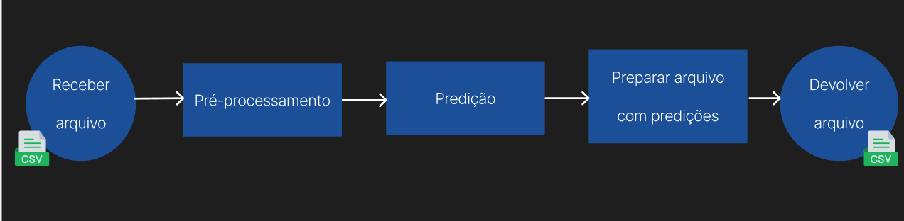

## Sumário

[1. Introdução](#c1)

[2. Estrutura da aplicação](#c2)

[3. Flow da aplicação](#c3)

[4. Pré-processamento](#c4)

[5. Pipeline Handler](#c5)

[6. Modelos ](#c6)

[7. Conclusão](#c7)

<br>

# <a name="c1"></a>1. Introdução

&emsp;&emsp; Este guia orienta o uso de um sistema desenvolvido para detecção de fraudes de água, projetado para identificar irregularidades no consumo tanto para clientes Pessoa Física (PF) quanto Pessoa Jurídica (PJ). O modelo, baseado em técnicas de Deep Learning , foi treinado utilizando dados históricos de consumo e registros de fraudes para garantir maior precisão nas predições.

&emsp;&emsp; Este documento fornece instruções planejadas para configurar e integrar o backend que hospeda os modelos, abordando desde o pré-processamento dos dados até a inferência dos resultados. O objetivo é garantir que o usuário compreenda o fluxo do sistema, desde a coleta dos dados até a visualização das predições.

# <a name="c2"></a>2. Estrutura da aplicação

&emsp;&emsp; O projeto foi organizado para separar as responsabilidades em camadas específicas, conforme a estrutura de diretórios abaixo:

 ```
    src/
    │
    ├── application/
    │   └── LeakSeekerModel/
    │       ├── inferencia/
    │       ├── Model.py
    │       └── __init__.py
    │
    ├── pipeline/
    │   ├── PipeLineHandler.py
    │   └── PreProcessing.py
    │
    ├── routes/
    │   └── main.py
    │
    ├── main.py
    ├── requirements.txt
    └── readme.md
 ```

```application/LeakSeekerModel/ ```
&emsp;&emsp; Diretório principal onde reside a lógica do modelo de detecção de fraudes.

    ```inferencia/:``` Contém o módulo de inferência, que realiza as predições com base nos dados recebidos e nos modelos de Deep Learning. Ele executa as predições tanto para Pessoa Jurídica quanto para Pessoa Física.
    ```Model.py:``` Script onde o modelo de Deep Learning está definido. Aqui, os modelos PJ e PF são carregados e executados para as predições de fraudes.
    ```__init__.py:``` Arquivo responsável por inicializar o pacote, permitindo o uso das funcionalidades contidas no diretório.

    ```pipeline/:``` Diretório responsável pelo pipeline de dados e inferência.

        ```PipeLineHandler.py:``` Este arquivo coordena o fluxo de dados entre as etapas do pré-processamento e inferência. Garanta que os dados sejam tratados corretamente e projetados para um modelo de forma eficiente.
        ```PreProcessing.py:``` Contém as funções responsáveis ​​pelo pré-processamento dos dados, como a normalização, preenchimento de valores ausentes, e outras transformações realizadas para preparar os dados antes de serem enviados ao modelo.

    ```routes/:```
&emsp;&emsp; Este diretório contém a lógica de roteamento da API, expondo endpoints que permitem a interação com o sistema de detecção de fraudes.

        ```main.py:``` Script principal de rotas. Defina como APIs que recebem requisições do frontend (desenvolvido em Angular) e encaminham os dados ao pipeline para processamento e inferência.
        ```main.py:```
        Arquivo de entrada do backend. Inicializa o servidor e carrega as rotas definidas no sistema, conectando o frontend e o modelo de previsão de fraudes.
        ```requirements.txt:```
        Arquivo contendo as dependências do projeto. Inclui bibliotecas como TensorFlow, Keras, Pandas, e outras medidas para a execução do modelo de Deep Learning e o tratamento dos dados.

# <a name="c3"></a>3. Flow da aplicação

&emsp;&emsp; O processo inicia com a coleta de um arquivo no formato CSV a partir do FrontEnd, que contém os dados de consumo de água de clientes Pessoa Física (PF) ou Pessoa Jurídica (PJ). Esses dados podem incluir informações como matrículas, histórico de consumo e outras variáveis importantes ​​para a análise.

&emsp;&emsp; Após a coleta do arquivo, os dados passam por uma etapa de pré-processamento. Nesta etapa, o sistema realiza transformações nos dados, como normalização, tratamento de valores ausentes e conversão de formatos, garantindo que os dados estejam prontos para serem inseridos no modelo de Deep Learning. Isso é feito para padronizar a entrada e melhorar a precisão das predições, conforme os dados que foram utilizados para o treinamento do modelo.

&emsp;&emsp; Com os dados já configurados, eles são alimentados no modelo de Deep Learning, que foi previamente treinado para identificar padrões associados a fraudes no consumo de água. O modelo realiza a inferência, classificando se há ou não sendo acusado de fraude para cada entrada no arquivo.

&emsp;&emsp; Após a etapa de predição, os resultados são formatados em um novo arquivo, contendo as predições do modelo. Este arquivo incluirá os dados originais, bem como uma nova coluna com o resultado da previsão (probabilidade de ser fraude).

&emsp;&emsp; O sistema finaliza o processo devolvendo o arquivo ao usuário. O arquivo resultante também será no formato CSV, facilitando sua manipulação e integração com o FrontEnd.


Figura 1: Fluxo de informações entre BackEnd e FrontEnd <br>
Fonte: Elaboração própria <br><br>

# <a name="c4"></a>4. Pré-processamento

&emsp;&emsp; O pré-processamento de dados é uma etapa essencial antes da aplicação de qualquer modelo Deep Learning, pois prepara os dados de maneira adequada, garantindo que estejam limpos, padronizados e relevantes. Define-se define a classe ```PreProcessing ``` que realiza uma série de transformações no conjunto de dados de consumo e fraudes. O código é dividido entre pré-processamentos comuns, além de etapas específicas para clientes PJ (Pessoa Jurídica) e PF (Pessoa Física). 

&emsp;&emsp; Pré-processamento comum:
    - Remoção de Colunas : Colunas irrelevantes são removidas utilizando o método auxiliar __remover_colunas.
    - Verificação de Duplicatas : O método __verificar_duplicatas_referenciagarante que apenas linhas duplicadas de matrícula e referência sejam mantidas.
    - Remoção de Linhas com Valores Específicos : Remove linhas com valores acima de um limite especificado nas colunas do DataFrame ( __remove_rows_with_column_value_greater_than_one).

&emsp;&emsp; Para PJ (Pessoa Jurídica):
    - Filtragem Inicial : Filtra dados da categoria PJ e com volume estimado não igual a 0.
    - Filtragem por Ocorrências : Considera apenas um conjunto específico de ocorrências (por exemplo, "NORMAL", "MEDIDOR NÃO LOCALIZADO").
    - Remoção de Outliers : Remove valores anômalos na coluna CONS_MEDIDOusando o método __remove_outliers.
    - Criação de Dummies : Transforma colunas categóricas em variáveis ​​dummy.
    - Processamento de Fraudes : Combina o DataFrame de fraudes com os dados PJ.
    - Clusters KMeans : Usa um modelo KMeans previamente treinado para definir um cluster com base nas regiões geográficas.
    - Normalização : Normaliza as colunas de consumo e volume usando RobustScaler.
    - Tabela Pivô : Gera uma tabela pivô para PJ com o consumo medido e volume estimado agregados por matrícula e referência.
    - Merge de Informações : Adicionadas informações sobre o tipo de conexão, descrição de ocorrência, fraudes e clusters ao DataFrame pivotado.

&emsp;&emsp; Para PF (Pessoa Física):
    - Filtragem Inicial : Dados selecionados da categoria "RESIDENCIAL".
    - Remoção de Colunas : Remove colunas desnecessárias para PF.
    - Remoção de Outliers : Aplique o método de remoção de outliers semelhante ao do PJ para a coluna CONS_MEDIDO.

&emsp;&emsp; Métodos Auxiliares:
    - Remover outliers com base no intervalo interquartil (IQR).
    - Remove colunas especificadas, se existirem no DataFrame.
    - Retém apenas linhas duplicadas de acordo com 'MATRICULA' e 'REFERENCIA'.
    - Remova linhas com qualquer valor acima do limite nas colunas citadas.


# <a name="c5"></a>5. Pipeline Handler

&emsp;&emsp; O pipeline ```PipeLineHandler``` é uma classe que centraliza as operações de leitura, processamento, previsão e salvamento de dados em um processo unificado. 

&emsp;&emsp; O pipeline começa com a leitura de arquivos CSV contendo os dados brutos e de fraude. O PreProcessing é requisitado e faz a limpeza , além da transformação dos dados, ajustando colunas e removendo valores inconsistentes. Com os dados pré-processados, modelos específicos para dados comerciais e principalmente fazem previsões sobre possíveis fraudes. Finalmente, o DataFrame resultante com as predições é salvo em um arquivo CSV para futuras análises.

# <a name="c6"></a>6. Modelos   

&emsp;&emsp; No backend da aplicação, utilizamos três modelos principais: dois voltados para detecção de fraudes em clientes Pessoa Física (PF) e Pessoa Jurídica (PJ), além de um modelo de clusterização chamado **KMeans**, utilizado tanto no pré-processamento quanto na pipeline de inferência.

&emsp;&emsp; **Modelos para Pessoa Física e Pessoa Jurídica**:  
&emsp;&emsp; A necessidade de dois modelos distintos se dá pela diferença de padrões de consumo e comportamentos entre esses dois tipos de clientes. As motivações para fraudar podem variar significativamente entre PF e PJ, o que justifica a criação de instâncias de modelos específicos para cada grupo.  
&emsp;&emsp; Além disso, os modelos de PF e PJ possuem arquiteturas distintas, levando em consideração as particularidades de cada segmento. Isso possibilita que o modelo de PF seja otimizado para tratar dados individuais e residenciais, enquanto o de PJ é ajustado para lidar com padrões de consumo em escala empresarial. Ambos os modelos são implementados de forma a rodar em paralelo no backend, garantindo que tanto os dados de PF quanto de PJ sejam processados corretamente.

&emsp;&emsp; **Modelo de Clusterização (KMeans)**:  
&emsp;&emsp; O modelo de clusterização KMeans é responsável por agrupar os dados com base em suas características geográficas e de consumo. Esse mesmo modelo é utilizado tanto no pré-processamento quanto na etapa de inferência, garantindo a consistência entre os clusters gerados nos dados de treinamento e os utilizados durante a previsão. A escolha de manter o mesmo modelo em ambas as etapas é estratégica, pois permite que a divisão por clusters permaneça alinhada em todas as fases do pipeline.

&emsp;&emsp; Esses três modelos trabalham de forma integrada, com o objetivo de detectar fraudes de forma mais precisa, ajustando-se às especificidades de cada tipo de cliente e área de atuação.

# <a name="c7"></a>7. Conclusão

&emsp;&emsp; O BackEnd foi estruturado de maneira que todo o processo — desde a aquisição dos dados, pré-processamento, até a inferência do modelo — seja executado dentro de uma única aplicação coesa. Essa centralização facilita o controle e a manutenção do sistema, garantindo uma execução mais eficiente e segura.

&emsp;&emsp; A aplicação oferece diferentes endpoints para atender as necessidades do FrontEnd, tornando a interação flexível e adaptável. É possível, por exemplo, retornar um arquivo CSV completo com as previsões realizadas pelo modelo ou fornecer respostas personalizadas baseadas em parâmetros específicos fornecidos nas requisições. Isso garante maior versatilidade e capacidade de integração com diversos cenários de uso.

&emsp;&emsp; A organização da aplicação é fundamental para que o código seja de fácil manutenção. A separação clara de responsabilidades, o uso de camadas de abstração adequadas e a documentação completa são fatores importantes.