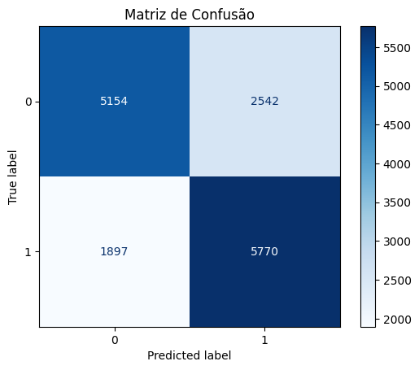

## Sumário

[1. Introdução](#c1)

[2. Características gerais dos Modelos](#c2)

[3. Resultados do Modelo PJ](#c3)

[4. Resultados do Modelo PF](#c4)

[5. Conclusão](#c5)

[6. Referências](#c6)

 

# 1. Introdução

&emsp;&emsp; Em projetos de Deep Learning, é sempre fundamental avaliar o desempenho dos modelos para garantir que eles estejam aprendendo e generalizando corretamente a partir dos dados. Para isso, o grupo decidiu elencar algumas métricas que nos ajudam a entender diferentes aspectos da performance do modelo. 

## 1.1 Acurácia

&emsp;&emsp; A acurácia é uma métrica de avaliação usada em aprendizado de máquina e estatística para medir o desempenho de um modelo de classificação. Ela indica a proporção de previsões corretas feitas pelo modelo em relação ao total de previsões realizadas. Por exemplo, se um modelo previu corretamente 90 casos de um total de 100, a acurácia seria 90%, ou seja, 0.90. Apesar de ser uma métrica intuitiva, a acurácia pode ser enganosa em conjuntos de dados desbalanceados, onde as classes são distribuídas de forma desigual. A fórmula da acurácia é:

$$
\text{Acurácia} = \frac{\text{Previsões corretas}}{\text{Total de previsões}}
$$

## 1.2 Precisão

&emsp;&emsp; Precisão é uma métrica de avaliação de desempenho usada em problemas de classificação, especialmente quando o conjunto de dados é desbalanceado. Ela mede a proporção de previsões positivas corretas feitas pelo modelo em relação ao total de previsões positivas feitas. Basicamente, a ideia é responder: "Das previsões positivas feitas pelo modelo, quantas estavam corretas?". A precisão é particularmente útil quando o custo de falsos positivos é alto, como no diagnóstico médico, onde é mais importante ter certeza de que as previsões positivas são verdadeiras (minimizando alarmes falsos). A fórmula da precisão é:

$$
\text{Precisão} = \frac{\text{Verdadeiros Positivos (TP)}}{\text{Verdadeiros Positivos (TP)} + \text{Falsos Positivos (FP)}}
$$

- **Verdadeiros Positivos (TP)**: São os casos em que o modelo previu corretamente a classe positiva;
- **Falsos Positivos (FP)**: São os casos em que o modelo previu a classe positiva incorretamente (ou seja, previu positivo, mas o rótulo verdadeiro era negativo).

## 1.3 Recall

&emsp;&emsp; Recall é uma métrica usada em problemas de classificação, especialmente quando há um desbalanceamento entre as classes. Ela mede a proporção de verdadeiros positivos identificados corretamente pelo modelo em relação ao total de exemplos que realmente pertencem à classe positiva. A ideia do recall é responder à pergunta: "Dos exemplos que realmente pertencem à classe positiva, quantos o modelo conseguiu identificar corretamente?". Essa métrica é útil em situações onde é mais importante identificar todos os casos positivos, como em diagnósticos médicos (para garantir que nenhuma doença seja ignorada) ou em sistemas de detecção de fraude, que é o nosso caso.

A fórmula do recall é:

$$
\text{Recall} = \frac{\text{Verdadeiros Positivos (TP)}}{\text{Verdadeiros Positivos (TP)} + \text{Falsos Negativos (FN)}}
$$

- **Verdadeiros Positivos (TP)**: Casos em que o modelo previu corretamente a classe positiva.
- **Falsos Negativos (FN)**: Casos em que o modelo previu incorretamente a classe negativa (ou seja, previu negativo, mas o rótulo verdadeiro era positivo).

## 1.4 F1 Score

&emsp;&emsp; O F1-Score é uma métrica de avaliação que combina a precisão e o recall em um único valor. Ele é especialmente útil quando há um desbalanceamento entre as classes, pois fornece uma média ponderada entre essas duas métricas, levando em consideração tanto os verdadeiros positivos identificados corretamente (recall) quanto a exatidão dessas previsões positivas (precisão). Ele é útil em cenários onde é importante alcançar um equilíbrio entre precisão e recall, evitando extremos, como prever muitos falsos positivos ou falsos negativos.

A fórmula do F1-Score é:

$$
F1 = 2 \times \frac{\text{Precisão} \times \text{Recall}}{\text{Precisão} + \text{Recall}}
$$

O resultado da fórmula acima varia entre 0 a 1, onde:

- **1** significa que o modelo tem tanto alta precisão quanto alto recall (ou seja, fez previsões perfeitas).
- **0** significa que o modelo tem baixa precisão e/ou baixo recall.

## 1.5 Função de perda

&emsp;&emsp; A função de perda é uma função matemática usada para medir o quão bem um modelo de aprendizado de máquina está performando. Ela quantifica a diferença entre as previsões feitas pelo modelo e os valores reais dos dados. O objetivo do treinamento de um modelo é minimizar essa função de perda, ajustando os parâmetros do modelo para que as previsões sejam o mais próximas possível dos valores reais. 

# 2. Características gerais dos Modelos

&emsp;&emsp; O Modelo PJ é uma Rede Neural LSTM, adequada para análise de sequências temporais, essencial dado o caráter sequencial dos nossos dados. Para tratar o desbalanceamento de classes, aplicamos a técnica de SMOTE, que sintetiza exemplos da classe minoritária, melhorando a generalização do modelo. A arquitetura do Modelo PJ consiste em uma entrada para sequências numéricas processadas por uma camada LSTM com 64 unidades, seguida por uma entrada para sequências categóricas que passam por uma camada densa com 32 unidades de ativação ReLU. As saídas dessas camadas são concatenadas e finalizadas com uma camada densa de saída com ativação sigmoid, configurada para realizar classificação binária.

&emsp;&emsp; O Modelo PF é implementado como uma rede neural sequencial que inclui múltiplas camadas densas, cada uma seguida por uma camada de dropout de 20% para mitigar o overfitting. Esta configuração é essencial para lidar com dados de alta dimensionalidade que foram pré-processados, ajudando a capturar a complexidade e as nuances dos dados eficazmente. A estrutura detalhada do modelo inclui camadas densas de 300, 124 e 64 neurônios, todas com ativação ReLU, exceto a última que utiliza sigmoid para a saída binária. A inclusão do Early Stopping previne o overfitting ao interromper o processo caso a perda de validação não melhore, garantindo que o modelo generalize bem sem excesso de treinamento.

# 3. Resultados do Modelo PJ

&emsp;&emsp; Analisando os resultados obtidos pelo modelo, que só considera as categorias que envolvem pessoas Jurídicas, é possível observar várias métricas chave que informam sobre sua performance. A acurácia do modelo é de 72%, o que indica uma capacidade razoável de classificação correta dos casos, mas essa métrica, sendo generalista, não revela como o modelo performa nas diferentes classes, aspecto crítico em datasets desbalanceados como o de detecção de fraudes. 

&emsp;&emsp; A precisão está em 79%, significando que a grande maioria das previsões de fraude pelo modelo são corretas, um resultado positivo especialmente porque os falsos positivos, situações nas quais transações legítimas são marcadas como fraudulentas, podem acarretar custos e inconvenientes significativos. Para a Aegea, os falsos positivos representam o custo operacional de enviar equipes para realizar inspeções presenciais nas instalações comerciais onde a fraude foi identificada. Esse esforço logístico envolve o deslocamento de técnicos, o uso de equipamentos e o tempo necessário para inspecionar as instalações. Caso o número de falsos positivos seja elevado, isso pode representar uma alocação ineficiente de recursos e custos desnecessários. Portanto, embora seja desejável minimizar falsos positivos, o impacto deles é relativamente controlável comparado ao impacto dos falsos negativos.

&emsp;&emsp; Contudo, o recall para a classe de fraudes é de apenas 59%, apontando que uma parcela considerável de fraudes reais não está sendo capturada pelo modelo. Nesse contexto, um recall baixo significa que o modelo deixa de identificar muitas fraudes, o que resulta em fraudes não detectadas que continuam a ocorrer, causando prejuízos financeiros à Aegea. O custo desses falsos negativos é potencialmente alto, pois fraudes não detectadas podem resultar em perdas de receita, penalidades regulatórias e desgaste na relação com os clientes. Para a Aegea, garantir um recall mais alto é crucial, pois evita que fraudes passem despercebidas e se perpetuem por longos períodos, gerando maiores prejuízos.

&emsp;&emsp; O F1-Score, que é uma média harmônica entre precisão e recall, para a classe de fraudes é de 68%, refletindo um equilíbrio moderado entre a capacidade do modelo de identificar fraudes corretamente e a frequência com que o faz. A métrica AUC-ROC, que mede a capacidade do modelo de distinguir entre as classes, está em 0.72, como pode ser observado na imagem abaixo. 

Figura 1: Curva ROC   
Fonte: Elaboração própria

&emsp;&emsp; A matriz de confusão nos fornece um panorama detalhado do desempenho do modelo nas diferentes categorias de previsão. Observamos que o modelo tem uma quantidade significativa de falsos positivos (1004) e falsos negativos (2665), sugerindo áreas onde o modelo pode ser melhorado para reduzir tanto interrupções desnecessárias para os clientes quanto o risco de perdas financeiras por fraudes não detectadas.

Figura 2: Matriz de Confusão   
Fonte: Elaboração própria

&emsp;&emsp; As curvas de precisão durante o treinamento mostram uma evolução marcada por oscilações significativas, especialmente nas primeiras épocas. Essas flutuações podem indicar uma certa instabilidade no aprendizado do modelo em fases distintas do treinamento. A precisão de validação, embora geralmente mais baixa do que a precisão de treinamento, apresenta uma tendência de estabilização ao longo das épocas. Isso sugere que, apesar das oscilações observadas, o modelo está começando a generalizar de maneira efetiva.

Figura 3: Curva de Precisão   
Fonte: Elaboração própria

&emsp;&emsp; Baseado nestes insights, algumas recomendações para melhorar o modelo podem incluir explorar técnicas adicionais para o balanceamento das classes, como ajustar os pesos ou aplicar técnicas de oversampling para a classe minoritária. Também pode ser benéfico ajustar hiperparâmetros, como a taxa de aprendizado e o número de épocas, ou experimentar com diferentes arquiteturas de rede para otimizar tanto o recall quanto a precisão. Por fim, uma análise aprofundada das características que são mais indicativas de fraude pode ajudar a refinar o modelo, aumentando sua precisão e recall. Além disso, a tentativa de incluir a temperatura como um dado externo, pode ajudar a entender o padrão de consumo das pessoas em alguns meses. Para reduzir o impacto dos falsos negativos, pode-se priorizar técnicas que aumentem o recall, mesmo que isso signifique um aumento moderado nos falsos positivos, desde que o custo de enviar equipes para inspeções extras seja aceitável para a empresa.

# 4. Resultados do Modelo PF

&emsp;&emsp; Analisando o desempenho do modelo PF (Pessoa Física), é possível observar resultados que nos permitem avaliar tanto a eficácia quanto as áreas que necessitam de aprimoramento. A acurácia geral atingida pelo modelo é de 71%, com uma precisão de 73% para a classe de não fraudes e 69% para fraudes, enquanto o recall para essas classes é de 67% e 75%, respectivamente. Isso indica uma habilidade moderada do modelo em identificar fraudes corretamente, superando ligeiramente sua capacidade de evitar falsos positivos. Nesse caso, a maior prioridade é manter um alto recall para a classe de fraudes, dado que a detecção de fraudes em residências é crítica para evitar perdas financeiras e garantir a sustentabilidade do fornecimento de água. Os falsos negativos, que representam fraudes não detectadas, acarretam um custo significativo, pois resultam em perdas contínuas e não recuperáveis.

Figura 4: Curva ROC   
Fonte: Elaboração própria

&emsp;&emsp; O F1-Score, que equilibra precisão e recall, é de 70% para não fraudes e 72% para fraudes, refletindo um desempenho balanceado, particularmente na identificação de casos fraudulentos. A matriz de confusão revela que o modelo identificou corretamente 5770 fraudes, mas também apresentou 2542 falsos positivos, indicando que, embora eficaz em detectar muitas fraudes reais, ainda confunde uma quantidade significativa de transações legítimas como fraudulentas.

Figura 6: Matriz de Confusão  
Fonte: Elaboração própria

&emsp;&emsp; As curvas de precisão durante o treinamento mostram uma estabilização após as primeiras épocas, com a precisão de validação mantendo-se consistentemente abaixo da precisão de treinamento. Isso sugere que o modelo está aprendendo de maneira efetiva, mas ainda há espaço para melhorias na generalização em dados de validação, uma vez que a precisão de validação não ultrapassa a de treinamento, indicando a possibilidade de leve overfitting.

Figura 7: Curva de Precisão no Treinamento  
Fonte: Elaboração própria

&emsp;&emsp; A análise da curva de precisão-recall evidencia um desafio típico em contextos de fraude, onde há um declínio gradual na precisão à medida que o recall aumenta, refletindo a dificuldade em equilibrar a captura da maioria das fraudes com a manutenção de um número baixo de falsos positivos.

Figura 8: Curva de Precisão e Recall  
Fonte: Elaboração própria

&emsp;&emsp; Para aprimorar o modelo, recomenda-se investigar as características mais fortemente correlacionadas com as fraudes para refinar o foco do modelo, explorar técnicas adicionais de balanceamento de dados como ajustes no peso das classes e experimentar com diferentes configurações de hiperparâmetros. Ajustes como early stopping ou revisão do otimizador podem também resultar em melhorias. Além disso, em um cenário de negócio onde é preferível capturar a maioria das fraudes, mesmo que isso gere alguns falsos positivos, a Aegea pode optar por uma abordagem mais agressiva para aumentar o recall, aceitando que algumas inspeções presenciais sejam desnecessárias para evitar que fraudes escapem do radar do modelo.

# 5. Conclusão

| Modelo | Acurácia  | Precisão | Recall | F1-Score | Matriz de Confusão | 
|--------|-----------|----------|--------|----------|--------------------|
| PJ     | 72%       | 79%.     | 59%    | 68%      |VP - 3832; FN - 2665|
| PF     | 71%       | 69%      | 75%    | 72%      |VP - 5770; FN - 2542| 
   
Tabela 1: Comparação entre modelos   
Fonte: Elaboração própria

**Obs: VP é Verdadeiros Positivos e FN é Falsos Negativos.**

&emsp;&emsp; A análise das métricas de desempenho dos modelos sugere que a Aegea deve adotar uma abordagem equilibrada entre precisão e recall. Enquanto a precisão é importante para evitar deslocamentos desnecessários de equipes de inspeção (falsos positivos), o recall é ainda mais crítico para minimizar as fraudes que continuam a ocorrer sem serem detectadas (falsos negativos). A estratégia ideal para a Aegea pode incluir o ajuste de limiares de decisão para maximizar o recall e, assim, aumentar a cobertura na detecção de fraudes, aceitando um leve aumento na quantidade de falsos positivos como um trade-off.

## Inferências dos Resultados e sua Generalização

&emsp;&emsp; **Generalização do Modelo PF:** O modelo PF apresenta uma acurácia de por volta de 70% no conjunto de teste, com um desempenho equilibrado em termos de precisão e recall, mas sem grande destaque em nenhuma das métricas. Isso sugere que o modelo tem uma capacidade de generalização razoável, mas não excepcional. A diferença entre as métricas de precisão e recall indica que o modelo pode estar enfrentando uma leve dificuldade em identificar corretamente algumas fraudes (classe 1), ou seja, ele está sacrificando falsos negativos (deixando fraudes passarem) em prol de minimizar falsos positivos.

&emsp;&emsp; **Generalização do Modelo PJ:** Com uma acurácia de 71%, o modelo PJ parece ser um pouco mais eficiente que o modelo PF em termos de generalização. No entanto, há uma diferença significativa entre as métricas de recall para as duas classes (0.79 para não fraudes e 0.63 para fraudes), o que pode indicar que o modelo está favorecendo a classe 0 (não fraudes) em detrimento da classe 1. Isso sugere que o modelo pode estar subestimando fraudes, resultando em mais falsos negativos (fraudes não detectadas), o que pode ser um problema em um cenário de detecção de fraudes.

### Análise Comparativa e Crítica da Generalização:

&emsp;&emsp; Ambos os modelos mostram que estão equilibrando as classes de forma razoável, mas o modelo PJ tem uma maior dificuldade em encontrar fraudes (classe 1) devido ao seu recall mais baixo (0.63). O modelo PF, por outro lado, apresenta um recall ligeiramente superior para fraudes, mas sua precisão é um pouco menor. É possível afirmar também, que os modelos têm uma capacidade de generalização moderada, com acurácias em torno de 70-71%. O modelo PJ parece generalizar um pouco melhor para a classe 0 (não fraudes), enquanto o modelo PF tem uma leve vantagem em identificar fraudes. Em um cenário de detecção de fraudes, é geralmente preferível que o modelo tenha um recall mais alto para a classe de fraude (classe 1), pois é crucial minimizar os falsos negativos (fraudes não detectadas), mas como foi evidenciado que para a Aegea é mais interessante priorizar a precisão, nesse caso levamos mais em consideração esta métrica.

# 6. Referências

- **[Understanding Precision, Recall, and F1 Score](https://machinelearningmastery.com/precision-recall-and-f1-score-for-imbalanced-classification/)**
- **[AUC-ROC Explained](https://developers.google.com/machine-learning/crash-course/classification/roc-and-auc)**
- **[Loss Functions in Deep Learning](https://towardsdatascience.com/loss-functions-in-machine-learning-8f8b1b8cb1ea)**
