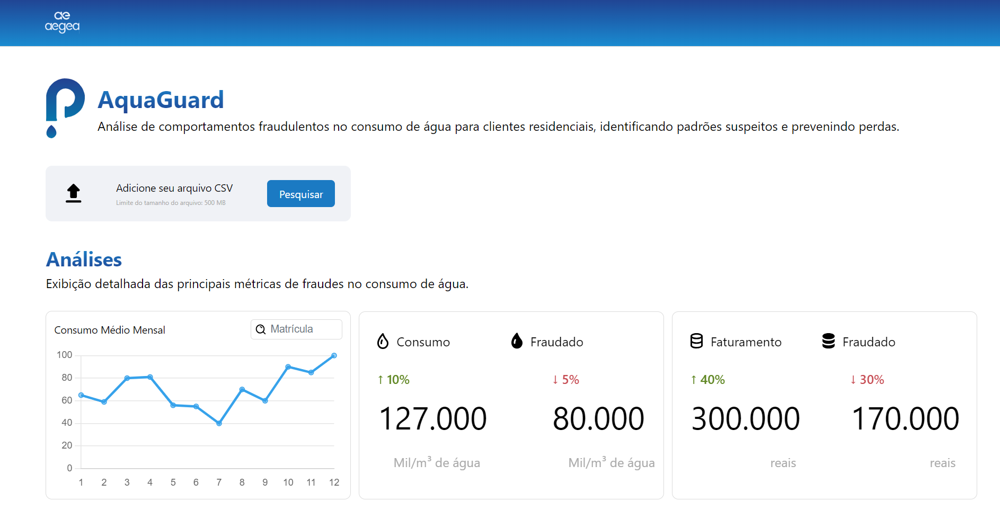
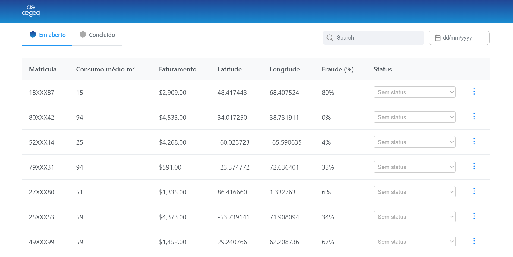
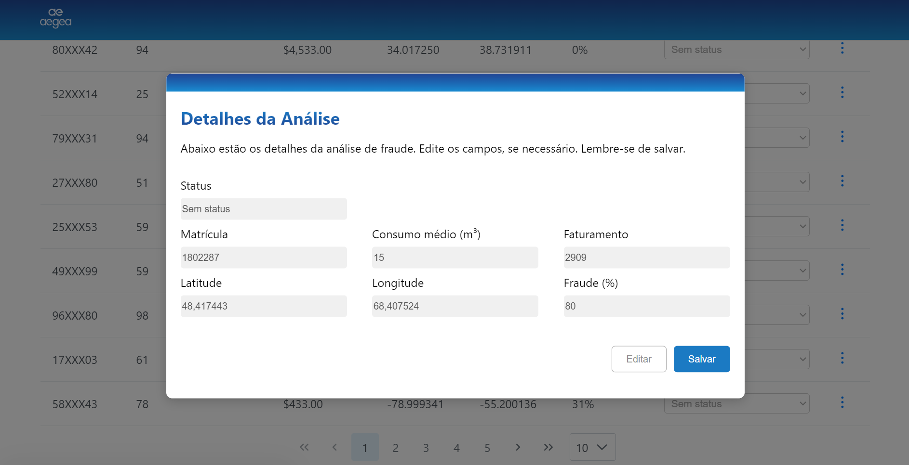
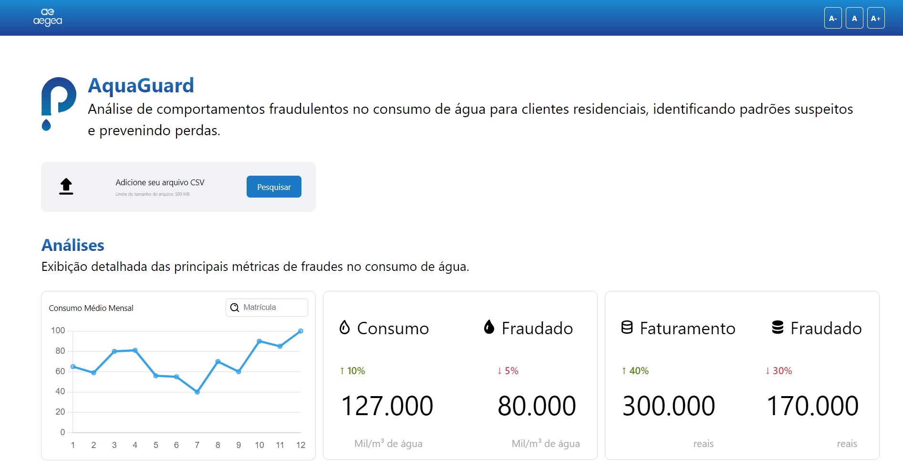
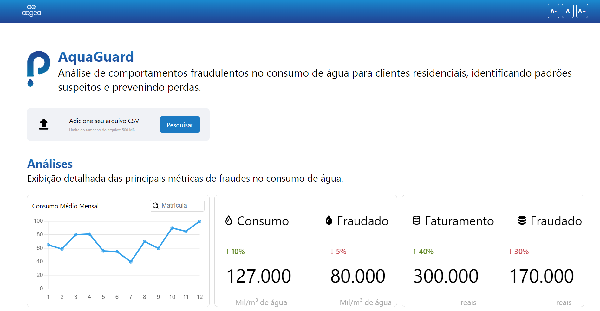
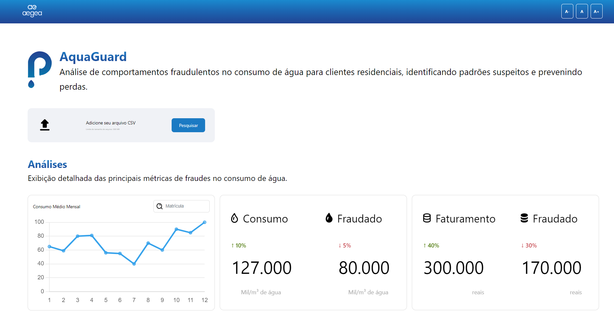

# 2024-T0004-SI11-G03-Relatório detalhado do Design System e da implementação da Interface

## 1. Introdução
Esta documentação oferece uma visão geral do frontend deste projeto, incluindo a configuração do ambiente de desenvolvimento, a estrutura do projeto, os padrões de codificação e as boas práticas aplicadas.

Inicialmente, a equipe considerou a utilização do Streamlit para o desenvolvimento da aplicação, seguindo uma orientação preliminar. No entanto, durante a fase de exploração da biblioteca, constatamos que o Streamlit apresentava incompatibilidades com o nosso protótipo de alta fidelidade. Além disso, a falta de familiaridade dos integrantes com a ferramenta impactou a produtividade. Por conta dessas limitações, decidimos utilizar o Angular.js no desenvolvimento do frontend, uma vez que se mostrou mais adequado às nossas necessidades e aproveitava o conhecimento prévio da equipe.

Este documento está organizado de forma a guiar qualquer usuário que deseje clonar e executar o frontend do projeto em seu próprio ambiente. Fornecemos instruções detalhadas sobre como clonar o repositório e rodar a aplicação, desde que os pré-requisitos, como a instalação do **Node.js** e do **Angular CLI**, sejam atendidos.

Posteriormente, discutiremos o **Design System** adotado, que assegura uma interface moderna, coesa e acessível para a aplicação.

## 2. Objetivo
O principal objetivo deste documento é fornecer uma visão detalhada sobre a utilização e implementação do frontend do projeto. Isso inclui as tecnologias empregadas, a estrutura de código, e as escolhas feitas no Design System para garantir uma interface moderna e coesa. Além disso, o relatório aborda a conformidade com padrões de design de interface e as boas práticas de desenvolvimento aplicadas, garantindo que o projeto esteja alinhado com metodologias ágeis e acessíveis.


## 3. Pré-requisitos
Para configurar e executar este projeto corretamente, certifique-se de que os seguintes componentes estão instalados e configurados em seu ambiente de desenvolvimento:

**Node.js e npm (Node Package Manager):**
  - Angular requer o Node.js. Você pode baixar e instalar a versão mais recente do Node.js no site oficial: Node.js.
  - O npm (Node Package Manager) é incluído com o Node.js e é usado para instalar e gerenciar as dependências do projeto.

**Angular CLI (Command Line Interface):**
  - Ferramenta de linha de comando que facilita a criação, construção e gerenciamento de projetos Angular.

Instale o Angular CLI globalmente usando o seguinte comando no terminal:
```bash
npm install -g @angular/cli
```
- **Editor de Texto ou IDE:**
  - Escolha um editor de texto ou um ambiente de desenvolvimento integrado (IDE) para escrever código Angular. Exemplo: Visual Studio Code.

## Tecnologia Utilizadas
- **Angular:** 18.2.4 -v

- **Node.js:** 20.11.1 -v 

- **TypeScript (ts):** 5.3.2 -v 

### Bibliotecas e Frameworks

```bash
  pip install -r requirements.txt
```

## 4. Inicializando esse projeto

### 4.1 - Obtendo o Código-Fonte
Para obter o código-fonte do projeto, siga os passos abaixo:
 - **Clonando o Repositório**: Execute o seguinte comando no terminal para clonar o repositório do GitHub:

```bash
git clone https://github.com/Inteli-College/2024-2A-T04-SI11-G03.git
```

- Ou faça o download do código-fonte e descompacte-o.

## 4.2 - Execução da aplicação
Para executar a aplicação localmente, siga os passos abaixo:
- Navegue até o diretório do projeto:

```bash
 2024-2A-T04-SI11-G03/src/Frontend/AquaGuard/src
```

- Inicie o servidor de desenvolvimento Angular com o seguinte comando:
 
```bash
ng serve
```

- A aplicação estará acessível em http://localhost:4200.

## 5. Design System Utilizado
### 5.1 - Design System Aqua Guard
Durante a Sprint 3, desenvolvemos uma versão do Design System para o projeto AquaGuard. Ele foi criado para garantir consistência visual e usabilidade na interface do usuário. Para mais detalhes e exemplos completos de implementação, você pode acessar o Design System completo clicando no link abaixo:


[Design System Aqua Guard](https://www.figma.com/proto/mf8lO89R6IttbnAdRuO8ls/AquaGuard---Design?node-id=435-1674&node-type=frame&t=JGhgCHeLIWYowiTY-0&scaling=scale-down-width&content-scaling=fixed&page-id=332%3A1899)

### 5.2 - Design System Angular Material
Neste projeto, foi utilizado o Angular Material, um Design System amplamente reconhecido, que traz consistência e acessibilidade à interface. A biblioteca do Material proporciona componentes prontos para uso, facilitando o desenvolvimento de interfaces modernas e responsivas. Utilizar essa biblioteca e esse design nos ajudou a otimizar o tempo de desenvolvimento e a padronizar o uso dos componentes.
#### 5.2.1 - Instalaão do Angular Material
Para adicionar o Angular Material ao seu aplicativo, execute o seguinte comando:

```bash
ng add @angular/material
```
Este comando instalará o Angular Material e fará as modificações necessárias nos arquivos de configuração do projeto, como o ``angular.json``. Durante a instalação, será solicitado que você escolha o tema. Porém, como utilizaremos nossos próprios tokens para personalização de cores e estilos, a escolha do tema se torna irrelevante, pois modificaremos o CSS diretamente.

## 6. Estrutura de Pastas do Frontend
O projeto foi organizado de maneira modular para facilitar a manutenção e evolução do sistema. Abaixo está a descrição da estrutura de pastas e seus respectivos componentes:
```
src/
├── app/                      # Diretório principal da aplicação
├── components/               # Contém todos os componentes da interface
│   ├── both/                 # Componente de aba
│   ├── consumptio-table/     # Componente de exibição da tabela de consumo
│   ├── customer-details-modal/ # Modal para detalhes de clientes
│   ├── data-picker/          # Componente de escolha de datas
│   ├── fraud-table/          # Componente de exibição da tabela de fraudes
│   ├── invoicing-table/      # Componente da tabela de faturas
│   ├── monthly-consumption-graph/ # Gráfico de consumo mensal
│   ├── search/               # Componente de busca
│   └── upload/               # Componente de upload de arquivos
├── assets/                   # Arquivos estáticos como imagens, ícones e estilos
└── requirements.txt/         # Arquivos de configuração de ambiente (desenvolvimento, produção)
```
### 6.1 - Componentes desenvolvidos

- both/: Componente que exibe abas de navegação entre diferentes estados, como "Em aberto" e "Concluído", utilizando os módulos TabMenuModule e RippleModule da biblioteca PrimeNG.
- consumptio-table/: Tabela de consumo de água, exibindo informações sobre consumo de diferentes clientes.
- customer-details-modal/: Modal que exibe detalhes de clientes, como informações de perfil e histórico de consumo.
- fraud-table/: Exibe dados relacionados a possíveis fraudes no consumo de água.
- invoicing-table/: Tabela de faturas geradas com base no consumo de água.
- monthly-consumption-graph/: Gráfico interativo que exibe o consumo mensal de água de cada cliente.
- search/: Componente de busca que permite ao usuário localizar informações específicas dentro da aplicação.
- upload/: Permite o upload de arquivos para alimentar dados na aplicação, como relatórios de consumo.

## 7. Interface e Funcionalidades

> **Observação:** A interface foi projetada para funcionar corretamente em uma tela com resolução de 1920x1080, com a escala configurada em 150% (recomendado) e o zoom do navegador ajustado para 100%.

Nesta seção, são apresentadas as imagens desenvolvidas da plataforma. Para uma melhor compreensão, assista ao vídeo explicativo <a href="https://www.youtube.com/watch?v=Asgw4zKYnZc">clicando aqui</a>.<br>
A tela foi projetada para fornecer uma visualização clara das informações relevantes para os usuários, utilizando componentes como tabelas e gráficos.



O modal é utilizado para garantir uma experiência de usuário contínua, sem a necessidade de redirecionamentos ou recargas de página.


## 8. Conformidade com Padrões de Explicabilidade
- **Visualização de Métricas e Resultados**: Na tela de "Análises", são apresentados gráficos e KPIs que mostram métricas claras como consumo de água e fraudes, com indicadores visuais (em verde e vermelho) que explicam o aumento ou redução das métricas. Isso ajuda o usuário a interpretar rapidamente os resultados do sistema.
- **Organização da Tabela**: A tabela de matrículas apresenta informações bem organizadas em colunas, permitindo que o usuário veja os detalhes principais em uma única visualização. A coluna "Status" inclui um menu suspenso para fácil seleção de status, proporcionando uma maneira intuitiva de gerenciar os dados.
A explicabilidade é um conceito fundamental em interfaces digitais, pois proporciona ao usuário clareza sobre como o sistema está funcionando e por que certas decisões foram tomadas. Na nossa interface a explicabilidade é implementada para garantir que os usuários entendam facilmente o funcionamento e as decisões do sistema. Abaixo estão os principais pontos de explicabilidade observados nas telas:
- **Feedback Claro e Imediato**: A interface exibe o modal detalhado ("Detalhes da Análise") que permite ao usuário visualizar e editar informações cruciais, como o Status, matrícula, consumo médio, faturamento e porcentagem da fraude, Longitude e Latitude. O botão "Salvar" fornece uma ação clara para concluir a edição, e o botão "Editar" é visível para facilitar a modificação dos dados.
- **Instruções Diretas**: O modal contém uma mensagem clara e direta no topo: "Abaixo estão os detalhes da análise de fraude. Edite os campos, se necessário. Lembre-se de salvar." Isso ajuda a guiar o usuário no preenchimento e edição dos dados.

Esses elementos garantem que o sistema esteja em conformidade com os padrões de explicabilidade, proporcionando transparência nas ações e nos resultados do sistema.

### 8.1 - Leis da UX 

A conformidade com padrões de explicabilidade garante que os usuários compreendam o funcionamento da interface e por que certas decisões são tomadas pelo sistema. Para isso, princípios de psicologia e design de experiência são aplicados, como descrito nas Leis da UX. Abaixo estão algumas leis aplicadas no projeto:
  1. **Lei de Hick**: O tempo para tomar decisões aumenta com a quantidade e complexidade das opções. Na nossa interface do AquaGuard, apesar de termos 8 status na tabela "Em aberto", o uso de cores e rótulos claros organiza as opções e facilita a seleção, minimizando a sobrecarga cognitiva e agilizando a tomada de decisão.
  2. **Lei de Jakob**: Os usuários esperam que interfaces novas funcionem de maneira semelhante às que já conhecem. No design do AquaGuard, os elementos como tabelas, botões de ação (Editar, Salvar) e modais seguem convenções comuns de interface, permitindo que os usuários se adaptem rapidamente ao sistema sem a necessidade de um longo processo de aprendizado.
  3. **Efeito da Usabilidade Estética**: A estética impacta diretamente na percepção de usabilidade. A interface limpa e bem organizada do AquaGuard, com cores neutras e ícones visíveis, ajuda os usuários a perceberem o sistema como mais utilizável, mesmo que enfrentem pequenas dificuldades. A estrutura clara e o design responsivo melhoram a experiência do usuário ao torná-la mais agradável visualmente.
  4. **Limiar de Doherty**: Para aumentar a produtividade, o sistema deve responder rapidamente às interações dos usuários. O uso adequado do Angular.js no AquaGuard foi intencional, pois, além de melhorar a performance em comparação ao Streamlit, permite no futuro integrar a aplicação ao Datadog e utilizar o LIGHTHOUSE para melhorias contínuas em práticas, SEO e acessibilidade. Embora o SEO não seja utilizado devido à regra de negócio, essa escolha técnica garante flexibilidade e escalabilidade no longo prazo.

Esses princípios ajudam a garantir que o sistema não apenas funcione bem, mas também seja compreensível, eficiente e agradável de usar.

## 9. Aplicação de Heurísticas de Nielsen
As heurísticas de Nielsen são princípios amplamente adotados para projetar interfaces eficazes e centradas no usuário. No desenvolvimento deste projeto, aplicamos esses princípios para garantir que a interface proporcione uma experiência de uso intuitiva e eficiente. Abaixo estão as heurísticas aplicadas, com exemplos claros de como foram implementadas nas telas do sistema:

- **Visibilidade do estado do sistema**: A interface informa ao usuário o estado atual das ações de maneira clara e imediata. Na tela principal, o usuário pode visualizar as atualizações em tempo real, como mudanças nos valores de consumo e nas porcentagens de fraude. Além disso, o modal de "Detalhes da Análise" oferece feedback instantâneo, permitindo que o usuário veja claramente o status de sua ação (editar, salvar), garantindo confiança no processo.

- **Correspondência entre o sistema e o mundo real**: O sistema utiliza termos e conceitos familiares ao usuário, criando uma conexão direta entre a interface e o mundo real. Na tela "Análises", gráficos e indicadores (como consumo, faturamento e fraudes) estão organizados de forma compreensível, utilizando unidades de medida e termos que fazem parte do vocabulário cotidiano dos usuários, como "Matrícula", "Consumo médio", "Faturamento" e "Latitude/Longitude".

- **Controle e liberdade do usuário**: O sistema oferece ao usuário a liberdade para tomar decisões e desfazer ações indesejadas. No modal "Detalhes da Análise", o usuário pode facilmente editar os dados, e, caso precise reverter ou ajustar, o botão "Salvar" confirma as alterações, enquanto o botão "Editar" permite reabertura dos campos, proporcionando flexibilidade sem comprometer o controle.

- **Consistência e padrões**: O uso do Design System desenvolvido pela equipe Leak Seeker (Grupo 3), em conjunto com o Angular Material, garante que o sistema mantenha uma consistência visual e funcional em todas as telas. Todos os componentes seguem o mesmo padrão de design e comportamento, como botões de ação, modais e tabelas. Isso facilita o aprendizado e garante que, uma vez entendida uma interação, o usuário possa aplicá-la em diferentes partes do sistema com confiança.

- **Prevenção de erros**: O sistema busca evitar que o usuário cometa erros, antecipando-se às suas ações. No modal "Detalhes da Análise", campos que exigem números (como "Consumo médio" ou "Fraude (%)") são pré-configurados para aceitar apenas valores numéricos. Além disso, o sistema valida as entradas em tempo real, prevenindo que dados incorretos ou incompletos sejam salvos. Isso reduz a necessidade de correções posteriores e minimiza a frustração do usuário.

- **Estética e design minimalista**: O design da interface segue princípios minimalistas, exibindo apenas as informações essenciais para o usuário. As telas são claras e organizadas, sem elementos visuais desnecessários que possam distrair ou confundir o usuário. Na tela "Análises", os gráficos são simples, porém informativos, proporcionando uma visualização clara das métricas mais importantes, como consumo e faturamento, mantendo a interface limpa e eficiente.

Essas são algumas das heurísticas utilizadas no desenvolvimento da interface. Esses princípios garantem que o sistema seja funcional, eficiente e fácil de usar, proporcionando uma experiência de uso fluida e sem frustrações. Ao seguir as heurísticas de Nielsen, o projeto entrega uma interface que atende tanto às necessidades dos usuários quanto às expectativas de usabilidade moderna.

## 10. Acessibilidade - Suporte a Zoom In e Zoom Out

A plataforma apresenta práticas de acessibilidade para garantir uma experiência inclusiva a todos os usuários. A funcionalidade de zoom in e zoom out é especialmente desenvolvida para atender às necessidades de pessoas com deficiências visuais e outras dificuldades de leitura, proporcionando uma interação mais confortável e acessível com o conteúdo online.

Essa solução é especialmente útil para pessoas com baixa visão ou outras limitações visuais. A capacidade de ajustar o tamanho da fonte permite que o usuário adapte o conteúdo conforme suas preferências, facilitando a leitura, reduzindo a tensão ocular e evitando a fadiga visual.

Além disso, essa funcionalidade também beneficia pessoas com dislexia, permitindo ajustar o tamanho e o espaçamento das fontes para melhorar a leitura. O redimensionamento do texto também é útil em ambientes de baixa luminosidade ou com reflexos, onde a visibilidade é comprometida. Ao permitir a personalização do tamanho do texto, a plataforma se adapta a uma variedade de situações, como leitura em dispositivos móveis ou em telas menores, sem comprometer a usabilidade.

### 10.1 Conformidade com o Guia WCAG

A funcionalidade de zoom in e zoom out está em conformidade com os seguintes critérios de sucesso do [Guia de Acessibilidade para Conteúdo Web (WCAG)](https://www.w3.org/WAI/standards-guidelines/wcag/):

**Critério de sucesso: 1.4.4 - Redimensionar texto (AA)**:  
Quando o texto é ampliado em até 200%, ele continua legível, sem perda de informação ou funcionalidade. Isso significa que não há necessidade de rolagem horizontal, e os textos permanecem organizados dentro de suas seções, facilitando a navegação e a leitura.

**Critério de sucesso: 1.4.12 - Espaçamento de texto (AA)**:  
O espaçamento de linhas, letras e parágrafos pode ser ajustado pelo usuário sem que a legibilidade do texto seja comprometida. A apresentação visual dos textos mantém uma estrutura coerente, mesmo com ajustes personalizados.

**Critério de sucesso: 1.3.1 - Informações e Relações (A)**:  
A organização estrutural da página respeita a hierarquia semântica e lógica, garantindo que o conteúdo seja compreensível tanto para usuários visuais quanto para aqueles que utilizam tecnologias assistivas, como leitores de tela. O layout responsivo mantém a acessibilidade ao redimensionar o texto, sem desorganizar os elementos visuais.

### 10.2 Visualização da plataforma 

**Imagem 1:** Visualização padrão da plataforma (100%)
Essa imagem mostra a interface da plataforma em seu tamanho original, sem ajustes de zoom. Todos os elementos são exibidos conforme o design inicial.



**Imagem 2:** Visualização com Zoom In (currentSize + 2)
Esta imagem demonstra a interface com um aumento de "currentSize + 2" no texto e nos elementos. A legibilidade do conteúdo permanece inalterada e a disposição dos elementos se ajusta sem a necessidade de rolagem horizontal.



**Imagem 3:** Visualização com Zoom Out (currentSize - 2)
Aqui, a interface é mostrada com uma redução de "currentSize - 2". Mesmo com o conteúdo mais compacto, a estrutura mantém-se clara e utilizável, garantindo que informações importantes não sejam perdidas.



## 11. Apêndice

### 11.1 Links úteis

- Node : https://nodejs.org/en
- Angular Material : https://material.angular.io/components/categories
- Angular Icons : https://www.angularjswiki.com/angular/angular-material-icons-list-mat-icon-list/


### 11.2 Boas práticas de desenvolvimento utilizadas 

#### 11.2.1 Git Flow: 
O Git Flow é baseado em um modelo de ramificação específico que define como as branches são criadas para facilitar o desenvolvimento, a revisão e a implantação do código. Utilizamos pois ele proporciona uma estrutura organizacional que ajuda os membros da equipe a entenderem em qual estágio do ciclo de vida uma determinada parte do código está. 

Além disso, as branches de feature são usadas para desenvolver novas funcionalidades de forma isolada para que os desenvolvedores trabalhem em suas próprias funcionalidades sem interferir no trabalho de outros.

#### 11.2.2 Nomenclatura das branchs:

- 'Development': branch principal de desenvolvimento do projeto.
- 'origin/Homologation' e 'origin/Production': branches remotas que representam os ambientes de homologação e produção, respectivamente.
- 'feature/code...:  branches de desenvolvimento de novas funcionalidades.

**Exemplo de boas práticas de nomenclatura:** 
Prefixo + Palavras-chave + Sprint Atual + Descrição: feature/code/sprint2/sidebar


#### 11.2.3 Pull Request:

Uma das boas práticas que seguimos é sempre abrir um Pull Request (PR) ao finalizar o desenvolvimento de uma funcionalidade ou correção de bug. Isso é feito para garantir que todas as alterações passem por uma revisão de código antes de serem integradas na branch de desenvolvimento principal (Development).

Ao abrir um PR, outros membros do grupo têm a oportunidade de revisar o código, fornecer feedback e isso promove a colaboração e ajuda a manter a qualidade do código.

#### 11.2.4 Código Autoexplicativo:
Prática fundamental para tornar o código-fonte o mais compreensível possível, sem a necessidade de comentários explicativos adicionais. Dessa forma, utilizamos nomes de variáveis, funções, classes e métodos que descrevem de forma clara sua finalidade.

## 11.3 Especificações da Interface

### 11.3.1 Indicadores de consumo

A porcentagem apresentada nos blocos de consumo e faturamento deve ser baseada no valor total do dataset. Por exemplo, se o valor total do consumo é de R$120.000 e R$50.000 estão associados a fraudes, o sistema deve indicar a porcentagem de fraudes em relação ao valor total. Neste caso, a porcentagem seria calculada como (50.000/120.000) * 100%, resultando em aproximadamente 41,67%. Assim, a métrica mostra o percentual que as fraudes representam no montante geral.

### 11.3.2 Escala - Gráfico de consumo anual

O gráfico de consumo anual deve começar sem dados exibidos, permanecendo em branco até que uma matrícula válida seja inserida. Após a inserção de uma matrícula que esteja presente no dataset, o gráfico deve apresentar a quantidade de água consumida por mês no período disponível. Como o modelo atual trabalha com uma janela temporal de um ano, o gráfico mostrará o consumo ao longo de 12 meses, distribuído mensalmente.

### 11.3.3 Volume e Faturamento das fraudes

Na tabela exibida na plataforma, há colunas que representam o faturamento e o consumo de água. O valor total de consumo e faturamento é calculado somando os valores dessas colunas. Conforme o usuário marca uma linha como "fraude", o sistema soma o consumo e o faturamento correspondentes e exibe esses valores no campo de "Consumo e Faturamento Fraudado". Dessa forma, é possível acompanhar em tempo real o impacto financeiro das fraudes identificadas.

### 11.3.4 Evoluções futuras

Uma funcionalidade adicional sugerida é a criação de uma automação para as matrículas que possuem mais de X% (definido pelo usuário) de chance de fraude. Essa funcionalidade moveria automaticamente a linha para o status de "Direcionar para fiscalização", o que poderia auxiliar na priorização de análises. Além disso, considera-se tornar toda a linha clicável, destacando-a ao passar o cursor sobre a área, simplificando a usabilidade, eliminando a necessidade de depender de pequenos ícones como os "...", que podem passar despercebidos pelos usuários.


## 12. Referências

- ARMIDORO, Giovana. 10 heurísticas de Nielsen: projetando interfaces e interações. Medium, 1 ago. 2021. Disponível em: [10 heurísticas de Nielsen: projetando interfaces e interações](https://medium.com/@giovanaarmidoro/10-heur%C3%ADsticas-de-nielsen-projetando-interfaces-e-intera%C3%A7%C3%B5es-dc0baa7e64fd). Acesso em: 29 set. 2024.
- UX DESIGN. As 20 Leis da UX. UX Collective, Disponível em: [As 20 Leis da UX (experiência do usuario)
](https://uxdesign.cc/20-leis-da-ux-para-melhorar-a-experiência-do-usuário). Acesso em: 29 set. 2024.
